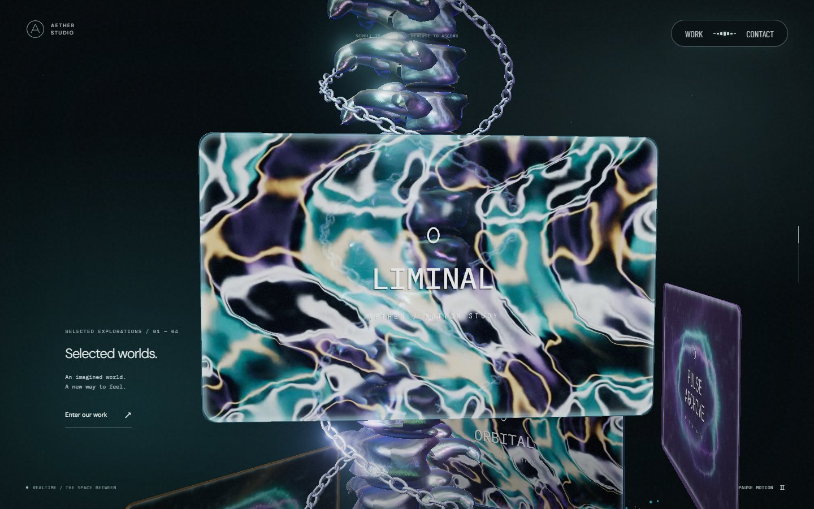
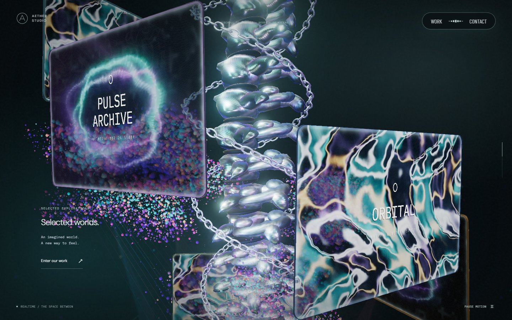
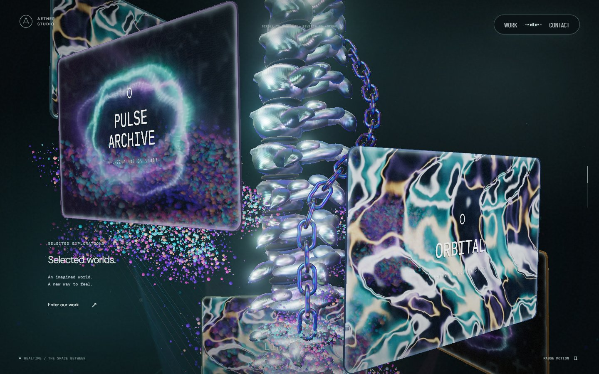
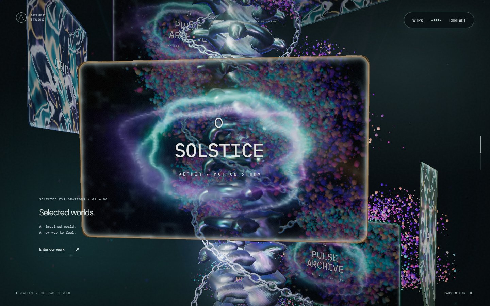
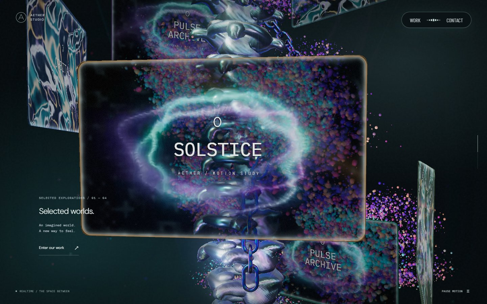
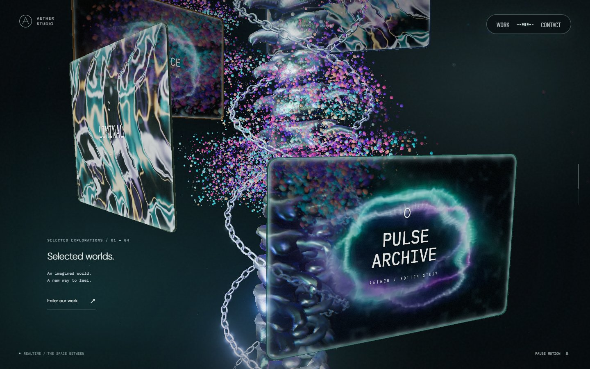
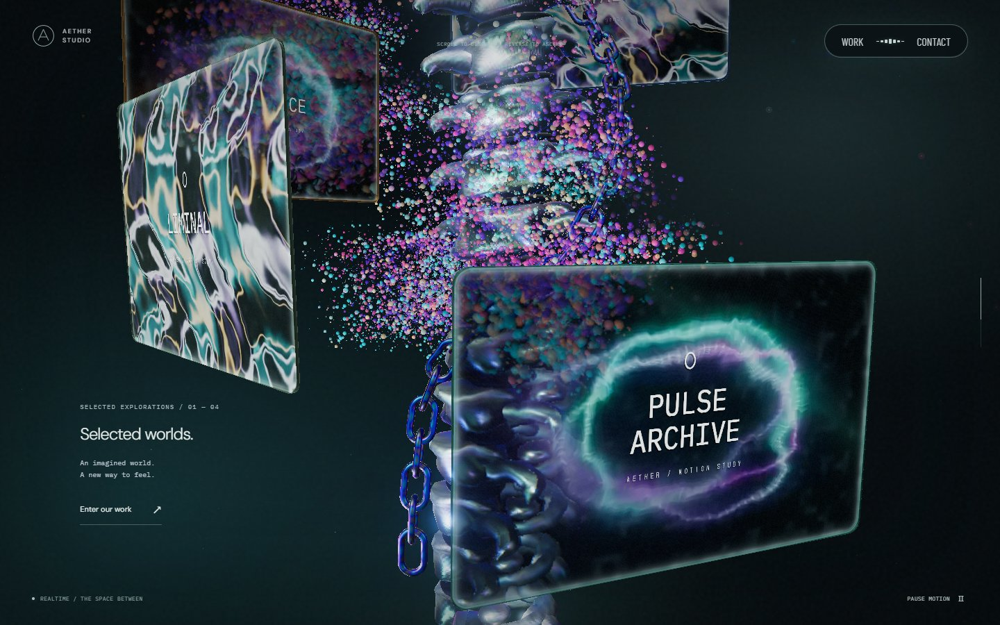

# 스크롤과 함께 내려오는 체인 · 2026-09-24

기준 커밋 `89fd8d2`의 두 줄 순환 체인을, 끝 링크가 있는 한 줄 체인으로 바꿨다. 스크롤을 내리면 본 컬럼을 따라 내려오고, 멈추면 위치를 유지하며, 역스크롤하면 같은 경로로 돌아간다.

## 형태와 표면

[Active Theory](https://activetheory.net/)를 1440×900 Chromium에서 실제 휠 입력으로 관찰했다. 길쭉한 링크의 곧은 옆면과 둥근 끝, 어두운 청색 바탕과 보라·청록색 반사를 참고했다. 참고 사이트의 코드·모델·텍스처는 가져오지 않았다. 원본과의 픽셀 일치를 주장하지 않는다.

[SceneChain.ts](../src/SceneChain.ts)는 닫힌 캡슐형 링크와 유한한 경로, 금속 재질을 만든다. 링크 폭과 굵기를 키웠고, 표면 좌표를 사용하는 거칠기·미세 요철·박막 반사를 적용했다. 별도 이미지 텍스처나 렌더 패스는 추가하지 않았다.

[SceneSpine.ts](../src/SceneSpine.ts)는 경로의 호 길이를 기준으로 42개 링크를 배치하고 이웃 링크를 90도씩 교차한다. 끝 링크는 온전한 크기를 유지한다. 기존의 modulo 재배치와 양 끝 축소를 제거했다. 본 컬럼의 회전을 보정해 끝 링크가 뒤로 돌아 숨지 않게 했고, 후반에는 모니터 왼쪽 여유 공간으로 이어지게 했다. 모니터가 체인 앞에 있을 때는 기존의 실제 깊이와 굴절을 유지한다.

## 시각적 변경

PC는 1440×900, DPR 1, 카메라 입력 0, 구간마다 240회 60Hz 시각 증가와 영상 2초를 사용했다. 변경 전후에 같은 조건을 적용했다. 아래는 실제 실행 화면이다.

| 구간 | 변경 전 | 변경 후 | 판단 포인트 |
| --- | --- | --- | --- |
| 진입 30% |  |  | 모니터 아래로 드러나는 끝 링크 |
| 중간 40% |  |  | 한 줄 경로와 커진 링크·금속 반사 |
| 하강 50% |  |  | 앞 모니터에 가려진 몸통과 아래 끝 |
| 후반 60% |  |  | 왼쪽으로 이어지는 자유단 |

390×844에서도 같은 네 구간을 캡처하고 끝 링크와 화면 밖 넘침을 확인했다. [모바일 40%](screenshots/single-chain/mobile/scroll-400.jpg) · [모바일 60%](screenshots/single-chain/mobile/scroll-600.jpg)

## 검사와 비용

`tests/chain.spec.ts`는 실제 체인 인스턴스의 변환을 사용한다. PC·모바일·소프트웨어 설정에서 링크 연결 간격, 350개 연속 스크롤 간격의 이동 연속성, 끝 링크 하강, 정지·역방향 복원을 검사한다. PC·모바일의 여덟 위치에서 끝 링크의 양 끝이 화면 안에 있는지도 확인한다. 화면 안 좌표 검사는 가림 검사를 대신하지 않으며, 기존 모니터 깊이 검사와 실제 캡처를 함께 사용했다.

체인은 기존과 같이 한 번의 인스턴스 드로우를 사용한다. 링크 수는 PC 208개·모바일 152개·소프트웨어 96개에서 모두 42개로 줄었다. 링크 자체를 더 매끈하게 만들어 체인 삼각형 수는 PC 49,920→53,760, 모바일 36,480→32,256, 소프트웨어 11,520→16,128로 변했다. 프레임 속도 개선으로 해석하지 않는다. 실제 iOS Safari와 저사양 기기의 장시간 성능은 이번 검증에 포함하지 않았다.
