

# 본 컬럼과 굴절 모니터 · 2026-09-22

[운영 사이트](https://aether-studio-nu.vercel.app/) · [README](../README.md) · [카메라 잠금](mechanical-camera.md)

본 컬럼·모니터 구간을 [Active Theory](https://activetheory.net/)에서 다시 움직여 보며 개선했습니다. 원본의 코드·모델·텍스처·영상을 가져오지 않고, 절차적 본 컬럼과 자체 생성 영상을 사용합니다. 아래 원본 이미지는 비교 근거이며 실행 사이트에는 포함되지 않습니다.

## 실제 입력으로 확인한 차이

1440×900 Chromium/D3D11에서 실제 wheel, 정지, 역스크롤, 좌우 드래그, 모니터 위 마우스 이동을 입력하며 44장의 화면과 연속 녹화를 확보했습니다. 정지·전진·역방향의 연속 캡처로 구조와 화면의 이동을 비교했습니다. 원본의 가상 스크롤은 wheel 누적값과 내부 진행률이 다르므로 두 사이트의 같은 백분율을 동일한 장면이라고 취급하지 않습니다.

- 원본 본 컬럼에는 두꺼운 세그먼트, 큰 연결 아치와 돌출면, 어두운 세그먼트 간격이 있습니다. 이전의 촘촘한 외피를 제거하고 비대칭 금속 본 컬럼으로 재구성했습니다.
- 원본 체인은 타원 링크가 서로 연결되어 있고 스크롤 정착 후 멈춥니다. 링크를 경로 접선에 맞추고 한 체인 안에서 방향을 교차시켰습니다.
- 모니터는 본 컬럼 앞뒤를 지나며 아래에서 들어와 위로 통과합니다. 같은 높이에서 반복 회전하던 4장을, 고도차가 있는 6장의 유한 나선 경로로 바꿨습니다.
- 영상과 함께 뒤쪽 본 컬럼·입자가 굴절되어 보입니다. 실제 배경을 공유하는 곡면 유리에 잔물결, 미세한 색 분산, 자체 GPU 영상과 중앙 제목을 합성했습니다.
- 본 컬럼·체인·모니터 위치는 스크롤에만 연결됩니다. 멈췄을 때는 영상과 표면의 빛만 계속 바뀌며, 중간 구간의 카메라 드래그 잠금은 유지합니다.

| 원본 관찰 화면 | 자체 구현 |
| --- | --- |
| 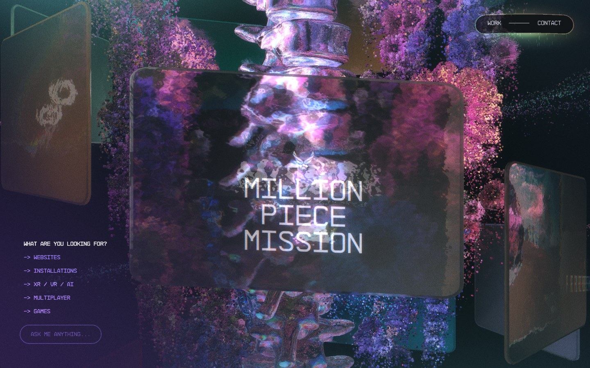 | 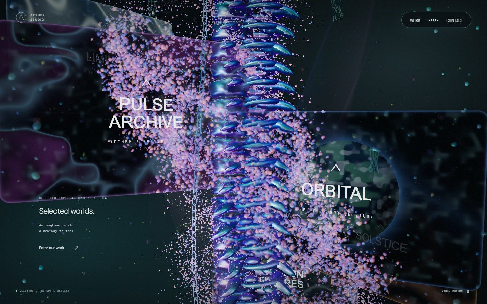 |

두 이미지는 대응하는 표현을 설명하기 위한 비교이며 같은 콘텐츠나 정확히 같은 카메라 상태가 아닙니다.

## 동일 입력의 변경 전후

각 비교는 AETHER의 동일한 1440×900 뷰포트, 스크롤 위치, 초기 드래그 각도 0에서 얻었습니다. 시간에 따라 영상과 조명이 바뀌므로 전체 픽셀 일치를 요구하지 않습니다.

| 대상 | 변경 전 | 변경 후 | 판단 포인트 |
| --- | --- | --- | --- |
| 32% 진입 | 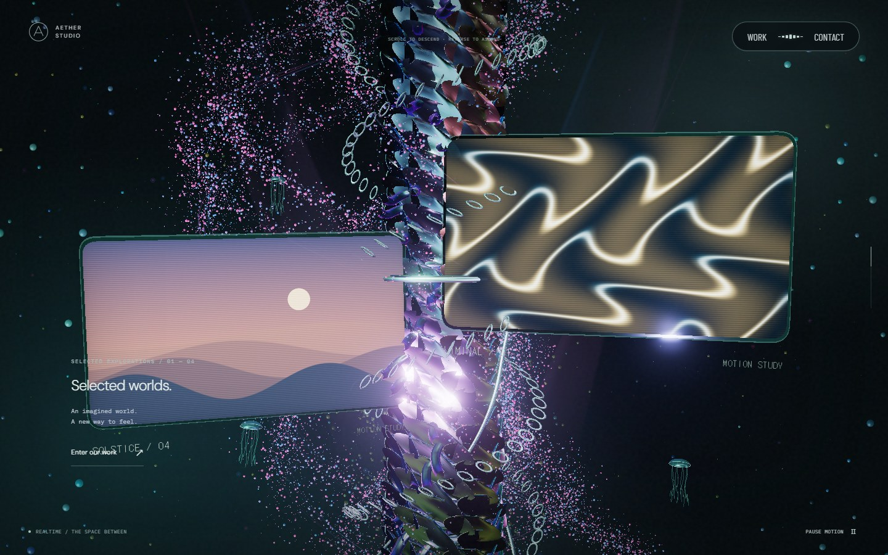 | 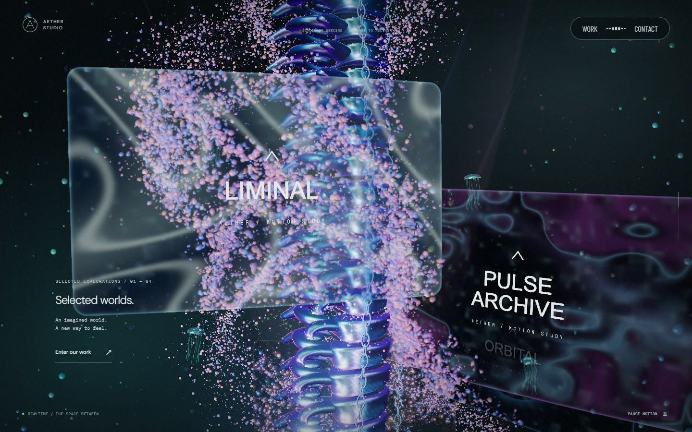 | 관절·체인·큰 유리 화면 |
| 40% 중간 | 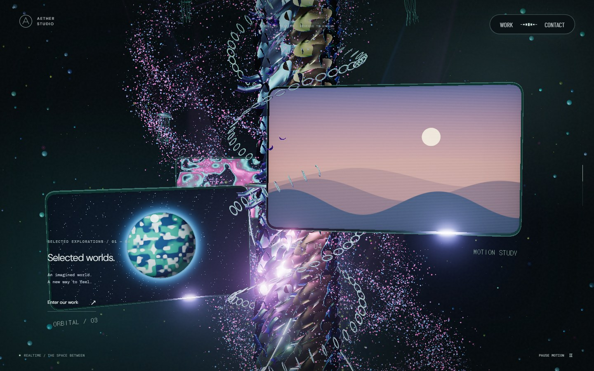 |  | 본 컬럼의 연속성과 전경·후경 이동 |
| 56% 후반 | 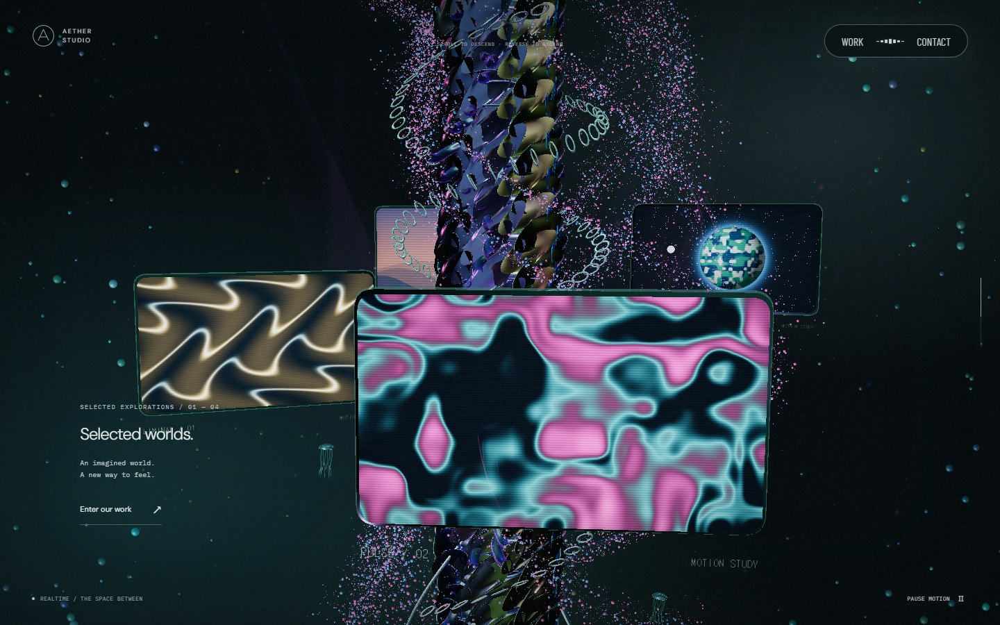 | 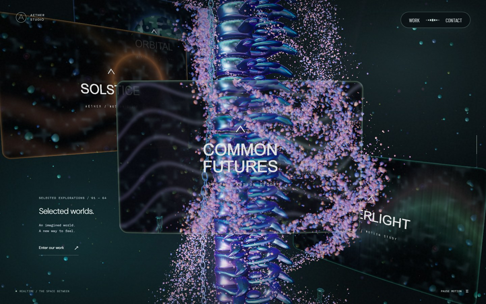 | 다음 화면으로 이어지는 세로 흐름 |

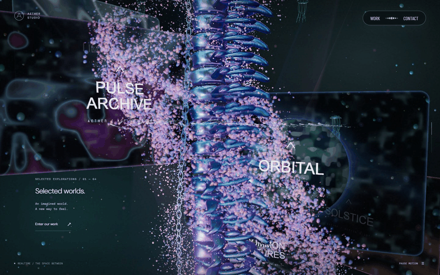

160px wheel 입력과 약 110ms 대기를 반복하며 캡처한 연속 화면을 일정 간격으로 재생한 요약입니다. 실시간 녹화의 프레임률 측정 영상은 아닙니다.

| 정착 직후 | 2.2초 뒤 | 모바일 에뮬레이션 |
| --- | --- | --- |
| 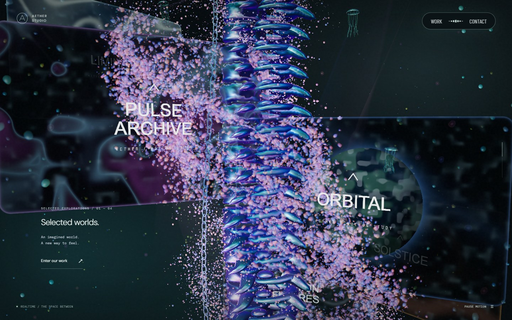 | 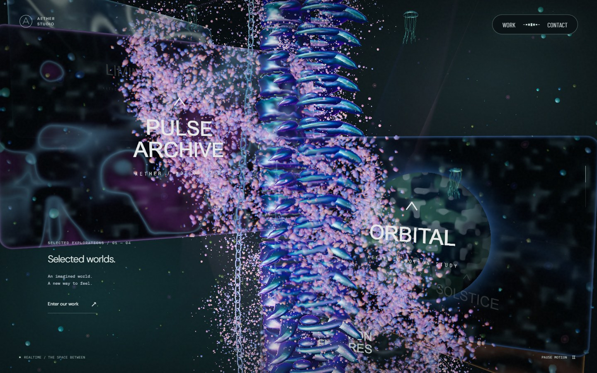 | 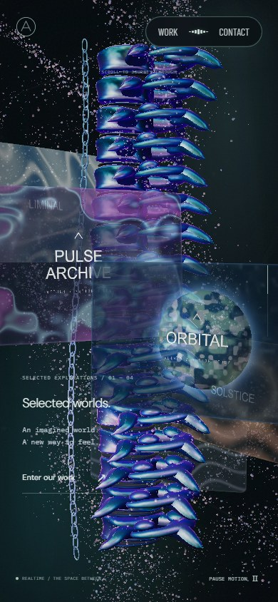 |

## 검증과 성능 경계

- lint·typecheck·production build 통과. production+SwiftShader interaction 7개가 재시도 없이 통과했습니다.
- 실제 본 컬럼·체인 인스턴스 행렬과 모니터 행렬로 정지·전진·왕복 복원을 검사합니다. 구간별 드래그 잠금과 마지막 링에서의 복귀도 유지합니다.
- 실제 WebGL에서 DPR 1.5·2를 사용해 공유 RT의 물리 viewport, 캡처 전후 renderer 상태, 의도적인 렌더 실패 뒤 대체 표현과 재시도 차단을 검사합니다. 초기 검수에서 발견한 DPR 중복 적용을 이 테스트로 회귀 방지합니다.
- 본 컬럼은 3개 InstancedMesh, 모니터는 최대 6개 draw call입니다. GPU 데스크톱만 최대 폭 720px의 공유 배경 RT를 사용하고 화면 갱신 두 번당 한 번 캡처합니다. 정지 모션에서는 해당 프레임을 즉시 갱신합니다.
- 모바일·소프트웨어 렌더러는 추가 RT 없이 투명 영상으로 표시합니다. 화면 정밀 굴절이 데스크톱과 같지는 않습니다. 자원 해제와 캡처 실패 시 복구 경로를 포함합니다.
- Windows D3D11의 데스크톱·고해상도·390×844 터치 에뮬레이션에서 페이지 오류 없이 스크롤·정지·역방향을 확인했습니다. 관측 구간의 RAF 간격 중앙값은 약 16.7ms였습니다. 실제 모바일 기기·Safari의 성능을 의미하지 않습니다. [입력·성능 관측값](screenshots/spine/input-evidence.json)

원본과 콘텐츠·해부학적 모델·영상은 다릅니다. 원본의 모델·실사 영상 품질이나 유사도 백분율을 보증하지 않습니다. 마우스 이동에 반응하는 주변 입자·광원의 추가 고도화는 별도 후속 범위로 유지합니다.
