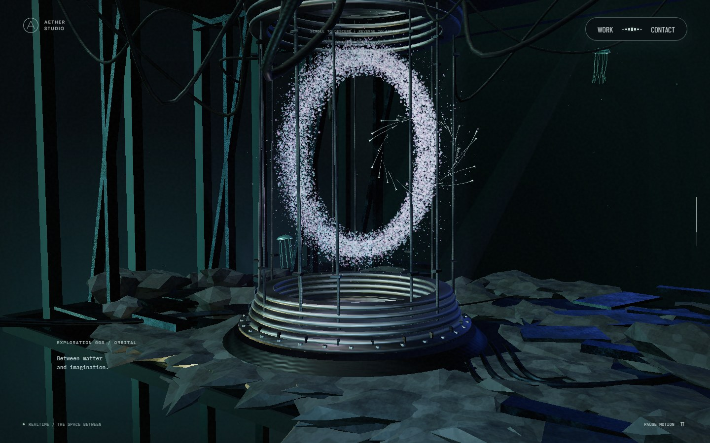
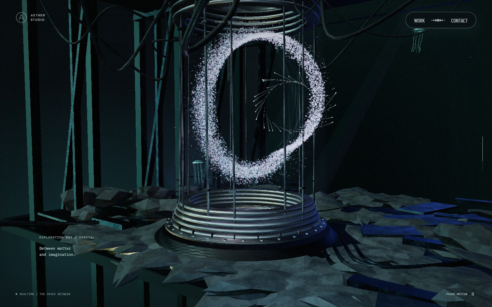
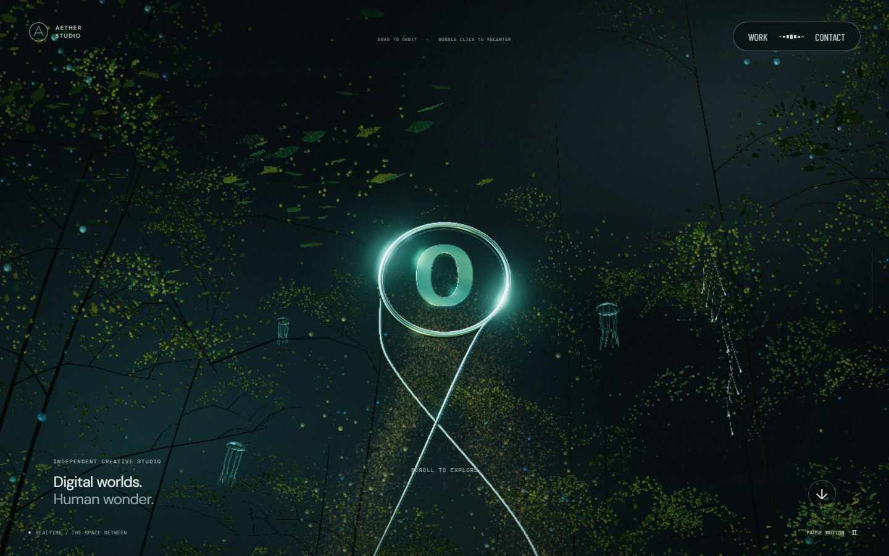
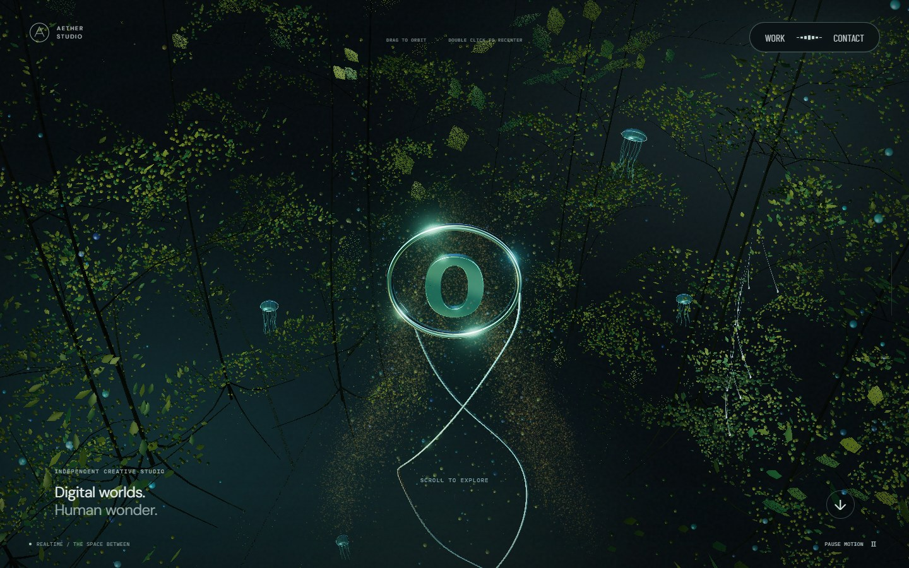
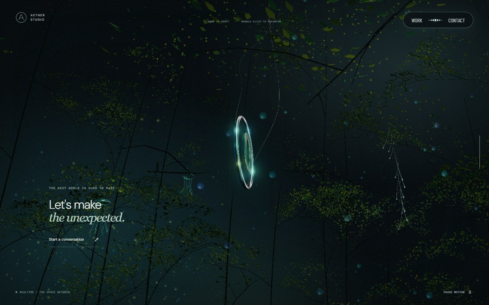
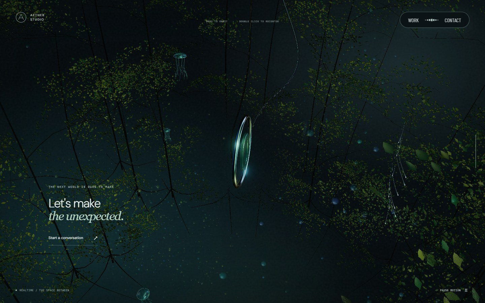
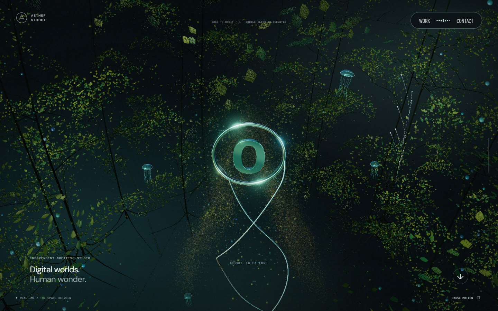
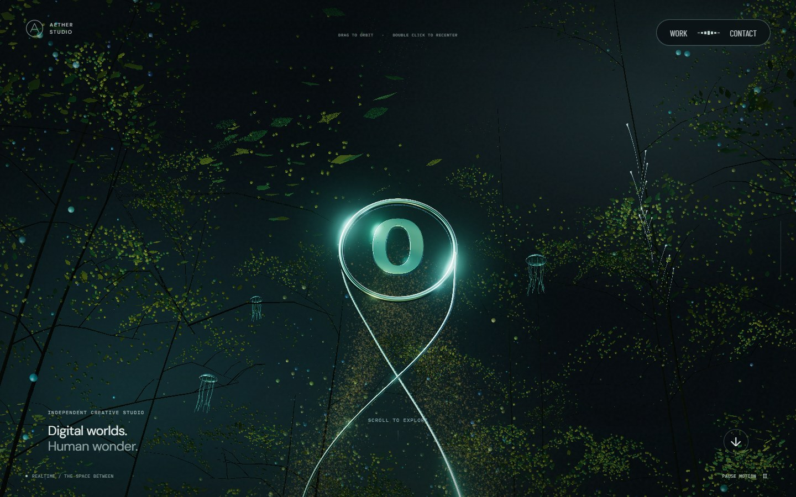
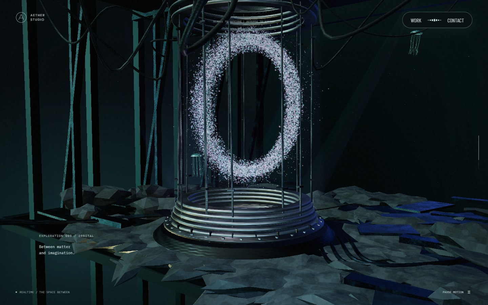

# 리액터 입자와 세로 카메라 입력 검증

2026-09-22, 수정 전 `af57c87`과 수정 후 `da14095`의 production 빌드를 실제 GPU에서 실행했다. 뷰포트 1440×900, DPR 1, Chromium·ANGLE D3D11, 동일한 스크롤 비율·포인터 경로·정착 시간을 사용했다. 조명과 영상의 시간은 고정하지 않았으므로 화면 전체의 픽셀 일치 비교는 아니다. 세로 입력은 방향을 바꾸는 수정이므로 결과 카메라 각도가 달라지는 것이 기대 동작이다.

## 같은 입력의 전후 화면

| 대상 | 변경 전 | 변경 후 | 판단 포인트 |
| --- | --- | --- | --- |
| 리액터 72%, 오른쪽 호를 따라 마우스 이동 |  |  | 스크롤이 멎어도 포인터 가까운 입자가 국소적으로 휘어진다. O 전체 위치·스크롤 경로는 유지한다. |
| 상단, 위→아래로 320px 드래그 |  |  | 상단이 앞으로 오고 위쪽에서 바라보는 시점으로 이동한다. |
| 하단 98%, 위→아래로 320px 드래그 |  |  | 하단 포레스트에서도 같은 세로 방향을 적용한다. |
| 상단, 아래→위로 320px 드래그 |  |  | 바닥이 앞으로 오고 아래쪽에서 바라보는 시점으로 이동한다. |

## 리액터 모양의 복귀

| 입력 전 | 이동 중 | 입력이 멎은 뒤 |
| --- | --- | --- |
|  |  |  |

리액터 구간에서만 포인터의 투영 위치와 입력 강도로 입자를 밀고 비튼다. 스크롤이 움직일 때만 작동하던 기존 입자 이동과 별도이므로 정지한 리액터에서도 반응한다. 입력 강도가 감쇠하면 기존 O 모양으로 돌아가며 별도 CPU 입자 반복·추가 draw 호출·렌더 타깃을 만들지 않는다. 본 컬럼 입자의 고정/스크롤 이동 역할, 스크롤 역방향, 중간 구간 카메라 잠금과 수평 궤도는 유지한다.

## 검증 결과

- 전체 자동 검사 **47개를 재시도 없이 통과**했다. lint·typecheck·production build도 통과했다.
- 실제 리액터 셰이더의 투명도 커버리지 변화를 읽어 색만 바뀐 것이 아니라 입자 위치가 변하는지 검사했다. 스크롤 변화량 0에서 변위가 생기며, 입력 강도 0 복귀 시 고정된 시간의 픽셀 전체가 원본과 일치했다. 입자 시드와 리액터 높이는 변하지 않았다.
- 상·하단 실제 마우스 드래그에서 아래 방향은 카메라 높이가 증가하고 위 방향은 감소했다. 손을 놓아도 시점을 유지하고 더블클릭으로 복귀했다.
- 실제 production 화면에서 모니터 영상 2개 재생, `WEBGL_lose_context` 이후 재준비·복원, 390×844 모바일 6개 스크롤 지점을 확인했다. 브라우저 오류는 없었다. 모바일 크기의 Chromium 검증이며 실물 iOS 검증은 아니다.
- 별도 코드 리뷰에서 임시 render target·visibility·frustum culling·렌더 콜백 복구, 취소·컨텍스트 세대 검사와 영상 지연 로드를 검토했으며 P1/P2 결함은 발견하지 못했다.

[전환 성능의 원인·전후 측정](transition-performance.md) · [초기부터 현재까지 42장](visual-history.md) · [메타데이터](metadata.md) · [후속 개선](next-improvements.md)
