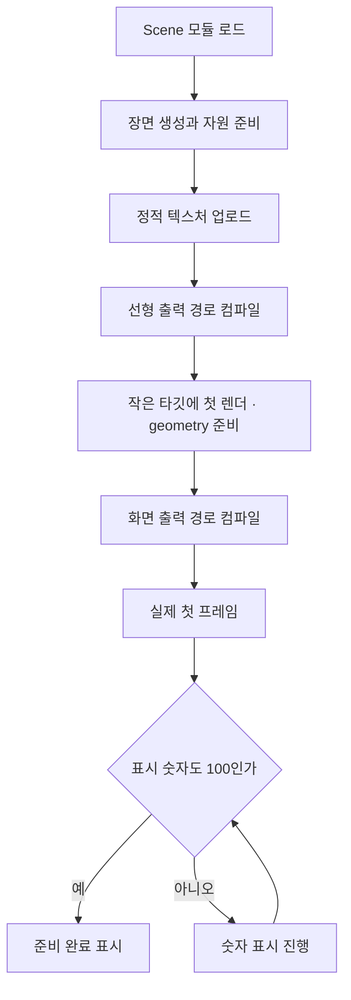
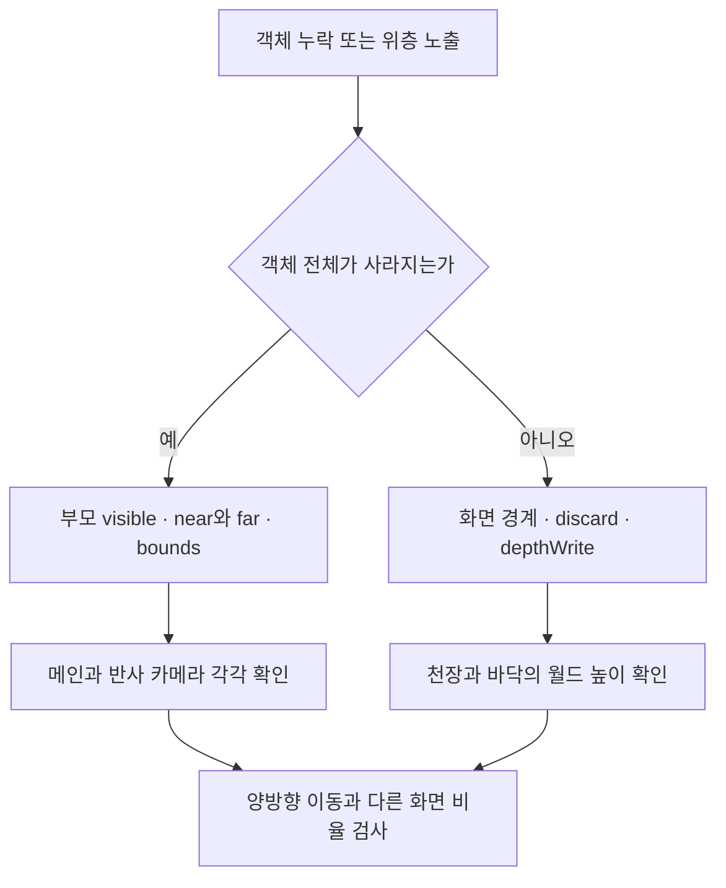

# 현재 구현의 트러블슈팅

[문서 홈](../README.md) · [구조](../architecture.md) · [과거 사례 7편](index.md) · [상세 검증 절차](runbook.md)

**증상 → 재현 조건 → 담당 코드 → 확인할 결과** 순서로 읽는 개발용 안내다. 2026-09-27 구현 `96ac71f`를 기준으로 하며, 과거 글의 화면과 성능 수치는 해당 버전의 기록으로 보존한다.

## 증상에서 시작하기

| 지금 보이는 증상 | 먼저 확인할 것 | 이동 |
| --- | --- | --- |
| 첫 화면이 늦게 열린다 | 모듈 요청·GPU 준비·숫자 연출의 시간 구분 | [로딩](#첫-화면이-늦게-열릴-때) |
| 돌아오면 배치나 회전이 달라진다 | 스크롤 변환·추종 지연·저장된 드래그 | [좌표와 시간](#스크롤과-시점이-어긋날-때) |
| 위층이 새거나 천장이 갑자기 기운다 | 월드 높이·화면 경계·깊이 쓰기 | [장면 경계](#경계에서-객체가-새거나-사라질-때) |
| 유리 화면이 어긋나거나 영상이 검다 | 타깃 크기·영상 owner·실패 상태 | [모니터와 영상](#모니터와-영상이-어긋날-때) |
| 포인터가 엉뚱한 화면까지 흔든다 | 물결·안개·스트릭의 적용 범위 | [입력 범위](#포인터-효과가-다른-장면에-남을-때) |

## 첫 화면이 늦게 열릴 때

로딩 숫자가 오래 보인다는 사실만으로 네트워크나 GPU 중 하나를 원인으로 확정할 수 없다. 현재 앱은 다음 과정을 거친다.



<sub>개념도 — 실제 준비 순서. 각 상자의 크기는 소요 시간을 뜻하지 않는다.</sub>

첫 화면을 띄우기 전에 GPU 자원을 준비하면 처음 스크롤할 때 생기는 지연을 줄일 수 있다. 그만큼 첫 화면이 나타나기까지 기다리는 시간은 늘 수 있다. 준비를 뒤로 미루면 첫 화면은 빨리 나타날 수 있지만, 처음 해당 장면에 도달했을 때 끊길 수 있다.

현재 [ScenePreparation](../../src/ScenePreparation.ts)은 텍스처 업로드, 선형 half-float 출력 경로의 `compileAsync`, 2×2 타깃의 준비 렌더, 화면 출력 경로 컴파일을 수행한다. 이 함수는 `VideoTexture`를 정적 업로드 대상에서 제외한다. 영상 첫 프레임 준비는 별도로 봐야 한다.

[App](../../src/App.tsx)의 표시 숫자는 24ms마다 1씩 증가한다. 이벤트가 이미 100을 보고했어도 숫자가 따라오는 시간이 남을 수 있다. 이는 다운로드 비율이나 남은 시간 추정치가 아니다.

| 분리할 구간 | 볼 자료 | 주의점 |
| --- | --- | --- |
| 요청·파싱 | Network의 Scene·Three.js·모델 데이터, Performance | 개발 서버와 production을 섞지 않기 |
| CPU 생성 | Performance의 긴 작업, geometry·Canvas 생성 | 파일 크기가 작아도 생성 비용은 클 수 있음 |
| GPU 준비 | 로딩 단계가 바뀌는 시점, shader link·첫 렌더 | `compileAsync` 완료가 영상 준비까지 뜻하지 않음 |
| 표시 숫자 | 실제 frame 완료와 `.experience.is-ready` 사이 | 고정 시간 연출과 실제 작업 시간 분리 |
| 첫 스크롤 | 새 세션의 첫 장면 진입과 재진입 | 시작 대기를 줄인 만큼 여기서 멈추지 않는지 확인 |

브라우저 콘솔에서는 현재 진단값을 읽을 수 있다.

```js
const canvas = document.querySelector('canvas[data-render-state]')
console.table({
  preparation: canvas?.dataset.preparation,
  renderState: canvas?.dataset.renderState,
  renderProfile: canvas?.dataset.renderProfile,
  quality: canvas?.dataset.quality,
  loading: document.querySelector('.experience')?.getAttribute('data-loading-progress'),
})
```

이 값은 상태 확인용이다. `frameMs`는 앱에서 평활화한 값이므로 원시 RAF p95나 GPU 시간으로 기록하지 않는다. 단계별 지속 시간을 현재 코드가 모두 저장해 주는 것도 아니다.

검사: `tests/loading.spec.ts`, `tests/preparation.spec.ts`. 완료 조건은 빠른 숫자 이동만이 아니라 **첫 표시·첫 스크롤·Work 진입·실패 시 대체 화면**이 함께 유지되는 것이다. [과거 첫 스크롤 원인 분리](../monitor-transition-performance.md)의 개선값을 현재 초기 로딩 시간으로 사용하지 않는다.

## 스크롤과 시점이 어긋날 때

현재 페이지 스크롤 비율과 장면 진행률은 같지 않다. `ScrollTimeline`이 특정 구간에 더 많은 스크롤 거리를 배정한다. 캡처를 단순히 `전체 높이 × .4`로 이동하면 장면 진행률 `.4`와 다른 위치를 볼 수 있다.

```text
페이지 거리 → scrollToScene → 목표 진행률
           → Scene의 보간 → 현재 진행률
           → ColumnFollow → 컬럼·꽃·모니터의 추종 진행률
```

아래로 스크롤할 때와 위로 돌아올 때 같은 진행률에서 멈추고, 카메라와 컬럼의 움직임이 멎은 뒤 비교한다. 카메라와 구조를 비교할 때 영상·시간 기반 입자를 별도로 취급한다. 테스트에서는 [scrollToProgress](../../tests/scroll.ts)를 사용한다.

| 구분 | 의미 | 예 |
| --- | --- | --- |
| 로컬 좌표 | 부모 안의 위치 | 링과 붙은 리본 연결점 |
| 월드 좌표 | 전체 공간 안의 위치 | 챔버 바닥·곡면 영상 |
| 화면 좌표 | 카메라가 투영한 위치 | 사선 전환·포인터 위치 |

부모가 다른 두 부품에 같은 회전값을 넣어도 같은 방향으로 붙어 움직이지 않을 수 있다. 링·리본은 [SceneEmblem](../../src/SceneEmblem.ts)의 공통 구조를 확인한다. 포레스트 드래그는 전경을 회전시키고 월드 영상은 유지하므로, 모든 물체가 같은 방향으로 도는 것이 정상 기준은 아니다.

하단 포레스트는 저장된 수평 각도 전체에 잠금 해제 가중치를 반복 적용하지 않는다. [SceneOrbit](../../src/SceneOrbit.ts)이 새 입력 변화량을 적용해, 스크롤만으로 이전 드래그가 증폭되는 것을 막는다. [증상·교정·검증 기록](../verification/lower-forest-controls-2026-09-27.md)

검사: `scroll-timeline`, `column-follow`, `lower-orbit`, `scene-framing`. 정방향·역방향, 드래그 후 진입, 모션 정지·재개를 함께 확인한다.

## 경계에서 객체가 새거나 사라질 때

한 장면을 숨기는 방식은 여러 개다. 각각 영향을 주는 범위가 다르다.

| 방식 | 하는 일 | 흔한 착각 |
| --- | --- | --- |
| `visible` | 객체·그룹 전체 표시 제어 | 메인 카메라에서 안 보인다고 반사에서도 불필요한 것은 아님 |
| 절두체 컬링 | 카메라 밖이라고 판단한 객체의 그리기 생략 | 셰이더로 늘어난 형상과 CPU bounds가 항상 일치하지 않음 |
| 화면 경계 마스크 | 픽셀별로 장면 전환 영역 제한 | 투명 색만으로 깊이 버퍼 영향까지 없어지지 않음 |
| 월드 공간 차폐 | 실제 천장·바닥이 뒤쪽을 가림 | 평면 캡처에서 맞아 보여도 근접·역진입은 다를 수 있음 |



<sub>개념도 — 진단 순서이며 자동 원인 판정은 아니다.</sub>

스케일 패널에 진입하는 동안 천장 각도가 바뀌어 기울어 보였다. `.735~.775`에서 각도가 바뀌던 코드를 제거하고 생성 시의 `.24rad`를 유지했다. [같은 위치의 실제 전후 화면](../verification/ceiling-entry-2026-09-27.md)

검사: `scene-boundary-placement`, `water-reflection`, `scene-framing`. 반사·굴절 타깃이 다른 해상도여도 전환선 위치가 같고, 뒤의 물체를 숨긴 픽셀에 불필요한 깊이가 남지 않는지 확인한다.

## 모니터와 영상이 어긋날 때

**유리 안의 화면만 커지거나 잘린다면** CSS 크기, DPR, 실제 렌더 타깃 픽셀 수를 따로 적는다. DPR은 CSS 한 픽셀을 몇 개의 실제 픽셀로 그릴지 정하는 비율이다. 이미 실제 픽셀 단위인 크기에 DPR을 또 곱하면 샘플 위치가 어긋날 수 있다. [이전 오류와 도식](posts/04-monitors.md)

**클릭한 프로젝트와 영상이 다르다면** `MonitorCatalog.mediaId`, `projectIndex`, `projects` 순서와 `App.ProjectDialog`의 영상 선택을 대조한다. 현재 상세는 배열의 짝수·홀수 위치로 영상을 고르므로 모니터 설정만 바꿔서는 상세가 함께 바뀌지 않는다.

**영상이 검다면** 요청 실패, 첫 디코딩, 재생 거부, owner 해제, 컨텍스트 복원을 나눠 확인한다. 같은 파일 URL을 쓰는 것과 같은 디코더를 공유하는 것은 다르다.

| 미디어 소유자 | 현재 역할 |
| --- | --- |
| `SceneVideo` | 모니터의 소스별 영상·텍스처 관리 |
| 공유 `SceneLightVideo` | `forest-memory.mp4` 디코더 하나를 포레스트·갤러리·리액터·수면 천장이 공유. `lightVideo`는 `forestVideo`와 같은 owner |
| `ProjectDialog`의 video | 상세 화면의 독립 HTML 영상 |

일시정지→재개, Work·상세→홈, 탭 숨김→복귀, 404·재생 거부 순서로 확인한다. 실패 시 대체 표현이 남고 요청을 무한 반복하지 않아야 한다. 검사: `video`, `light-video-browser`, `project-transition`.

## 포인터 효과가 다른 장면에 남을 때

물결·안개·빛 꼬리는 같은 포인터를 읽어도 적용 범위와 수명이 다르다.

| 효과 | 적용 범위 | 담당 코드 |
| --- | --- | --- |
| 문구 물결 | 큰 문구가 있는 검은 판 | `PointerFlow`, `SceneSurfaceFlow`, `SceneLayers` |
| 안개 걷힘 | 본 컬럼의 좌하단 안개 | `PointerFlow`, `SceneHaze` |
| 스트릭·잔광 | 상단·하단 포레스트 | `SceneInteraction`, `SceneInteractionScope` |
| 표면·입자 반응 | 리액터 O·스케일 패널 등 개별 대상 | `ReactorFlow`, `SceneScaleSurface` 등 |

검은 문구 판의 물결을 후처리 화면 전체에 적용하면 링·모니터 윤곽과 클릭 위치까지 흔들릴 수 있다. 현재 물결은 판 재질에서 처리한다. [적용 범위를 좁힌 기록](../mobile-optics-correction.md)

포인터가 UI 위로 이동했을 때는 새 스트로크 연결을 끊고, 남은 흔적은 해당 효과의 정책대로 감쇠시킨다. 포레스트를 벗어난 스트릭은 수명을 비워 빠르게 돌아와도 다시 나타나지 않게 한다. 검사: `pointer-streak-scope`, `haze-lifecycle`, `surface-flow`, `mobile-touch`.

## 검증 기록 남기기

```text
기준 커밋 / 변경 커밋:
증상과 재현 입력:
브라우저 / GPU / viewport / DPR / 품질:
진행률 / 시간 고정 여부 / 영상 준비 상태:
확인한 원인 / 아직 분리하지 못한 원인:
변경 내용 / 실행한 검사:
전후 캡처 또는 측정 원자료:
남은 실기기·실패 경로:
```

정지 화면은 구도와 잘림을, 짧은 영상은 움직임을, 프레임 기록은 성능을 보여 준다. 서로를 대신하지 않는다. 더 자세한 측정·실패 복구 절차는 [runbook](runbook.md)을 따른다.
