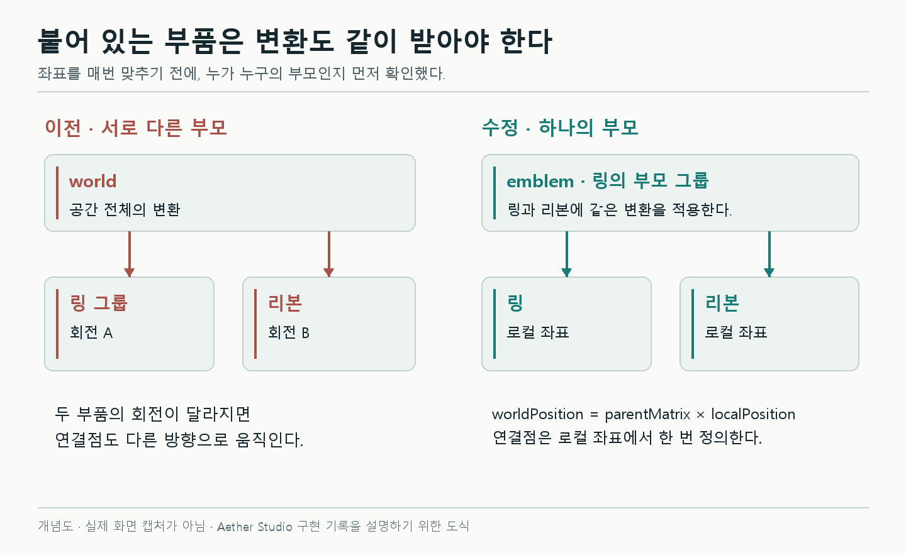
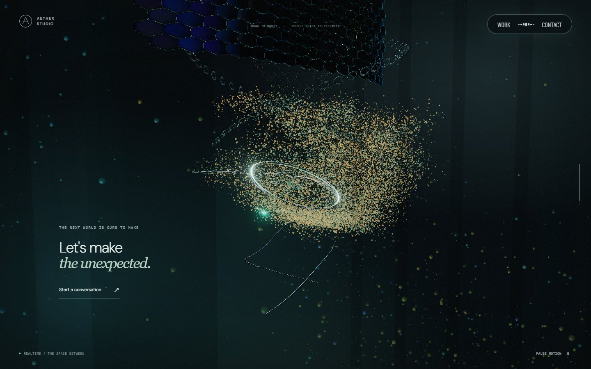
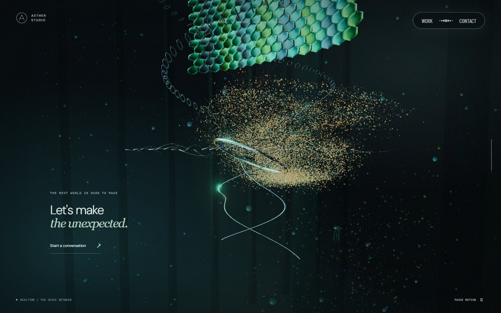

# 3D 스크롤 페이지를 만들었는데, 아래로 내려가는 느낌이 없었다

링이 본 컬럼으로 바뀌고, 다음에는 리액터가 나타났다. 장면별 캡처만 보면 순서는 맞았다. 그런데 실제로 스크롤해 보면 같은 자리에서 오브젝트를 교체하는 느낌이었다. 드래그로 시점을 바꿔도 손을 놓으면 정면으로 돌아왔고, 마지막에는 링이 뒤집혔다.

AETHER를 구현하며 확인한 카메라와 좌표 문제다. 장면을 더 추가하기 전에, 무엇이 움직이고 무엇이 제자리에 남아야 하는지부터 정리해야 했다.

이 글에서 **본 컬럼**은 관절 형태의 금속 세그먼트가 이어진 모델을 뜻한다. Three.js의 `Bone`이나 `Skeleton`으로 리깅한 모델은 아니다. 코드 생성과 수정에는 AI를 사용했으며, 아래 원인과 결과는 저장된 코드·입력 검사·실제 캡처로 확인한 범위다.

## 링과 리본이 따로 움직인 이유

처음에는 링에 붙은 리본 트레일이 미세하게 어긋났다. 링을 기울이거나 스크롤할 때 연결부가 함께 움직이지 않았다.

두 오브젝트의 부모가 달랐다.

```ts
// 당시 구조를 줄인 예시
world.add(emblem)
world.add(ribbons)

emblem.rotation.y = pointerTilt
ribbons.rotation.y = anotherMotion
```

링의 변환은 `emblem`에만 적용된다. 리본을 비슷한 수식으로 돌려도 회전 중심이나 이동량이 조금만 달라지면 연결부가 벌어진다.

수정은 좌표 보정보다 단순했다.

```ts
// 실제 수정의 핵심
emblem.add(ribbons)
```

리본의 연결점을 링의 로컬 좌표로 맞추고, 별도로 돌리던 회전도 제거했다. 이제 링의 위치·회전·크기를 바꾸면 리본이 같은 부모 변환을 받는다.



*설명용 도식. 실제 화면 캡처가 아니다. 붙어 있는 부품은 부모를 공유하고, 서로 다른 층은 월드 기준점을 유지한다.*

## 카메라는 원점을 계속 보고 있었다

링과 리본을 묶은 뒤에도 하강하는 느낌은 부족했다. 이전 카메라 경로에는 거리, 수평 각도, 수직 각도, 노출만 있었다. 카메라는 계속 같은 원점을 바라봤다.

이 상태에서 중앙 모델의 형태를 바꾸면 ‘다음 층으로 내려간다’는 정보가 없다. 주변 공간도 중심을 따라 움직이면 더 그렇다.

경로에 **중심의 월드 높이**를 추가했다. 카메라와 시선의 중심은 내려가고, 리액터 챔버와 스케일 패널은 자기 층에 남도록 했다.

```ts
// 개념을 줄인 예시: 카메라는 내려가는 중심 주위를 돈다.
focus.set(0, journey.height, 0)

camera.position.copy(focus).add(orbitOffset)
camera.lookAt(focus)
```

현재 장면에서는 리액터 중심이 `Y=-40.4`, 바닥이 `Y=-44.1`, 그 아래 스케일 패널 중심이 `Y=-48`에 있다. 이 값은 AETHER 안에서 정한 좌표다.

장면의 상위 그룹이 내려가는 경우에는 자식의 로컬 위치에서 그 이동량을 빼 준다.

```ts
// 현재 구현에서 사용하는 배치 방식
root.position.y = journey.height
space.position.y = chamberHeight - journey.height
scaleWall.position.y = scaleHeight - journey.height
```

예를 들어 root가 -30이고 자식이 -10.4이면, 자식의 월드 높이는 -40.4다. root가 더 내려가도 차이를 보정하므로 방의 위치는 유지된다.

한동안 스케일 패널은 화면 중앙에서 작아지며 링으로 바뀌었다. 이것도 같은 문제였다. 스케일 패널을 위층에 남겨 두고 카메라가 그 아래를 통과하게 바꾸자, 마지막 포레스트가 다음 공간으로 읽히기 시작했다.


*하강 동작을 수정한 당시의 실제 wheel 입력 캡처를 이어 붙인 GIF다. 현재 최종 재질과 다른 역사 화면이며, 실시간 프레임률 측정 영상은 아니다.*

## 키프레임을 늘리는 것만으로는 움직임이 매끄러워지지 않았다

경로는 24개 기준점으로 나눴다. 이때 각 구간에 독립적으로 `smoothstep`을 넣으면 기준점마다 속도가 0이 된다.

정지 사진에서는 자연스럽게 보일 수 있지만, 실제 입력에서는 가속하고 멈추는 동작이 계속 반복될 수 있다. 하강 경로를 정리하면서 이 보간 방식도 함께 바꿨다. 별도로 보고된 프레임 장애라기보다는 경로의 속도 변화를 줄이기 위한 보강이었다.

현재는 양옆 구간의 기울기를 고려하는 cubic 보간을 사용한다. 같은 방향으로 내려가는 기준점에서는 속도를 이어 가고, 방향이 바뀌는 지점에서는 기울기를 줄인다. 수평 회전값도 0~2π로 계속 잘라 넣지 않고 누적 각도로 저장한다.

기준점의 위치가 맞는지와 **기준점을 지나는 속도가 자연스러운지**는 서로 다른 검사였다.

## 드래그 해제 코드가 시점을 초기화하고 있었다

카메라가 정면으로 돌아오는 원인은 release 처리에서 바로 확인됐다.

```ts
// 이전 처리
const release = () => {
  held = false
  targetYaw = 0
  targetPitch = 0
}
```

각도를 보존하려면 해제 시 목표 각도를 바꾸면 안 된다. 현재는 드래그 시작 각도를 기준으로 이동량을 누적하고, 손을 놓은 뒤에는 남은 회전 속도만 줄인다.

```ts
// 실제 처리의 핵심
if (orbitEnabled && !held) {
  targetYaw += velocityYaw * delta
  velocityYaw *= Math.exp(-7 * delta)
}
```

수평 각도는 여러 번 드래그해 한 바퀴 이상 돌 수 있다. 수직 각도는 과도하게 뒤집히지 않도록 제한한다. 단순히 마우스를 누르는 동작에 연결되어 있던 줌도 제거했다. 기본 시점으로 돌아가는 동작은 빈 공간 더블클릭으로 분리했다.

측면으로 돌면서 포인터 흔적의 투영도 함께 고쳤다. 고정된 `z=0` 평면에 흔적을 놓으면 카메라가 옆으로 돌아갈 때 그 평면과 시선이 거의 평행해진다. 지금은 현재 중심을 지나면서 카메라를 바라보는 평면에 포인터 광선을 교차시킨다. 뒤쪽으로 돌아도 흔적이 포인터 주변에 남도록 하기 위해서다.

## 입력을 받는 조건과 카메라에 적용하는 조건이 달랐다

본 컬럼·모니터·리액터·스케일 패널 구간에서는 큰 궤도 회전을 막아야 했다. 그런데 금속 구조가 화면에 남아 있는 전환 중간에 드래그가 다시 허용됐다.

당시에는 드래그 허용 여부와 카메라에 입력을 반영하는 가중치의 경계가 달랐다. 약한 포인터 시차가 먼저 살아나는 구간도 있었다.

두 조건을 같은 `orbitWeight`에 연결했다. 입력이 잠길 때는 진행 중인 드래그와 남은 각속도를 멈춘다. 잠긴 상태에서 받은 이동량이 쌓였다가 다음 장면에서 갑자기 적용되지 않게 하는 처리다.





*1440×900에서 90% 위치에 정착한 뒤 동일한 700px 수평 드래그를 입력한 당시 전후 화면이다. 금속 구조가 남은 상태에서 시점이 바뀌는지를 비교한다. 시간에 따라 바뀌는 조명과 영상 프레임은 일치시키지 않았다.*

중간에 잠금 해제 시점도 다시 조정했다. 이전 기록은 96%까지 잠금이지만, 현재는 스케일 패널 퇴장을 맞춘 뒤 94~97.5%에서 점진적으로 입력을 돌려준다. 과거 숫자를 현재 동작으로 읽으면 안 되는 부분이다.

카메라 잠금과 포인터 효과는 별개다. 카메라를 돌릴 수 없어도 모니터 선택이나 입자·빛 반응은 유지한다.

세로 드래그 방향도 수정했다. 화면의 y는 아래쪽이 양수지만 NDC의 y는 위쪽이 양수다. 여기에 pitch를 더하는 방향까지 겹치면서 기대와 반대로 움직였다. 수직 입력의 부호만 바꿔 아래로 끌면 위쪽을, 위로 끌면 밑면을 보게 했다. 수평 회전과 중간 구간 잠금은 그대로 유지했다.

## 스크롤이 멈추면 구조도 멈춰야 했다

카메라가 내려가더라도, 정지 중 본 컬럼과 체인이 계속 흐르면 스크롤에 붙어 있는 느낌이 사라졌다.

구조 위치에 재생 시간을 섞던 부분을 절대 스크롤 위치의 함수로 바꿨다. 같은 스크롤 위치라면 같은 구조가 나온다. 아래로 갔다가 올라와도 정확히 돌아올 수 있다.

영상과 조명은 별도의 시간값을 쓴다. 따라서 본 컬럼이 정지했다고 전체 화면 픽셀이 같아야 하는 것은 아니다. 실제 검사는 본 컬럼과 체인의 인스턴스 행렬을 비교했다. 같은 위치에서 시간을 바꾸면 동일하고, 다른 위치에 갔다 돌아오면 복원되는지 확인했다.

모션 중지 버튼에도 별도 문제가 있었다. 모션 선호가 바뀌면서 장면을 재구성하면 새 카메라가 기본값에서 시작했다. yaw·pitch·경과 시간을 ref에 보존해 재생 상태를 넘겨 주고, 중지 중에는 더블클릭도 카메라를 바꾸지 않게 했다.

마지막 링의 반전은 경로 문제가 아니었다. 종료 가중치에 따라 링 전체에 Z축 180도 회전을 적용하고 있었다. 심벌의 roll은 0으로 유지하고, 위쪽으로 이어져야 하는 리본의 방향을 따로 처리했다.

## 다시 확인한 조건

실제 wheel로 내려갔다가 올라오면서 카메라와 중심의 월드 높이를 읽었다. 정지한 24개 위치뿐 아니라 이동 중 화면도 확인했다. 드래그 해제·취소·창 포커스 이탈 후 시점 유지, 중간 구간 잠금, 모션 중지·재개도 각각 검사했다.

다만 정착 후 화면이 맞는다고 전환 성능까지 해결된 것은 아니었다. 최초 모니터가 들어올 때의 긴 프레임은 이후 측정에서 별도 문제로 남았다. 카메라 경로의 불연속과 렌더링 지연을 같은 ‘끊김’으로 묶지 않고 나눠 확인해야 했다.

구현과 당시 입력 기록은 [실제 스크롤 검증](../../dynamic-motion.md), [카메라 잠금](../../mechanical-camera.md), [세로 입력 검증](../../transition-input.md)에 남겨 두었다. 핵심 코드는 [Journey.ts](../../../src/Journey.ts), [SceneInteraction.ts](../../../src/SceneInteraction.ts)에서 볼 수 있다.
