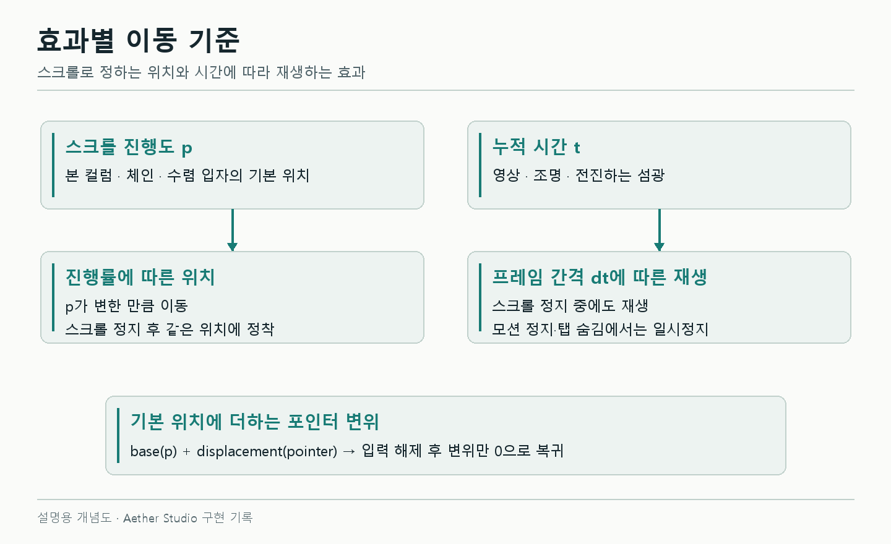

# Three.js 체인 경로와 파티클의 스크롤·포인터 반응

본 컬럼 주변의 체인은 앞뒤에 매달린 줄처럼 보였다. 스크롤을 멈춰도 입자는 계속 흘렀고, 리액터의 O 형태 입자는 멈춘 상태에서 마우스에 반응하지 않았다. 포인터를 따라 생기는 잔광은 길게 늘어난 가시 모양이었다.

각 효과가 어떤 값을 따라 움직이는지부터 확인했다. 체인은 스크롤 위치, 영상은 재생 시간, 포인터 반응은 이동 방향이 필요했다.

## 본 컬럼을 감는 체인 경로

처음에는 체인 하나를 본 컬럼 앞에, 다른 하나를 뒤에 놓았다. 옆에서 보면 감긴 형태가 되지 않았다. 각 체인의 경로가 앞과 뒤를 모두 지나도록 두 줄의 나선으로 바꿨다.

```ts
// 경로 설명용 예시
const angle = t * Math.PI * 2 * turns + strandOffset
position.set(
  Math.cos(angle) * radius,
  (t - 0.5) * height,
  Math.sin(angle) * radius,
)
```

실제 체인은 각각 약 2.15회전한다. 본의 굴곡에 따라 중심과 반지름도 바뀐다. 타원 링크의 긴 방향을 경로의 접선에 맞추고, 이웃한 링크는 90도씩 교차시켰다.


*1440×900, 스크롤 34%의 당시 화면. 모델과 체인 배치 비교이며 영상·조명 시각은 다르다.*

각 체인의 z좌표가 본 앞뒤를 모두 지나는지 검사했다. 높이순으로 링크를 따라가며 누적 회전도 확인했다. 두 체인을 나란히 세워 놓은 배치는 이 조건을 만족하지 못한다.

## 같은 스크롤 값에서 같은 위치

위치에 매 프레임 이동량을 더하면 같은 지점으로 돌아와도 처음 모습과 달라진다. 본과 체인에는 절대 스크롤 위치를 사용했다.

```ts
const t = THREE.MathUtils.euclideanModulo(
  i / linksPerStrand + progress * 3.4,
  1,
)
```

`progress`가 같으면 `t`도 같다. 경로 끝에서 처음으로 되돌아오는 링크는 크기를 줄여 갑작스러운 출현을 감췄다. 같은 값으로 120번 갱신해도 인스턴스 행렬이 유지되고, 다른 위치를 거쳐 돌아왔을 때 복원되는지 확인했다. 정지 중에는 행렬 업로드도 생략한다.

주변 입자는 이동하는 입자와 상대적으로 자리에 남는 입자로 나눴다.

```glsl
float phaseScroll = motionTime() * aAdvected;
```

`aAdvected`가 0인 입자는 스크롤에 따른 흐름을 더하지 않는다. 카메라는 내려가므로 화면에 고정되는 것은 아니다. 영상과 조명, 생성 후 날아가는 섬광은 시간값으로 재생한다.



*입력 구조도. 포인터 변형은 스크롤로 계산한 기본 위치에 더한다.*

## 멈춘 리액터의 포인터 반응

본 주변 입자가 아래로 내려가 O 모양을 만드는 흐름은 이미 있었다. 그런데 ‘스크롤 변화가 있을 때만 이동’하는 조건이 리액터의 포인터 반응에도 걸려 있었다. 스크롤을 멈추면 마우스를 움직여도 입자는 그대로였다.

본 구간의 스크롤 변위와 리액터의 포인터 변위를 분리했다. 커서와 입자의 거리는 화면에 투영된 좌표로 계산하고, 변형은 카메라 기준 좌표인 view 공간에서 적용했다. 화면비와 깊이가 바뀌어도 보이는 커서 주변이 반응하게 하려는 처리였다.

처음 조정한 반응은 너무 강했다. 입자가 같은 반경으로 밀려나면서 가운데가 빈 원이 생겼다.


*스크롤 72%, 같은 포인터 경로. 빈 영역과 O의 폭을 비교한 화면이며 조명 시각은 다르다.*

고정 반경에서 영향력을 끊던 부분을 Gaussian 감쇠로 바꿨다. 커서에서 멀어질수록 힘이 완만하게 줄어든다. 입자마다 영향 폭과 접선·깊이 방향의 반응도 조금씩 달리했다. 입력이 사라지면 추가 변위가 줄어들어 원래 O로 돌아간다.

이때 연속된 입자 필드 외에 따로 겹쳐 있던 코어도 제거했다. 같은 입자가 본 주변에서 리액터로 이어지도록 원래 씨드와 리액터 높이는 유지했다.

## 포레스트에 남는 이동 방향

초기 포레스트는 둥근 입자 덩어리처럼 보였다. 줄기·가지·고사리형 잎으로 바꾸고 월드 공간에 고정했다. 카메라가 돌면 가까운 가지와 먼 가지의 이동량이 달라지고 가림 순서도 바뀐다. 카메라에 너무 가까운 가지는 깊이에 따라 흐리게 했다.

입자에는 커서가 지나간 방향을 잠시 남겼다. 현재 커서 위치 하나만 저장하면 이전에 지나간 곳의 움직임을 유지할 수 없었다. 화면에 40×28 격자를 두고 이동 방향을 주변 셀에 기록했다. 이 값이 서서히 퍼지고 약해지면 입자는 뒤늦게 따라 움직인다.

격자는 4,480바이트의 RGBA8 텍스처로 공유한다. CPU에서 격자를 계산하고, 입자는 셰이더에서 읽는다. 별도 장면 캡처는 추가하지 않았다. 줄기와 뿌리는 고정하고 잎에는 약하게, 미세 입자에는 더 직접적으로 적용했다.

첫 접촉이나 긴 공백 뒤에는 현재 위치만 저장한다. 예전 좌표부터 선을 이으면 화면을 가로지르는 흐름이 생기기 때문이다. UI 위의 입력, 터치, 취소, 탭 숨김, 화면 이탈에서는 기록을 비운다. 전환 중 보이는 숲에는 같은 격자를 적용하고 기존 경계로 자른다.

## 가시 모양 잔광 수정

기존 잔광은 생성점에 머문 채 길이만 늘어났다. 선두가 곡선을 따라 전진하고, 뒤쪽 정점이 같은 경로의 과거 위치를 읽도록 바꿨다.

```glsl
// 선두와 잔광의 위치 관계를 줄인 예시
vec2 head = flight(age);
vec2 tail = flight(max(0.0, age - delay));
```

잔광마다 굽힘·폭·밝기를 조금씩 다르게 줬다. 두 부분은 같은 경로 함수를 사용한다. 두께는 화면 픽셀로 환산해 카메라가 내려가도 갑자기 굵어지지 않게 했다.

입력을 멈춘 뒤 선두 픽셀이 전진하는지 확인했다. 수명은 2.35초다. 1.6초 뒤에는 잔광이 남고 3초 뒤에는 사라졌다. 이후 섬광을 숲 구간에만 제한한 수정은 [7편](07-scene-continuity.md)에 정리했다.

입자의 위치 검사는 조명을 고정하고 실제로 차지하는 픽셀 영역을 비교했다. 리액터는 정지 상태에서도 입력에 반응하고, 입력을 지우면 원래 영역으로 돌아왔다. 체인의 정지·왕복은 행렬로 검사했다.

[월드 공간·입자 기록](../../living-worlds.md) · [포인터 흐름](../../particle-pointer-flow.md) · [리액터 입력](../../transition-input.md) · [SceneSpine.ts](../../../src/SceneSpine.ts) · [Atmosphere.ts](../../../src/Atmosphere.ts) · [PointerFlow.ts](../../../src/PointerFlow.ts)
