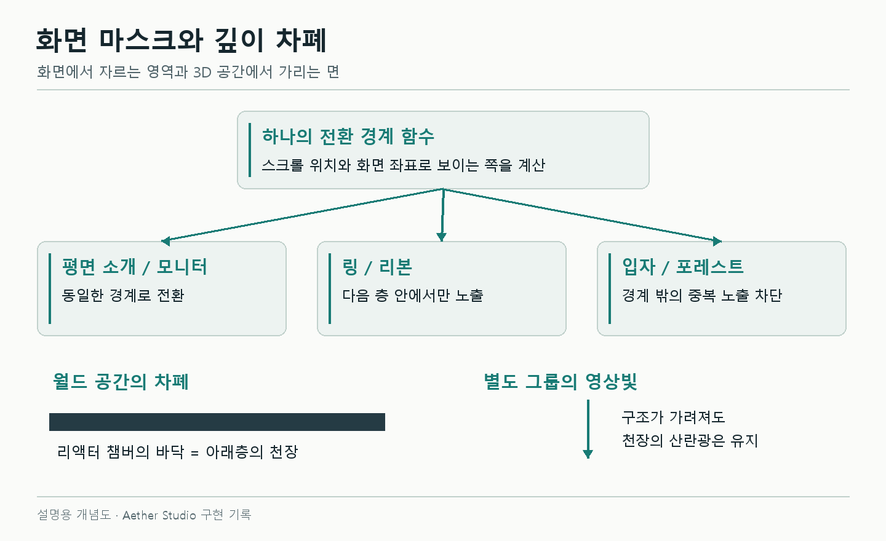

# Three.js 장면 전환의 깊이 버퍼와 화면 마스크

리액터 아래층에 스케일 패널을 배치했는데 천장 밑으로 위층의 부품과 기둥이 보였다. 마지막 숲으로 넘어갈 때는 링 일부가 먼저 나타났다. 위치를 맞춘 모델들이 전환 중에는 서로 다른 기준으로 그려지고 있었다.

공통 화면 마스크를 적용하고, 실제로 가려야 할 표면의 깊이 처리를 정리했다. 이 글은 PR #17까지의 수정 기록이다. 그 뒤 넓은 천장을 제거한 변경은 [7편](07-scene-continuity.md)에서 이어진다.

## 장면들이 공유하는 사선 경계

상단 숲에서 소개 문구로 넘어갈 때 링은 문구 앞에 남고, 아래에서는 본과 모니터가 들어와야 했다. 요소마다 등장·퇴장 시점이 달라 화면이 따로 움직였다.

스크롤 위치로 경계를 한 번 계산해 숲, 문구, 링, 본, 모니터에 전달했다. 각 표면은 화면 좌표를 구한 뒤 경계 밖의 픽셀을 버린다.

```glsl
// 화면 마스크 계산을 줄인 예시
vec2 screen = clipPosition.xy / clipPosition.w * 0.5 + 0.5;
float edge = screen.y - (screen.x - 0.5) * 0.20;

if (edge > upper || edge < lower) discard;
```

좌표를 0~1의 화면 UV로 맞추면 저해상도 캡처에서도 같은 경계를 사용할 수 있다. 실제 경계에는 작은 노이즈와 완화 구간을 넣었다. 소개 문구는 카메라를 향하는 평면에 올리고 깊이 검사를 유지해 링 뒤에 놓았다.



*구조도. 화면 마스크와 바닥·천장의 깊이 처리를 함께 사용한 당시 구성이다.*

## 투명한 기둥 뒤로 사라지는 링

희미해진 기둥이 링을 가리는 문제는 깊이 버퍼에서 생겼다. 기둥의 색은 거의 투명해도 깊이값이 남아 있으면 뒤쪽 링의 픽셀이 그려지지 않을 수 있다.

투명한 장식에는 불필요한 깊이 쓰기를 끄고, 실제 가림막 역할을 하는 천장은 깊이를 기록하게 했다. 화면 마스크 밖의 픽셀은 알파만 0으로 만들지 않고 `discard`했다. 그래야 색과 깊이가 함께 빠진다.

기존 재질의 `onBeforeCompile` 훅도 유지했다. 먼저 본 표면 효과를 적용한 뒤 마스크 코드를 붙이고, 프로그램 캐시 키에 두 효과를 반영했다.

## 천장 아래로 나온 기둥

리액터로 진입할 때 입자가 O로 모이는 과정이 너무 일찍 보였다. 당시에는 불투명한 천장과 막힌 상단 덮개를 추가하고, 수렴 입자를 리액터 진입 영역 안으로 제한했다.

아래층에서는 천장을 넓혀도 일부 기둥이 남았다. 모델 끝이 실제 바닥 아래로 튀어나와 있었다. 카메라와 돌출 부품이 모두 천장 아래에 있으니 천장이 가려 줄 수 없는 위치였다.


*PR #13, 1440×900, 스크롤 78.5%. 위층 부품의 노출을 비교한 화면이며 영상 조명 시각은 다르다.*

당시에는 카메라의 월드 높이로 아래층 진입을 판단해 리액터와 긴 지지대를 숨겼다. 돌아오면 다시 표시했다. 아래층의 배경 벽과 천장 물결빛은 남겼다. 이후 이 높이 조건이 전환 중 장치를 너무 일찍 숨기는 문제가 되어, 7편에서 화면 경계 기준으로 바뀐다.

```ts
// 당시 높이 조건을 줄인 예시
const inLowerRoom = eyeHeight <= floorHeight - 0.03

chamber.visible = deviceWeight > 0.001 && !inLowerRoom && deviceCoverage
ruins.update(inLowerRoom ? 0 : architectureWeight)
architectureBars.visible = !inLowerRoom
```

## 바닥과 덮개의 접점

리액터 받침은 바닥에서 약 0.485만큼 떠 있었다. 상단 덮개와 천장 사이에도 2.52의 간격이 있었다. 눈으로 위치를 조정하다 보니 닿아야 하는 면이 다른 값을 쓰고 있었다.

받침은 윗면을 유지한 채 아랫면을 바닥 아래까지 연장했다. 천장 높이는 덮개의 윗면에서 계산했다.

```ts
const capThickness = 0.26
const capCentreY = 3.15
const ceilingY = capCentreY + capThickness * 0.5
const ceilingThickness = 0.18
```

덮개 윗면과 천장 아랫면이 모두 3.28이 된다. 케이블 끝과 가로보도 같은 기준에 맞췄다.


*PR #16, 스크롤 67.5%, 1440×900·DPR 1. 같은 프레임 시계와 영상 2초 시점으로 촬영했다.*

접점은 모델의 월드 bounding box로 확인했다. 바닥에 굴곡이 있어 중심 높이만으로는 부족했다.

바닥을 넓힌 뒤에는 카메라가 두께 부분을 통과할 때 검은 띠가 화면을 덮었다. 위 표면, 두께, 아래쪽 천장을 분리했다. 카메라가 가까워지는 순간에는 두께를 줄여 보이게 하고 하부 천장과 빛은 유지했다. 위로 돌아가는 경로도 함께 확인했다.

## 마지막 링과 수면의 표시 범위

마지막 링·내부 O·리본에는 숲과 같은 `forestEntry` 경계를 적용했다. 숲이 열린 픽셀부터 나타나고, 아직 스케일 장면인 영역에는 그려지지 않는다.

조명은 자체 제작한 영상 텍스처를 여러 표면에서 공유한다. 월드 위치로 샘플링해 같은 순간에도 가지와 장치의 면마다 다른 색을 받는다. 부드러운 광선 면에는 깊이 검사를 적용했다.

수면은 작은 파동으로 법선과 반사 위치를 바꾼다. 비스듬히 볼수록 반사가 강해지는 Fresnel 항을 더했고, 데스크톱에서는 512×512 평면 반사 타깃을 재사용했다. 모바일·소프트웨어 렌더러에서는 장면 반사 캡처를 생략한다.

이후 영상은 어두운 사틴 반사로 교체했다. 스케일의 동심원 무늬는 타일 중심의 반지름을 쓰던 위상식을 방향성 굴곡으로 바꿔 제거했다. 겹친 나선 입자도 지웠고 포인터 주변의 들림은 남겼다.

마스크 검사는 숨긴 곳의 색과 깊이를 모두 읽었다. 표준·커스텀 셰이더, 화면비, 타깃 크기를 바꿔 경계가 맞는지 확인했다. 실제 캡처에서는 접점과 앞뒤 순서를 확인했다. 추가한 설비의 렌더링 비용은 [성능 기록](05-performance.md)에 따로 남겼다.

[공간 전환](../../spatial-transitions.md) · [차폐·영상빛](../../scene-occlusion-light.md) · [챔버 접점](../../chamber-art-direction.md) · [SceneCurtains.ts](../../../src/SceneCurtains.ts) · [SceneWorlds.ts](../../../src/SceneWorlds.ts) · [SceneWater.ts](../../../src/SceneWater.ts)
