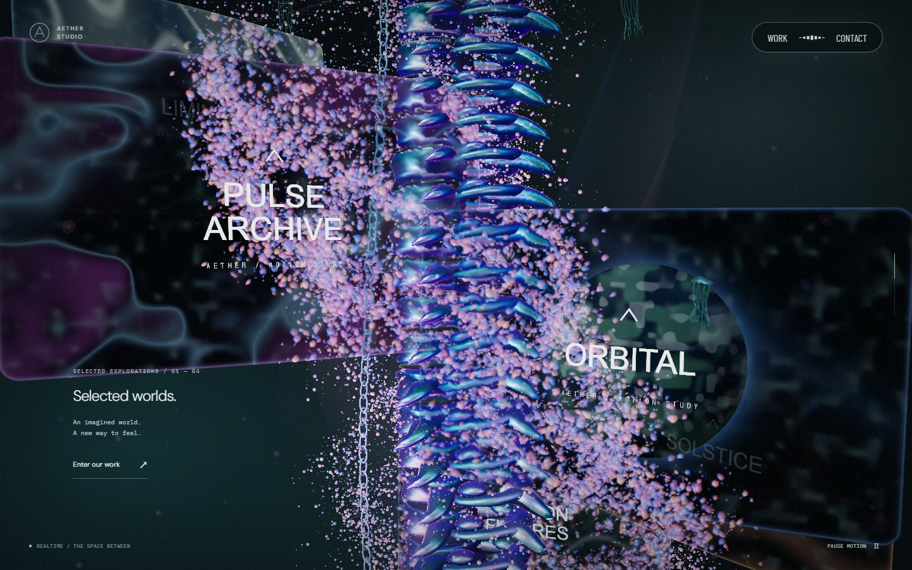
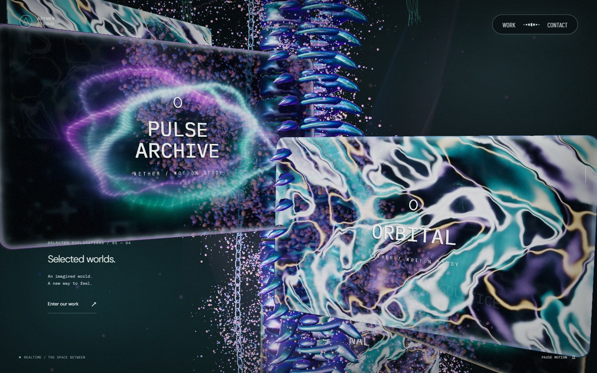
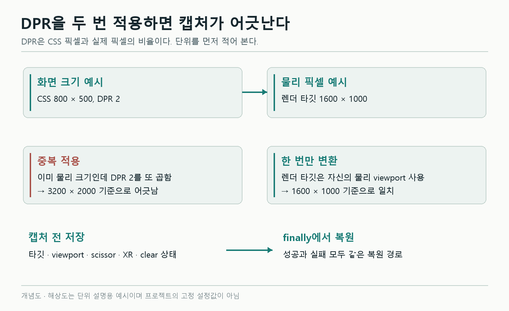
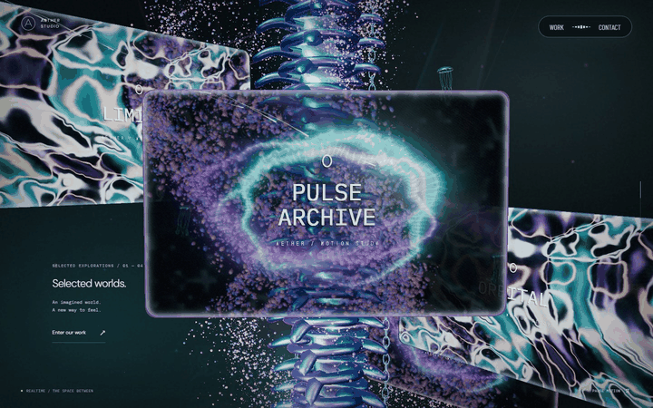

# 유리 모니터에 영상을 넣으면서 생긴 문제들

Aether의 본 컬럼 구간에는 유리 모니터 여섯 장이 있다. 판 위에서는 영상이 재생되고, 유리 너머로는 본 컬럼과 입자가 굴절되어 보인다. 스크롤을 멈추면 판의 위치는 멈추지만 영상은 계속 움직인다.

단순히 `VideoTexture`를 연결하는 데서 끝나지 않았다. 고해상도에서 굴절 화면의 크기가 어긋났고, 화면을 떠났다가 돌아오는 동안 영상과 GPU 자원의 수명을 따로 관리해야 했다. 색 공간 처리에서는 리뷰에서 제기한 의심이 실제로 맞는지부터 확인할 필요가 있었다.

| 영상 모니터 적용 전 | 적용 후 |
| --- | --- |
|  |  |

*Aether의 실제 화면이다. 1440×900, DPR 1, 스크롤 40%, 기본 카메라에서 비교했다. 여러 재질·영상 변경을 포함하며 영상과 조명의 시간은 고정하지 않았다. 아래 DPR 문제 하나의 전후 사진은 아니다.*

## 1. 굴절용 화면은 이미 물리 픽셀이었다

유리 뒤의 장면을 별도 `RenderTarget`에 그린 뒤 모니터 셰이더에서 읽는다. `RenderTarget`은 화면 대신 그림을 저장하는 GPU 버퍼라고 보면 된다. 여섯 판이 같은 배경을 공유하므로 판마다 장면 전체를 캡처할 필요는 없다.

검수 중 고해상도에서 이 배경 캡처에 DPR이 중복 적용되는 문제가 발견됐다. 캡처 크기를 계산한 값과 실제 WebGL viewport가 같은지 따로 확인해야 했던 이유다.

`getDrawingBufferSize()`는 CSS 크기가 아닌 **물리 픽셀 크기**를 반환한다. 이 값으로 타깃을 만든 뒤 `setViewport()`에 같은 크기를 다시 넣으면 canvas DPR이 한 번 더 적용될 수 있다.



*개념 도해. 캡처 크기를 계산할 때 적용한 DPR과 renderer가 viewport에 적용하는 DPR을 구분한다.*

현재 코드는 물리 크기로 타깃을 정한 다음 타깃 자체의 viewport를 사용한다. 아래는 크기 선택과 렌더링 부분만 줄인 예시다.

```ts
renderer.getDrawingBufferSize(drawingSize)

const width = Math.max(1, Math.min(720, Math.floor(drawingSize.x)))
const height = Math.max(
  1,
  Math.round(width * drawingSize.y / Math.max(1, drawingSize.x)),
)

target.setSize(width, height)
renderer.setRenderTarget(target)
// 이 뒤에 물리 픽셀 크기로 setViewport()를 다시 호출하지 않는다.
renderer.render(scene, camera)
```

테스트도 “계산 결과가 720×540인가”에서 끝내지 않았다. DPR 1.5와 2에서 **실제 draw가 실행되는 순간의 `gl.VIEWPORT`**를 읽어 `[0, 0, 720, 540]`인지 확인했다. 계산식만 검사했다면 renderer 안에서 다시 적용되는 배율은 놓칠 수 있다.

## 2. 캡처가 실패해도 원래 화면은 복구되어야 했다

굴절 배경을 캡처할 때는 모니터를 잠시 숨긴다. 자신의 화면이 배경에 다시 들어가는 것을 막기 위해서다. 캡처 중에는 render target, `autoClear`, XR 상태도 달라진다.

여기서 렌더링이 실패한 채 함수가 끝나면 다음 화면까지 잘못된 타깃에 그리거나, 모니터가 계속 숨겨진 상태로 남을 수 있다. 이 부분은 실패를 의도적으로 발생시키는 테스트로 검증했다.

처리 구조를 간단히 나타내면 다음과 같다.

```ts
// 개념 예시: 실제 구현은 cube face, mip level, XR 상태도 보존한다.
const previousTarget = renderer.getRenderTarget()
const previousVisible = monitors.visible

try {
  monitors.visible = false
  renderer.setRenderTarget(backgroundTarget)
  renderer.render(scene, camera)
} finally {
  monitors.visible = previousVisible
  renderer.setRenderTarget(previousTarget)
}
```

예외가 나면 이전 굴절 이미지를 계속 쓰지 않고 절차적 유리 표현으로 돌아간다. 같은 실패를 매 프레임 반복하지 않도록 캡처 실패 상태도 남긴다. 테스트에서는 정상 캡처 이후 실패를 주입해 상태가 복구되는지, 오래된 배경이 해제되는지, 실패한 캡처를 다시 시도하지 않는지 확인했다.

장면이 겹칠 때는 또 다른 중복이 있었다. **모니터의 굴절 배경을 그리는 중에 수면 반사가 전체 장면을 다시 그리는 경로**다. 캡처 중에만 수면 반사를 제외하고 끝나면 되돌렸다. 주 화면의 물 반사는 유지된다. 이 비용과 가시성 판정은 [첫 전환 성능 분석](05-performance.md)에서 이어서 다룬다.

## 3. 모니터 여섯 장에 디코더 여섯 개가 필요하지는 않았다

두 종류의 영상이 반복해서 배치되므로 미디어 요소와 `VideoTexture`도 두 개만 만들었다. 여섯 판은 이 텍스처를 공유한다.

영상은 모니터 구간이 처음 열릴 때 로드한다. 초기 `preload`는 `none`이고, 첫 진입 전에는 `src`를 연결하지 않는다. 모션 감소 상태에서 처음 접속해도 영상을 내려받지 않는다.

판의 위치와 영상의 재생 시간은 기준이 다르다.

- 판·본 컬럼·체인의 위치는 스크롤을 따른다.
- 영상은 스크롤이 멈춰도 재생을 이어간다.
- 모션 정지, 다른 화면, 상세 dialog, 숨긴 탭에서는 영상을 멈춘다.
- 같은 구간으로 돌아오면 같은 미디어 객체와 재생 위치에서 이어간다.



*실제 화면의 시간 변화를 묶은 GIF다. 앱의 재생 FPS나 디코더 처리량을 측정한 자료는 아니다.*

GPU 장면을 다시 만드는 것과 미디어를 버리는 것도 분리했다. 모션 설정 변경으로 장면이 재구성될 때마다 영상을 0초로 돌릴 이유는 없기 때문이다. 실제 화면이 끝나는 시점에 이벤트, 텍스처, 미디어 URL을 해제한다.

## 4. `play()`가 끝날 때 이미 다른 화면일 수 있다

`video.play()`는 Promise를 반환한다. 호출한 뒤 사용자가 구간을 떠나거나, 다시 들어오거나, 페이지를 종료할 수 있다.

늦게 도착한 이전 결과가 숨긴 영상을 켜는 것도 문제지만, 오래된 결과가 **새로운 정상 재생을 멈추는 것**도 문제다. 그래서 각 재생 시도에 번호를 붙였다.

```ts
// 실제 SceneVideo.ts의 재생 완료 처리에서 핵심 부분을 발췌했다.
const currentAttempt = ++attempt

void video.play().then(() => {
  if (disposed || !active) {
    video.pause()
    return
  }
  if (currentAttempt !== attempt || failed()) return
  loaded()
})
```

위 코드는 완료 경로만 보여준다. 실제 구현은 거부 경로도 처리한다. 다운로드·디코딩 오류나 자동 재생 차단이 발생하면 절차적 영상 셰이더를 남기고, 같은 미디어 소유자의 수명 동안 자동 재시도하지 않는다.

이 수명 문제들은 모두 운영에서 재현된 사고 목록은 아니다. 비동기 재생을 붙이면서 처리한 위험을 실패 주입으로 확인한 항목이다. `NotAllowedError`, 영상 요청 실패, 빠른 이탈·복귀, 해제 후 늦은 완료를 따로 검사했다. 조명 영상의 수명 테스트 중 일부는 DOM 모의 객체를 쓰므로 실제 브라우저 디코더 검증과도 구분한다.

실제 브라우저에서는 다음을 확인했다.

- 정지 후 350ms 동안 재생 시간이 그대로인지 확인했다.
- 복귀 전후 미디어 객체·소스·로드 횟수가 같은지 확인했다.
- 재생을 다시 요청한 시점이 정지 직전의 영상 시간과 같은지 확인했다.
- 실패 후 반복 활성화에도 요청이 늘거나 처리되지 않은 Promise 오류가 나오지 않는지 확인했다.

## 5. 파일이 재생된다는 것과 같은 품질이라는 것은 달랐다

첫 모니터 진입 지연을 분석한 뒤, 지원하는 환경에서는 VP8 WebM을 선택하도록 바꿨다. 지원 조회가 실패하거나 VP8을 지원하지 않으면 기존 H.264 MP4를 고른다. 선택한 형식 하나만 내려받으며 WebM 실패 뒤 MP4를 연속 요청하지 않는다.

영상의 해상도와 프레임률을 낮춰 얻은 결과는 아니다. 두 형식 모두 640×400, 24fps, 10초, 무음이다. 다만 손실 재인코딩이므로 같은 내용이라고 해서 바이트나 화질이 완전히 같지는 않다.

| 항목 | 결과 |
| --- | ---: |
| 기존 MP4 두 편 합계 | 2,101,778 bytes |
| 채택한 VP8 두 편 합계 | 2,070,979 bytes |
| 크롬 영상 원본 대비 SSIM | 0.977189 |
| 오로라 영상 원본 대비 SSIM | 0.984363 |

SSIM은 두 영상의 구조적 차이를 비교하는 지표다. 숫자가 높다고 최종 3D 화면의 인상이 같다고 보장하지는 않는다. 두 파일의 480프레임을 끝까지 디코딩해 규격과 오류를 확인하고, 실제 모니터의 굴절·반사와 합쳐진 모습은 화면에서 별도로 확인했다.

영상은 자체 수식으로 생성해 저장소의 `public/media/`에 둔다. 이 크기에서는 별도 영상 클라우드를 추가하지 않고 사이트와 같은 CDN으로 제공했다. 생성 스크립트와 manifest에 규격·원본/결과 해시를 남겨 교체 후에도 어느 파일을 검증했는지 확인할 수 있게 했다.

## 6. sRGB 이중 변환이라는 의심은 픽셀로 확인했다

공유 조명 영상에는 다음 설정이 있다.

```ts
film.colorSpace = THREE.SRGBColorSpace
```

리뷰에서는 이 설정이 있는데 커스텀 셰이더에서 sRGB를 linear로 다시 바꾸면 이중 변환일 수 있다는 의심이 나왔다. 코드를 바로 지우기 전에 설치된 Three.js의 실제 업로드 경로를 확인했다.

검사한 Three r186에서 `VideoTexture`는 `RGBA8`로 업로드됐다. Three의 기본 `map` 재질은 셰이더에서 한 번 변환하지만, 직접 만든 `uLightFilm` 샘플러에는 그 처리가 자동으로 붙지 않았다. 따라서 이 커스텀 경로에는 명시적 변환이 필요했다.

실제 MP4를 2.52초와 6.72초에 정지하고 두 경로의 픽셀을 비교했다.

| 비교 | 결과 |
| --- | --- |
| 명시적 변환을 둔 조명 셰이더 ↔ Three 기본 map | 두 프레임 모두 평균·최대 RGB 오차 0 |
| 명시적 변환을 제거한 대조군 | 중간톤이 평균 약 57~59/255 더 밝음 |
| 확인한 영상 업로드 내부 형식 | `RGBA8`, `SRGB8_ALPHA8` 업로드 없음 |

결과적으로 변환 코드를 유지하고 실제 영상 검증을 추가했다. 이 검사는 SwiftShader에서 수행했으며, 다른 Three 버전과 브라우저에서도 업로드 방식이 같다고 단정하지 않는다.

화면의 색이 이상할 때 `colorSpace` 설정 이름만 보고 판단하기보다, **업로드 형식 → 샘플링 → 색 변환 → 최종 출력** 중 어디에서 변환되는지 확인할 근거가 생겼다.

## 확인하지 못한 범위

실제 Safari/iOS의 코덱 선택, 백그라운드 복귀, 발열과 장시간 메모리는 아직 별도 검증이 필요하다. 모바일 에뮬레이션과 지원 조회를 조작한 테스트가 실기기 결과를 대신하지는 않는다.

로컬 문서에는 [모니터 구현과 입력 검증](../../monitor-cinema.md), [굴절 RT 검증](../../spine-monitors.md), [영상 생성·해시·전체 디코딩](../../media-sources.md), [실제 색 공간 측정](../../performance/video-color-v13.json)을 남겼다. 관련 구현은 `SceneMonitors.ts`, `SceneVideo.ts`, `SceneLightVideo.ts`, `SceneLighting.ts`에서 확인할 수 있다.
