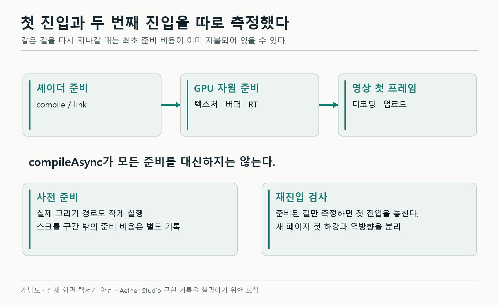
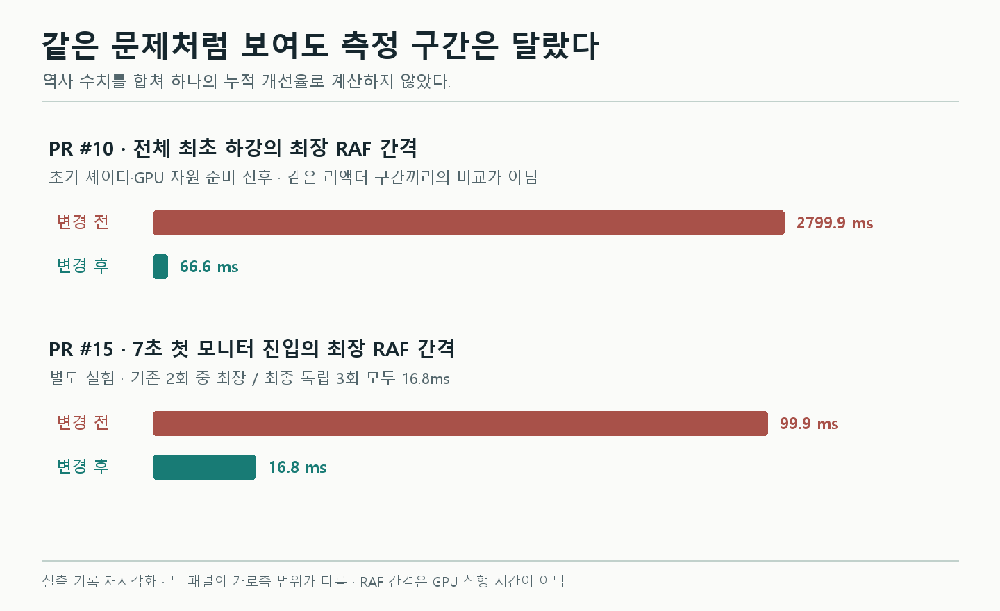
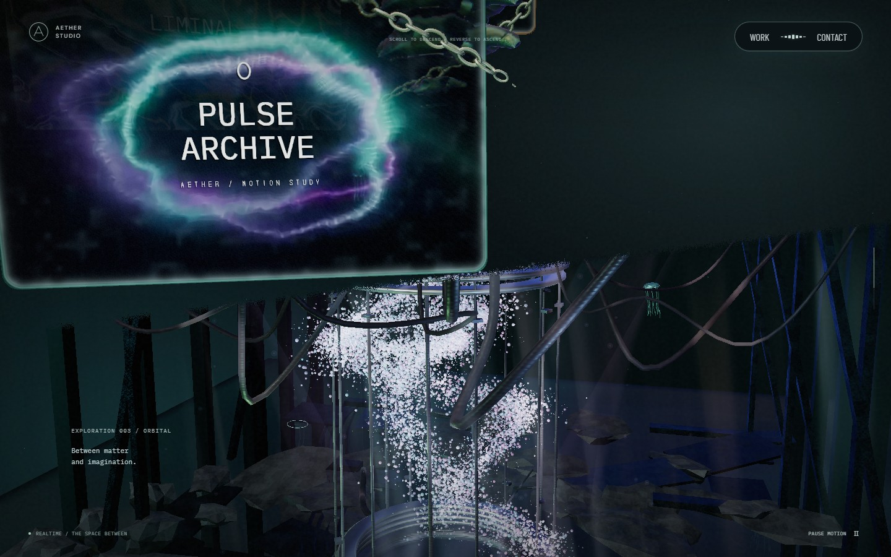

# 첫 스크롤에서만 멈추던 3D 페이지: 셰이더와 영상 경로를 나눠 확인하기

페이지를 처음 아래로 스크롤하면 특정 전환에서 길게 멈췄다. 같은 페이지를 다시 올릴 때는 비교적 부드러웠다. 정착한 장면에서 측정한 프레임 간격은 약 16.7ms였는데, 실제로 이동하면 리액터 진입에서 약 2.8초가 비었다.

결과적으로 한 가지 원인으로 끝나지 않았다. 먼저 숨은 장면의 셰이더와 GPU 자원을 준비했고, 그 뒤에도 남은 첫 모니터 지연은 영상 초기화 경로를 따로 비교했다. 마지막에는 보이지 않는 굴절·수면 반사 패스를 줄였다.

## 1. 같은 장면을 두 번째 볼 때는 왜 달랐을까

첫 비교는 로컬 production 빌드의 Chromium/ANGLE D3D11, 1440×900, DPR 1에서 진행했다. 장면 준비 후 1초를 기다리고, RAF마다 스크롤 위치를 바꿔 19초 동안 0→99%를 내려갔다. 800ms 뒤에는 같은 페이지에서 19초 동안 다시 올라왔다.

자연스러운 휠 조작 검수와는 별개의 통제된 측정이다. 콜백 사이의 RAF 간격, longtask, 셰이더 컴파일·링크 호출을 함께 기록했다.

| 수정 전 | 첫 하강 | 같은 페이지의 상승 |
| --- | ---: | ---: |
| RAF 간격 중앙값 | 16.7ms | 16.7ms |
| RAF 간격 p95 | 16.7ms | 16.7ms |
| 최장 RAF 간격 | 2799.9ms | 16.8ms |
| 33.5ms 초과 | 8회 | 0회 |
| 전환 중 셰이더 컴파일 / 링크 | 66 / 33회 | 0 / 0회 |

p95만 보면 문제가 없는 것처럼 보인다. 하지만 일부 전환에서만 발생한 긴 멈춤은 전체 표본의 상위 5%보다 훨씬 적었다. 그래서 이 경우에는 중앙값·p95와 함께 **최대 간격, 긴 프레임 수, 최초 진입 위치**를 봐야 했다.



*개념 도해. 여기서 첫 진입과 재진입은 같은 페이지에서 아직 쓰지 않은 경로와 이미 사용한 경로를 구분한다. OS·드라이버의 모든 캐시를 비운 실험이라는 뜻은 아니다.*

## 2. 숨긴 광원이 셰이더 구성을 바꿨다

리액터 광원이 숨긴 그룹 아래에 있었다. 리액터가 등장하면 렌더러가 보는 광원 개수가 달라진다. 여러 머테리얼은 이 광원 구성에 맞는 셰이더 프로그램을 새로 준비해야 했다.

광원을 장면에 계속 두고 강도만 리액터 노출량에 따라 바꾸도록 수정했다. 보이는 밝기·색·등장 시점을 유지하면서 렌더러가 사용하는 광원 구성을 고정한 것이다.

숨긴 장면도 초기 준비에 포함했다. 이때 `compileAsync()` 한 번으로 모든 준비가 끝나지는 않았다.

- 직접 canvas에 그릴 때와 bloom·굴절의 linear half-float 타깃에 그릴 때는 프로그램 변형이 다를 수 있다. 두 출력 경로를 준비했다.
- 컴파일 뒤에도 첫 uniform 조회와 geometry 업로드가 남는다. 작은 2×2 타깃에 실제로 한 번 그렸다.
- 정적 캔버스 텍스처는 `initTexture()`, 굴절·반사 타깃은 `initRenderTarget()`으로 준비했다.

영상까지 모두 미리 로드한 것은 아니다. 정적 텍스처만 준비하고 `VideoTexture`는 제외해 기존 지연 로드를 유지했다.

준비 과정의 순서를 줄이면 다음과 같다.

```text
CSS 대체 화면 표시
  → 정적 텍스처 업로드
  → linear 타깃 경로 compileAsync
  → 2×2 타깃에 숨은 geometry 첫 렌더
  → canvas 출력 경로 compileAsync
  → 준비 완료 후 장면 표시
```

이 작은 렌더를 위해 잠시 바꾼 visibility, frustum culling, 반사 콜백, render target은 `finally`에서 되돌린다. 비동기 준비 중에 화면이 해제되거나 WebGL context를 잃는 경우도 있으므로 세대 번호와 취소 조건을 확인한다. 오래된 준비 완료가 이미 종료된 장면을 다시 실행하면 안 된다.

이 부분은 renderer 모의 테스트로 취소, 컴파일 실패, 첫 렌더 실패, 상태 복구를 검사했다. 실제 GL에서의 비용은 별도 스크롤 측정으로 확인했다.

## 3. 2.8초 멈춤은 줄었지만 한 프레임이 남았다

첫 전환 준비를 바꾼 뒤 같은 조건에서 측정했다.

| 최초 하강 | 수정 전 | 수정 후 |
| --- | ---: | ---: |
| 최장 RAF 간격 | 2799.9ms | 66.6ms |
| 33.5ms 초과 | 8회 | 1회 |
| 전환 중 컴파일 / 링크 | 66 / 33회 | 0 / 0회 |
| 최소 품질 계수 | 0.85 | 1.00 |

2799.9→66.6ms는 **전체 하강의 최댓값**이다. 리액터·하단 포레스트의 대응 구간은 최대 16.8ms가 되었고, 남은 66.6ms는 첫 모니터 진입에 있었다.

작업을 초기 화면 앞으로 옮겼다는 비용도 남는다. 수정 후 `ready`는 탐색 시작 후 3675.9ms였지만 수정 전의 동등한 준비 시각은 없었다. 이 결과를 초기 로딩이 빨라졌다고 표현할 수는 없다.

이후 공유 조명 영상을 추가하면서 첫 모니터에서 약 83ms의 긴 간격이 다시 기록됐다. 검은 대체 텍스처로 영상 샘플링 분기까지 준비해도 이 프레임은 남았다. 셰이더 컴파일과 longtask가 잡히지 않았다고 해서 바로 “GPU 문제”나 “영상 문제”로 확정할 수는 없었다.

## 4. 영상 요청과 디코딩 경로를 하나씩 바꿨다

다음 진단은 첫 모니터만 더 좁게 봤다. RTX 2060 SUPER, Chromium/ANGLE D3D11, 1440×900, DPR 1의 로컬 production 환경이다. HTTP 캐시를 끄고 새 브라우저에서 준비 후 1초를 기다렸다. 7초 동안 스크롤을 0→36.5%로 진행했으며 조건별로 두 번 반복했다.

한 번에 GPU 브라우저 하나만 실행했다. 최종 비교 중 lint가 겹친 기록은 대표값에서 제외하고 따로 측정했다.

| 진단 조건 | 최대 RAF 간격 1회 / 2회 |
| --- | ---: |
| 기존 H.264 모니터 두 편 | 99.9 / 83.3ms |
| 모니터 영상 요청 차단 | 16.8 / 16.8ms |
| 조명 영상 요청만 차단 | 66.7 / 49.9ms |
| 모니터 첫 데이터 수신 후 일시정지 | 83.4 / 66.7ms |
| 모니터 한 편만 허용 | 50.0 / 50.0ms |
| 같은 내용의 VP9 응답 | 50.0 / 116.7ms |
| 같은 내용의 VP8 응답 | 16.8 / 16.8ms |
| 영상 가속 디코딩 비활성 | 16.8 / 16.8ms |

모니터 요청을 막으면 긴 간격이 사라졌다. 첫 데이터가 온 뒤 재생만 멈추면 지연이 남았다. 지속적인 영상 재생보다 **첫 로드·디코더 준비 범주**를 더 살펴볼 이유가 생겼다.

VP9은 반복 편차가 커 최종안으로 고르지 않았다. 브라우저 가속을 끄는 플래그도 진단에만 사용했다. 방문자에게 플래그 변경을 요구하는 해결책은 아니었다.

720×450 타깃의 draw를 생략하는 실험도 했지만 긴 간격은 83.3/66.7ms로 남았다. 이 크기는 굴절과 bloom 일부가 겹치므로 “굴절만 제거한 실험”이라고 해석하지 않았다.

### JS와 GPU 쿼리는 짧은데 화면은 왜 100ms를 비웠을까

기존 H.264 두 실행에서 JS RAF 콜백 최댓값은 3.9/2.8ms, 유효한 WebGL GPU 쿼리 최댓값은 약 6.95/6.49ms였다. 이것만 더해서 화면의 전체 프레임 시간을 설명할 수는 없다.

RAF 간격에는 callback 바깥에서의 브라우저 스케줄링·네이티브 미디어 처리·합성 대기가 영향을 줄 수 있다. WebGL timer query도 해당 WebGL context의 명령을 감쌀 뿐 영상 디코더와 합성기의 전체 GPU 작업을 재는 것은 아니다.

CDP Media 기록에서는 기존 H.264 모니터가 `D3D11VideoDecoder`, VP8은 `VpxVideoDecoder`를 사용했다. 가속을 끈 H.264는 `FFmpegVideoDecoder`였다. 같은 H.264여도 작은 조명 영상은 이 환경에서 `FFmpegVideoDecoder`로 처리됐다.

추가 trace에서 디코더의 GPU 자원 준비와 디코드 span은 각각 약 31ms였다. 두 구간은 거의 겹쳐 있어 더하면 안 된다. 영상 첫 데이터·첫 프레임 시각과 긴 RAF 간격이 겹친다는 사실까지는 확인했지만, 네이티브 단계 하나가 전체 지연의 몇 %를 만들었다고 확정하지 않았다.

## 5. 같은 규격의 VP8을 선택한 뒤 다시 측정했다

최종적으로 두 영상을 같은 640×400·24fps·10초 규격의 VP8로 재인코딩했다. 지원하면 WebM, 미지원이면 기존 MP4를 첫 진입 때 선택한다. 실패하면 절차적 영상으로 돌아간다. 지원 형식 선택과 화질 검증은 [영상 모니터 글](04-monitors.md)에 정리했다.

최종 구현에는 다음 절의 가시성 개선도 함께 들어갔다. 따라서 최종 전후 결과 전체를 코덱 하나만 바꾼 실험으로 볼 수는 없다. 위 조건별 실험이 디코딩 경로를 별도로 분리한 근거다.

| 측정 | 기존 | 최종 |
| --- | --- | --- |
| 첫 진입 7초 | 2회 최대 99.9 / 83.3ms | 독립 3회 모두 최대 16.8ms |
| 전체 하강 19초 | 2회 최대 66.6 / 83.3ms | 2회 모두 최대 16.8ms |
| 전체 상승 19초 | 2회 모두 최대 16.8ms | 2회 모두 최대 16.8ms |

최종 독립 첫 진입은 총 1260개의 RAF 간격이며 33.5ms 초과는 없었다. 측정한 스크롤 구간 안에서 품질 계수는 1.00, longtask·셰이더 컴파일·링크와 브라우저 오류는 0이었다. 초기 로딩 구간 전체에 longtask가 없었다는 뜻은 아니다.



*측정 기록 기반 차트. 첫 GPU 준비 개선과 이후 영상 진입 진단은 빌드·구간·측정 횟수가 다른 실험이다. 두 결과를 이어 붙여 누적 개선율을 계산하지 않는다.*

## 6. 경계 뒤의 굴절·반사는 그리지 않아도 됐다

모니터와 리액터가 겹치는 순간에는 주 화면 외에도 굴절 배경과 물 반사를 그린다. 사선 전환 경계가 완전히 닫혀도 이 작업을 계속하면, 최종 화면에 기여하지 않는 draw가 남는다.

| 겹침 구간 변경 전 | 변경 후 |
| --- | --- |
|  |  |

*실제 production 화면. 1440×900, DPR 1, 스크롤 65%, 기본 카메라·포인터 입력 없음. 논리 시계 270프레임을 진행하고 영상을 2초에 정지해 위상을 맞췄다. 같은 화면을 유지하는지 보는 자료이며 FPS 측정 자료가 아니다.*

완전히 닫힌 경계에서는 그룹을 숨겼다. 일부만 열린 경우에는 판과 테두리의 투영 범위를 확인해 화면에 기여할 수 있을 때만 굴절 배경을 캡처한다. 첫 등장, 재진입, 타깃 재준비에서는 격프레임 갱신 주기와 무관하게 바로 캡처한다. 그렇지 않으면 다시 들어온 첫 프레임에 예전 배경이 보일 수 있다.

여기서 “주 카메라에 안 보이면 물체를 숨긴다”로 끝내면 안 됐다. 주 카메라 밖의 모니터가 물 반사에는 보일 수 있기 때문이다.

### 절두체 컬링과 장면 경계의 가시성은 다른 판단이다

절두체 컬링은 카메라의 시야 범위와 물체의 경계를 비교한다. Aether의 사선 wrapper는 화면의 일부를 덮는 별도 조건이다. 물 반사까지 있으면 **어느 카메라의 렌더 패스를 판단하는지**도 구분해야 한다.

그래서 전체 물체를 주 카메라 기준으로 없애지 않고, 해당 캡처의 필요 여부를 골랐다. 물 반사는 실제 패스에 전달된 카메라로 판정한다. 다음은 그 부분의 실제 코드다.

```ts
surface.onBeforeRender = function (...args) {
  visibility.begin(args[2])
  if (!visibility.intersects(surface, upper, lower)) return
  reflect.apply(this, args)
}
```

근접면을 가로질러 투영 좌표가 불확실하면 렌더를 유지한다. 거짓으로 “보인다”고 판단하면 비용이 조금 남지만, 거짓으로 “안 보인다”고 판단하면 화면 일부가 사라지기 때문이다. 테스트에서는 주 카메라 밖·간접 반사·절두체 재진입·다른 카메라에서 보이는 수면을 구분했다.

이것은 Aether에서 추가한 가시성 최적화와 회귀 방어다. 과거 별도 프로젝트의 절두체 컬링 사고를 이번 프로젝트에서 다시 겪었다는 기록은 아니다. `frustumCulled = false`가 코드에 있다는 사실만으로 특정 소실 버그가 있었다고 추정하지 않았다.

## 7. draw는 줄었지만 GPU 시간은 같은 방향으로 움직이지 않았다

요청 스크롤 59~69% 구간에서 draw가 있는 RAF 콜백만 골라 두 반복을 합쳤다. GPU 값은 같은 콜백에 대응하는 유효한 쿼리만 사용했다.

| 방향 | 렌더당 평균 draw 전→후 | CPU p95 전→후 | GPU p95 전→후 |
| --- | ---: | ---: | ---: |
| 하강 | 152.71 → 133.83 | 3.8 → 3.9ms | 7.31 → 7.96ms |
| 상승 | 165.45 → 142.55 | 3.5 → 3.7ms | 6.46 → 5.71ms |

전체 렌더의 평균 GL 호출은 약 4% 줄었다. 하지만 하강 겹침 구간의 최대 217 draw는 남았고, GPU p95는 하강에서 오히려 올라갔다. 보이는 모니터·리액터·물 반사가 동시에 필요한 순간은 계속 그렸기 때문이다. **호출 수 감소를 GPU 시간이나 FPS 개선율로 바꿔 말할 수는 없었다.**

이후 리액터 챔버의 설비를 보강한 최신 표본에서는 하강 최대 draw가 217→226으로 늘었다. 한 번의 왕복에서 RAF 최대는 전후 16.8ms였지만 GPU p95는 하강 4.35→3.92ms, 상승 4.41→4.68ms로 일관되게 줄지 않았다. 이전의 217을 현재 부하 상한으로 남겨두면 안 되는 이유다.

## 측정을 다시 할 때 남겨야 할 정보

이번 분석에서 다음 구분은 결과 해석에 직접 영향을 줬다.

- **요청 스크롤과 렌더 진행률:** 관성 보간 때문에 다를 수 있다. 긴 프레임이 끝날 때 요청 위치만 보면 문제가 난 장면을 잘못 짚을 수 있다.
- **RAF 간격과 콜백 CPU·WebGL GPU:** 서로 다른 범위다. 짧은 GPU query로 전체 브라우저 파이프라인이 가볍다고 판단하지 않는다.
- **실제 draw와 진단용 표시 값:** 화면 telemetry는 15렌더마다 갱신되므로 모든 프레임의 비용 집계에 쓰지 않았다.
- **정지 캡처와 실시간 측정:** 전후 영상 위상을 맞춘 사진은 화질 검수용이다. 고정 간격으로 만든 GIF도 실제 FPS가 아니다.
- **반복과 실행 환경:** 새 브라우저·캐시 설정·GPU·DPR·방향·횟수를 함께 기록한다. 서로 다른 단계의 역사 숫자를 한 실험으로 합치지 않는다.

현재 가장 필요한 후속 확인은 실제 Safari/iOS와 저사양 기기다. 이 글의 최종 16.8ms는 특정 데스크톱의 반복 관측이며 모든 기기의 상한이 아니다. 장시간 발열·메모리와 겹침 구간의 최대 GPU 부하도 남아 있다.

원자료는 [첫 전환 준비](../../transition-performance.md), [영상 초기화와 조건별 실험](../../monitor-transition-performance.md), [GPU 쿼리·표본 매칭 방법](../../evidence/monitor-performance-method.md), [최신 챔버 비용](../../chamber-art-direction.md)에 보관했다. 관련 변경은 `da14095`, `cdb7bc3`, `6da8426`이며, 원시 trace가 없는 환경에서는 보관된 해시만으로 원자료를 복원할 수 없다.
