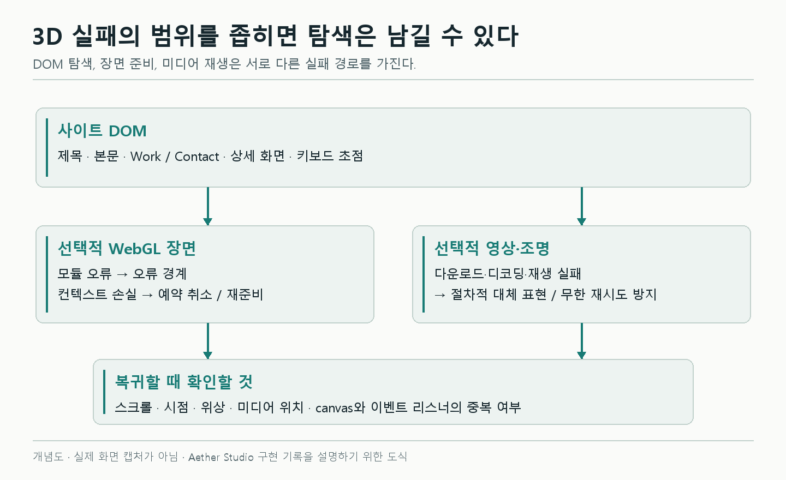
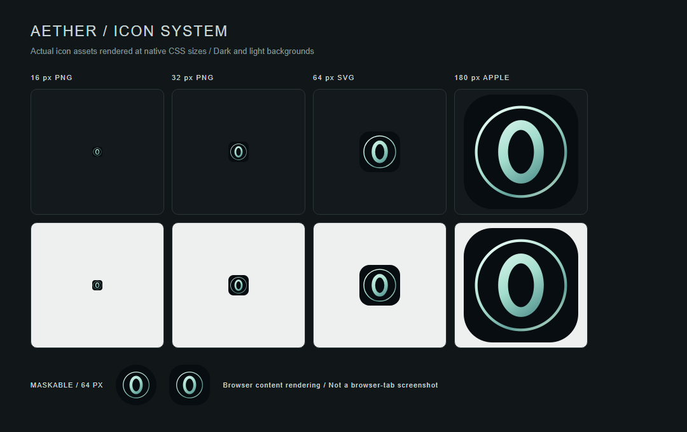
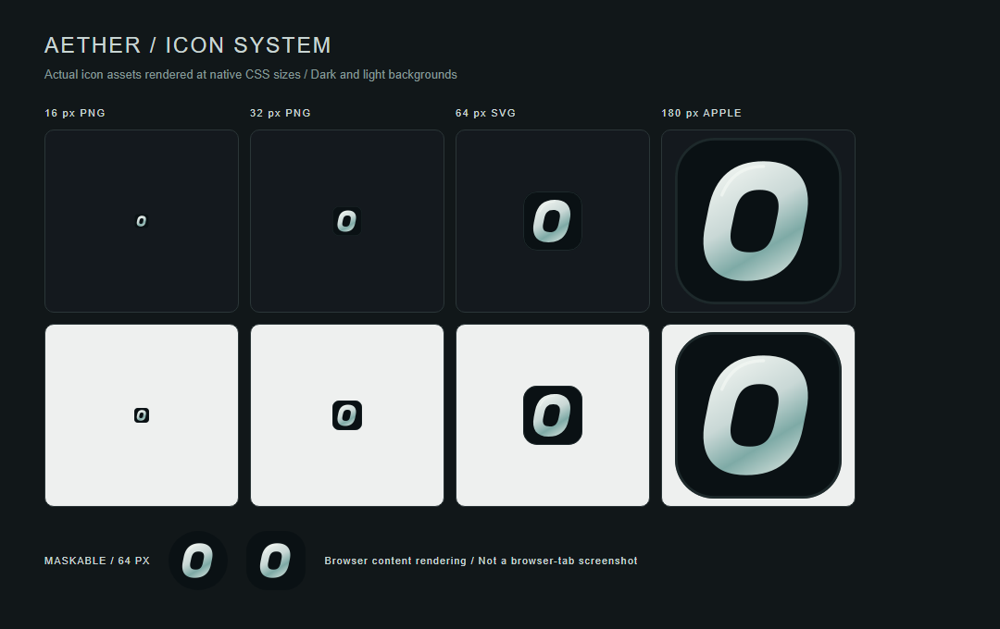

# 3D가 실패해도 사이트까지 사라지면 안 된다

3D 화면을 만드는 작업이라고 해서 WebGL만 확인할 수는 없었다. 장면 모듈 로딩이 실패하면 본문까지 사라졌고, 테스트 보고서를 저장했더니 개발 서버가 페이지를 새로고침하기도 했다. 마지막에는 파비콘과 문서 제목을 바꾸는 작은 수정에서 캐시와 링크 호환성도 확인해야 했다.

이 글은 렌더링 바깥에서 만난 문제를 정리한다. 앞선 글과 같은 Aether Studio 구현 기록이며, 완료한 수정과 아직 확인하지 못한 환경은 구분했다.

## 장면 모듈 하나가 실패했는데 페이지 전체가 사라졌다

3D 장면은 동적으로 불러오는 선택적 모듈이다. 독립 레드팀 검수에서 요청을 차단하자 이 모듈의 실패가 앱 전체로 퍼지는 문제가 재현됐다. 네트워크가 정상일 때는 드러나지 않던 문제였다.

오류 경계를 장면 주변으로 좁혔다. React의 오류 경계(Error Boundary)는 하위 컴포넌트의 렌더링 오류를 격리한다. 장면을 표시할 수 없으면 CSS 배경을 사용하고, 본문과 Work·Contact 탐색은 남긴다.

아래는 현재 `SceneBoundary.tsx`의 핵심 부분이다. 오류 경계 자체가 모든 비동기 오류를 잡아 주는 것은 아니다. 이벤트·영상 재생 Promise·렌더 루프의 실패는 각 소유자가 별도로 처리한다.

```tsx
static getDerivedStateFromError() {
  return { failed: true }
}

componentDidCatch() {
  this.props.onUnavailable()
}

render() {
  return this.state.failed ? null : this.props.children
}
```

검증할 때는 단순히 에러 상태를 주입하는 대신 장면 모듈 요청을 실제로 차단했다. 데스크톱과 모바일 크기에서 본문·탐색이 남는지 확인했다. WebGL을 사용할 수 없는 경우와 모듈 요청이 실패한 경우도 별도 테스트다. 둘은 같은 장애가 아니기 때문이다.

## 복구 화면과 실제 링이 함께 보였다

CSS 배경은 좋은 대체 수단이지만, WebGL 장면이 준비된 뒤에도 남으면 링이 두 개처럼 보인다. 반대로 너무 일찍 숨기면 준비 중에 빈 화면이 나온다.

장면 준비 상태와 대체 화면 표시를 연결했다. 실제 렌더가 준비되면 canvas를 보여주고, 장면 실패·컨텍스트 손실에서는 대체 화면으로 돌아간다. 짧은 뷰포트에서 히어로 문구가 잘리는 문제와 Work·Contact로 이동한 뒤 이전 섹션 일부가 남는 문제도 함께 수정했다.


*초기 구현 검증 때 남긴 실제 소프트웨어 렌더러 화면이다. WebGL 미지원 시의 CSS 대체 화면이나 최신 버전 캡처로 읽으면 안 된다. 대체 경로의 동작 근거는 실패 요청·컨텍스트 테스트에 있다.*

## WebGL 컨텍스트를 복구한다고 재생 상태까지 복구되지는 않는다

GPU 자원을 잃었다가 다시 확보하는 상황은 페이지 새로고침과 다르다. 사용자는 스크롤 위치와 선택한 시점에서 계속 보고 싶다.

현재 코드는 `webglcontextlost`에서 기본 동작을 막고 렌더 예약을 취소한다. 진행 중이던 준비 작업도 세대 번호를 바꿔 무효화한다. 복원 시에는 환경과 해상도를 다시 설정한 뒤 장면 준비를 거친다. 무효화된 비동기 준비 작업이 늦게 끝나서 새 상태를 덮지 않도록 하는 장치다.

핵심 흐름을 줄이면 다음과 같다. 실제 구현에는 영상 동기화와 대체 화면 전환도 들어 있다.

```ts
// 개념을 줄인 예시
function onContextLost(event: Event) {
  event.preventDefault()
  contextLost = true
  preparationGeneration++
  cancelScheduledRender()
}

async function prepare() {
  const generation = ++preparationGeneration
  await prepareGpuResources()
  if (disposed || contextLost || generation !== preparationGeneration) return
  requestRender()
}
```

검증에는 `WEBGL_lose_context`를 사용했다. 별도 브라우저 검수에서 40% 위치의 장면과 미디어 재생 복귀, 중복 canvas 여부를 확인했다. 자동검사의 탭 숨김은 `document.hidden`과 이벤트를 모의했고, 영상 위치의 보존은 `video.spec.ts`에서 따로 검사했다. 모션 정지 전후의 선택 시점과 일부 애니메이션 진행 상태도 확인했지만, 모든 위상을 검증했다는 뜻은 아니다. 새로고침 한 번으로 복구 확인을 대신하지 않았다.



*개념도다. 실제 UI 캡처가 아니라 DOM과 WebGL·미디어의 복구 책임을 나눈 그림이다.*

## 테스트가 화면을 새로고침하고 있었다

초기 자동화 검수에서는 테스트 중 페이지가 새로고침되는 문제가 있었다. 원인은 앱의 상태 갱신이 아니라 테스트 보고서였다. Playwright가 HTML 산출물을 저장하자 Vite 파일 감시가 이를 변경으로 보고 전체 새로고침을 일으켰다.

산출물을 `.qa/`에 모으고 감시 대상에서 제외했다. 아래는 현재 Vite 설정이다.

```ts
server: { watch: { ignored: ['**/.qa/**'] } }
```

CI에서는 개발 서버 대신 이미 생성한 production 빌드를 사용한다. 테스트 도구가 만드는 파일과 앱 입력을 분리하니 재현 조건도 단순해졌다. 화면을 흔드는 주체가 앱인지, 검수 도구인지 먼저 구분할 필요가 있었다.

## 버튼은 있는데 클릭 테스트가 시간 초과됐다

Linux CI의 실패 trace에서는 자산 요청이 정상이고 Work 링크도 보였다. 그런데 화면 갱신 간격이 최대 10.21초까지 벌어졌다. Playwright는 요소가 안정적인지 프레임을 보며 기다리므로, 느린 렌더링이 클릭 대기로 나타날 수 있다.

초기 대응은 소프트웨어 렌더러의 품질 경로를 분리하는 것이었다. 당시에는 렌더링 해상도 배율인 DPR을 0.75로 두고, 입자 상한 축소와 환경 반사 계산 생략을 적용했다. 또 소프트웨어 프레임이 끝난 뒤 50ms의 입력 처리 여유를 뒀다. 여러 WebGL 브라우저를 동시에 돌리지 않도록 테스트 worker도 1개로 고정했다. 초기 기록의 입자 상한 2,000개는 그 버전의 값이며, 이후 늘어난 장면 전체의 현재 입자 수를 뜻하지 않는다.

로컬 SwiftShader 검증에서는 Work 클릭 71ms를 관측했다. 이 값을 일반 사용자 클릭 지연의 보장치로 쓰지는 않는다. 기기·소프트웨어 렌더러·테스트 조건이 다르다.

파비콘 문서를 정리한 PR #17에서도 기존 Work 클릭 테스트의 10초 제한 초과가 한 번의 CI 작업에서 재시도까지 발생했다. 앱 코드가 같은 직전 전체 CI와 로컬 동일 흐름 두 번은 통과했고, 실패 작업을 코드 변경 없이 다시 실행해 통과했다. 이 경우는 **CI 시간 초과를 재확인한 기록**이다. 원인을 새로 고쳤다고 적거나 모든 불안정성이 사라졌다고 말할 근거는 없다.

## 정지 화면이 같다고 입력까지 정상인 것은 아니었다

초기 검증에서는 캡처를 여러 장 동시에 만들면서 GPU를 경쟁시켰고, 입력 후 실제 프레임이 그려지기 전에 비교하는 문제도 있었다. 이후에는 테스트가 렌더 완료 상태를 기다리고, 실제 wheel·pointer·클릭을 넣어 결과를 확인했다.

검사 대상을 나누면 해석하기 편하다. 좌표·행렬은 움직임의 부호와 복귀를 확인한다. 픽셀 비교는 셰이더 효과가 화면에 나타났는지 확인한다. 캡처는 겹침과 레이아웃을 검수한다. 하나만으로 다른 검사를 대체하지 않는다.

키보드 탐색과 상세 화면도 같은 기준이다. Escape로 닫은 뒤 초점이 원래 카드로 돌아오는지, 화면 스크롤 잠금이 풀리는지, 다음 프로젝트의 제목과 내용이 맞는지 검사했다. 초기 카드 설명과 전경 프로젝트가 불일치한 부분은 공통 문구로 교정했다. 스케일 패널의 시각 문구를 보강할 때 접근 가능한 DOM 설명도 남겼다.


*초기 버전의 실제 상세 화면이다. 초점 복귀·Escape 동작은 이 정지 이미지가 아니라 `experience.spec.ts`의 입력 검사로 확인한다.*

## 파비콘만 바꿀 때 OG 이미지가 같이 생성되지 않도록 했다

아이콘과 링크 공유 미리보기 이미지인 OG 카드를 같은 스크립트로 생성하고 있었다. 파비콘만 수정하려는 작업에서 생성기 전체를 돌리면 이미 승인한 OG 카드도 다시 만들어진다. 실제 배포 사고의 복구가 아니라, 이번 아이콘 변경에서 기존 공유 카드를 보존하기 위한 예방 조치였다.

기본 실행은 아이콘만 만들도록 바꾸고, 공유 카드는 `--share-card`를 명시했을 때만 생성하게 했다. 기존 OG 이미지의 SHA-256도 검사해 원본 바이트가 유지되는지 확인했다. 아이콘 URL에는 버전 쿼리를 붙여 이전 파일 캐시와 구분했다.

```html
<link rel="icon" type="image/svg+xml" sizes="any" href="/favicon.svg?v=2" />
<link rel="manifest" href="/site.webmanifest?v=2" />
```

SVG 하나만 확인하지 않고 16·32px PNG, ICO 내부 크기, Apple·maskable 아이콘도 같이 확인했다. 운영 배포에서는 HTML과 manifest가 가리키는 자산 9개를 실제로 요청해 로컬 파일과 비교했다. 웹앱 아이콘을 원형으로 잘라도 심벌이 잘리지 않게 중앙 안전 영역에 두었다.




*같은 Chromium 본문에서 실제 아이콘 파일을 같은 크기로 렌더한 전후 캡처다. 브라우저 탭 바를 촬영한 이미지는 아니다. OG 이미지는 변경하지 않았다.*

## 문서 제목을 바꾸자 이전 링크가 끊겼다

형태 중심 별칭을 본 컬럼·리액터 챔버처럼 정리하면서 제목도 바꿨다. GitHub는 제목에서 fragment를 생성하므로, 제목을 바꾸면 기존 북마크의 `#...` 주소도 달라진다. 파일 경로가 그대로여도 생기는 회귀다.

리뷰에서 발견한 뒤 변경된 제목 14개에 이전 앵커를 남겼다. 아래 제목은 새 용어로 읽히지만, 이전 주소도 계속 사용할 수 있다.

```html
<a id="지하-공간과-조명-영상-정리"></a>

# 리액터 챔버와 조명 영상 정리
```

문서 내부 링크만 검사했다면 놓쳤을 문제다. GitHub가 렌더한 변경 전 제목 ID와 변경 후 앵커를 직접 대조했다. 스타일 수정에서도 외부에서 들어오는 주소는 계약으로 남아 있었다.

## 다음에 같은 구조를 만든다면

장면이 예쁘게 보이는 경로만으로 완료를 판단하지 않으려 한다. 장면 chunk 실패, 컨텍스트 손실, 영상 재생 실패, 숨긴 탭 복귀, Escape와 초점 복귀를 먼저 작은 검사로 마련할 수 있다. 캡처·로그·보고서 파일은 처음부터 앱 감시 경로와 분리한다.

현재 검증은 Chromium과 모바일 에뮬레이션 중심이다. 실제 Safari/iOS·저사양 GPU·장시간 발열 검증은 남아 있다. 초기 axe 검사에서 검출된 위반이 없었다는 기록도 대비와 모든 접근성을 인증하는 결과는 아니다.

### 코드와 검증 기록

- [초기 실패 격리·CI 검증](../../verification.md), [메타데이터](../../metadata.md)
- [SceneBoundary.tsx](../../../src/SceneBoundary.tsx), [Scene.tsx](../../../src/Scene.tsx), [Vite 설정](../../../vite.config.ts)
- [사용자 흐름 테스트](../../../tests/experience.spec.ts), [메타데이터 테스트](../../../tests/metadata.spec.ts)
- 변경 근거: `1860ad4` 감시 제외, `3fbb045` 소프트웨어 렌더러 입력 여유, `be28f58` 아이콘 생성 분리, `7071e5f` 이전 문서 앵커 보존. PR #17 CI 재실행 결과는 [PR 기록](https://github.com/okorion/aether-studio/pull/17)에서 확인할 수 있다.
