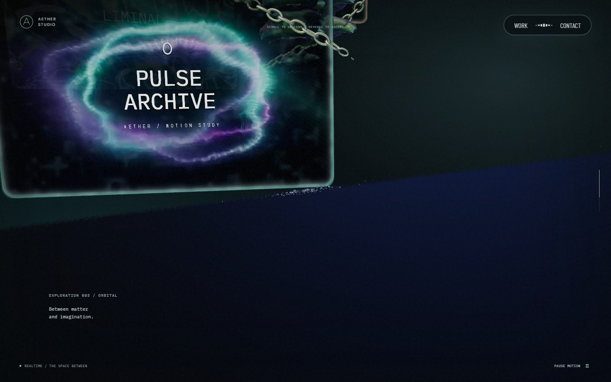
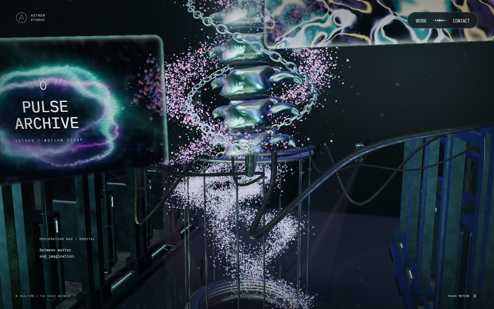
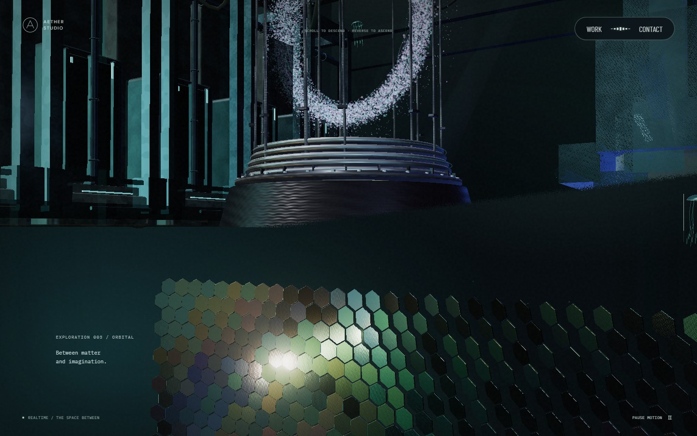
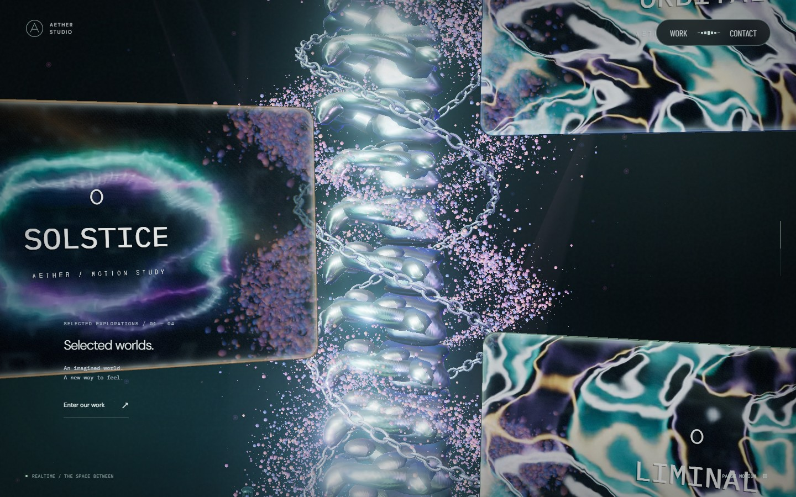
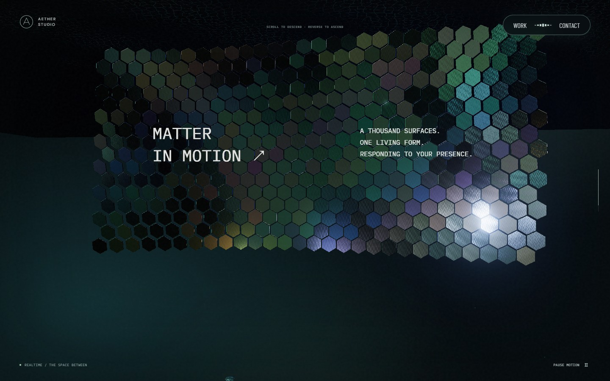

# 전환을 가렸더니, 이어져야 할 장면까지 가려졌다

앞의 6편은 PR #17까지의 기록이다. 이 글은 그 뒤에 확인한 화면 전환과 모니터 배치 문제를 추가로 정리했다. 같은 코드를 다시 고친 사례지만, 앞선 측정값을 이번 결과처럼 사용하지는 않았다.

## 다음 공간 대신 남색 판이 보였다

본 컬럼과 모니터를 지나 리액터로 내려갈 때, 화면 아래쪽에 남색 면이 넓게 나타났다. 파티클이 수렴하는 과정을 가리려고 넣었던 큰 천장이었다. 작은 장치의 덮개와 방 전체를 막는 천장은 역할이 달랐는데, 전환에서는 둘 다 같은 차폐물로 작동했다.



*실제 변경 전 화면 · 스크롤 65%. 모니터 아래의 넓은 불투명 면 때문에 다음 장치가 보이지 않는다.*



*실제 변경 후 화면 · 같은 스크롤과 뷰포트. 위쪽은 본·모니터, 아래쪽은 리액터를 그린다. 재질과 모니터 배치 변경도 함께 포함된 비교다.*

큰 천장 메시의 렌더링을 끄고 장치 자체의 작은 덮개는 유지했다. 천장 좌표는 접점을 검사하는 기준으로 남겼다. 투명도를 낮춘 반투명 판을 겹쳐 놓은 방식은 아니다. 필요 없는 면이 깊이 버퍼까지 가리지 않도록 아예 그리지 않는다.

본 컬럼에도 별도 문제가 있었다. 전환 끝에 아래 코드를 통해 위로 10만큼 밀려나고 있었다.

```ts
// 변경 전 이동량 중 전환 후반 항
const spineOffset = -12 * (1 - emergence)
  + 10 * smooth(.60, .67, progress)
```

두 번째 항을 제거했다. 본은 내려가는 기준점을 계속 따라가고, 사선 경계가 지나간 부분만 잘린다. 오브젝트를 먼저 치워서 전환을 만드는 대신, **오브젝트가 있는 상태에서 보이는 영역을 줄였다.**

## 입자는 한 번에 변형하면 양쪽 장면을 유지할 수 없었다

기존 파티클은 스크롤에 따라 하나의 형태가 본 주변 흐름에서 리액터의 O 형태로 수렴했다. 전환 경계 위에서도 같은 형태를 사용하면, 아직 본 장면인데 주변 입자가 먼저 사라진다.

겹치는 구간에서만 본 주변 형태를 유지하는 Points를 하나 더 그렸다. 입자 위치·속성 버퍼는 원래 필드와 공유한다. 위쪽은 본의 형태, 아래쪽은 수렴하는 형태로 각자의 영역만 그린다. 기본 이동은 계속 스크롤 진행률을 따르므로 정지 중에 입자 위치가 흘러가지 않는다.

복제 비용이 없다는 뜻은 아니다. 버퍼 업로드를 반복하지 않지만 겹치는 동안 draw와 픽셀 처리 비용은 추가된다. 완전히 가려진 뒤에는 그 복제 필드를 숨긴다. 이 비용은 아래의 실제 왕복 측정으로 따로 확인한다.

## 바닥 높이가 아니라, 같은 화면 경계를 기준으로 잘랐다

리액터에서 스케일 패널로 갈 때는 카메라 높이로 상단 장치를 통째로 숨기고 있었다. 실제 화면에는 리액터 일부가 남아야 하는데, 눈이 바닥 아래로 내려갔다는 이유로 장치 전체가 사라질 수 있었다.

`deviceExit`라는 공통 화면 경계를 두고 다음처럼 나눴다.

| 영역 | 위 경계 | 아래 경계 |
| --- | --- | --- |
| 본·모니터 | 모니터 진입 | 리액터 진입 |
| 리액터·바닥·주변 설비 | 리액터 진입 | 스케일 진입 |
| 스케일·하부 천장·투영광 | 스케일 진입 | 마지막 포레스트 진입 |

각 영역 안의 물체는 계속 3D다. 경계만 화면 좌표를 사용한다. 하부 천장과 영상에서 가져오는 빛은 별도 그룹으로 옮겨, 상단 장치가 사라져도 남도록 했다.



*실제 변경 후 화면 · 스크롤 76.5%. 상단 설비와 하단 패널이 같은 사선 경계의 서로 다른 쪽에 있다.*

## 모니터가 본을 가로지른 이유

패널의 위치와 방향을 모두 `turn = step * 1.13`으로 계산하고 있었다. 스크롤이 바뀔 때마다 모니터가 원형 경로를 돌아 본과 체인 사이를 통과했다. 유리 효과로 뒤쪽이 일부 보이다 보니 이 교차가 더 어색하게 드러났다.

패널별 방향과 앞뒤 깊이를 고정했다. 스크롤은 세로 위치에만 반영한다. 체인보다 앞쪽에 패널을 배치하고, 호버는 회전 대신 컬럼 바깥쪽으로 조금 이동하는 효과로 바꿨다.

본의 밀도도 다시 해석했다. 필요한 것은 큰 빈틈이 아니라 더 높고 적은 세그먼트였다. 데스크톱에서는 18개를 13개로 줄이고 각 본의 높이를 키웠다. 단순히 스케일을 줄여 링처럼 얇아지는 방향은 적용하지 않았다.



*실제 변경 후 화면 · 스크롤 50%. 본·체인은 뒤쪽 흐름을 유지하고 모니터는 앞쪽에서 이동한다.*

스케일 재질에는 타일마다 다른 거칠기와 박막 반사, 미세 표면 변화를 넣었다. 반사를 세게 키우기만 했던 첫 조정은 화면이 희게 뭉개져 다시 낮췄다. 넓은 굴곡으로 면의 방향을 달리해 빛을 받는 타일과 어두운 타일이 함께 보이도록 조정했다.



## 효과에도 영역이 필요했다

느린 섬광은 포레스트의 화면 경계를 그대로 사용한다. 태어날 때 영역을 검사하고, 이동한 뒤의 픽셀도 다시 검사한다. 생성 위치만 제한하면 날아가는 섬광이 다른 장면으로 넘어갈 수 있기 때문이다. 중간 장면으로 나가면 이전 궤적을 비워서, 빠르게 돌아왔을 때 다시 나타나지 않도록 했다. 다른 파티클의 포인터 변형은 유지했다.

마지막 링의 리본은 스크롤 도중 아래에서 위로 뒤집고 있었다. 위쪽으로 붙는 자세를 보이지 않는 중간 구간에서 미리 설정했다. 마지막 숲에 들어올 때는 이미 링 위에 붙어 있다.

검증 조건과 최종 수치는 [이번 변경의 실행 기록](../../scene-continuity.md)에 따로 남겼다. 핵심 검사는 공유 경계 밖의 픽셀 누출, 정지·역스크롤 복원, 모니터 방향 고정과 호버 이동이다. 재질의 유사도를 객관적인 백분율로 측정한 결과는 없다.
