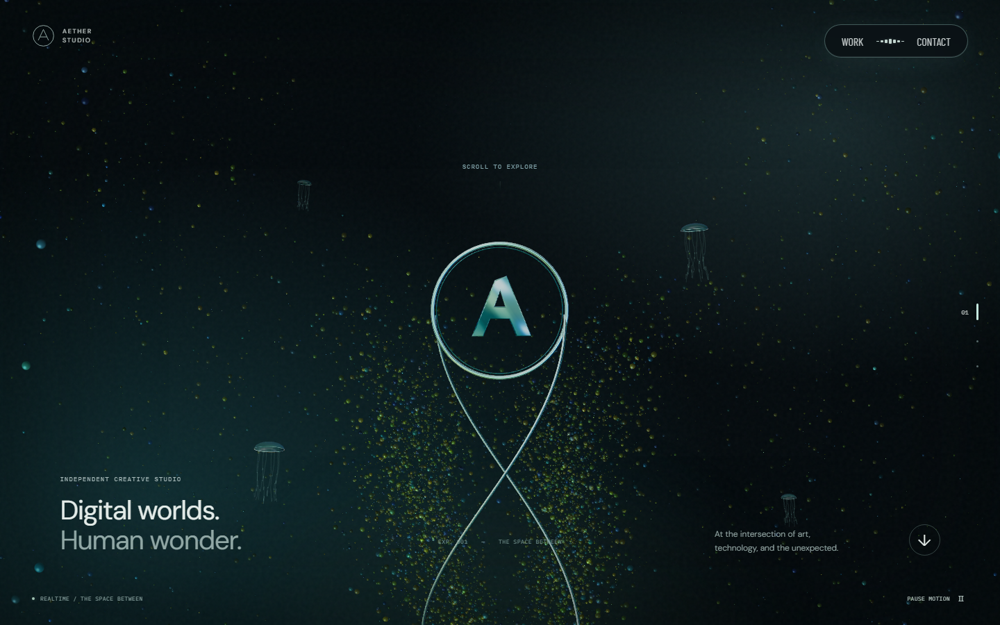
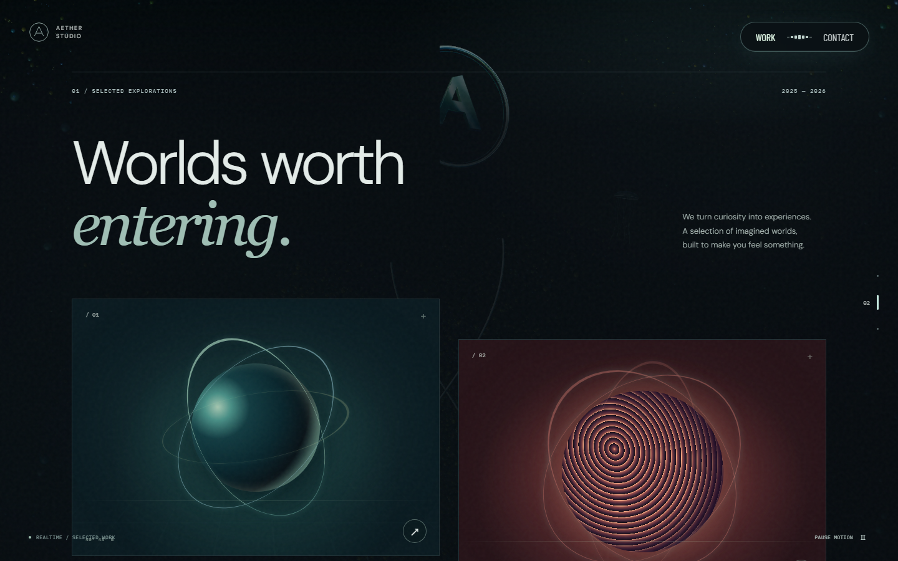
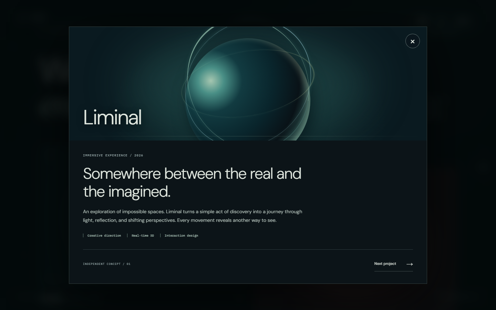
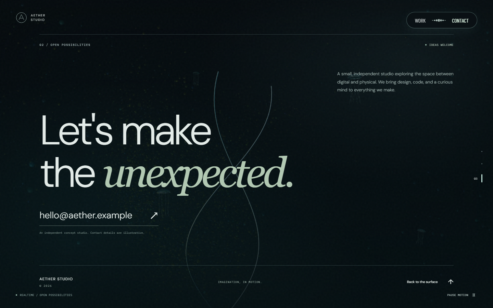
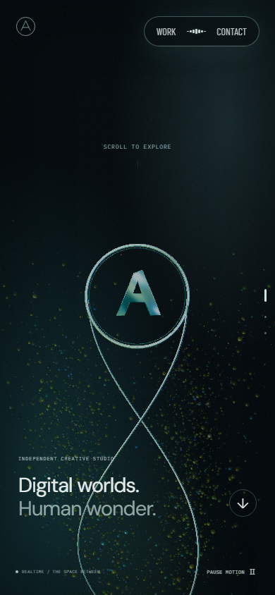
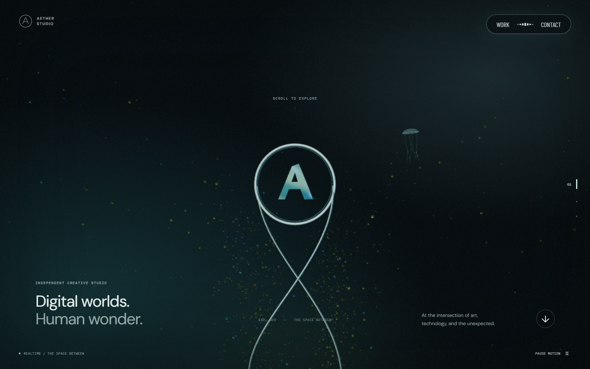

# 초기 구현 검증 · 2026-09-21

## 공개 배포 확인 · 2026-09-21

- 운영 주소: https://aether-studio-nu.vercel.app/
- Vercel production 배포 `dpl_A1R3e5o69FtR6CGG3AFxGXaseGZp` · READY
- 최초 배포 애플리케이션: `4ba178d` · 후속 README·캡처와 `.vercel/` Git 제외 설정은 앱 코드를 변경하지 않음
- 비로그인 Chromium에서 홈 → Work → Liminal 상세 → Escape → Contact 이동 및 390×844 모바일 탐색 확인
- 실제 3D canvas ready와 웹폰트 로딩 후 캡처, page error 0개
- 배포 후 Vercel error 로그 조회 결과 없음. 정적 사이트이며 브라우저 오류 확인은 별도로 수행했고 지속 오류 수집 도구는 미설정
- [README 초기 배포 기록](../README.md)의 초기 이미지는 로컬이 아닌 공개 배포에서 캡처
- 저장소는 PRIVATE로 유지하며 사이트만 공개. 예시 프로젝트·연락처는 데모 콘텐츠
- 최초 GitHub CI는 12개 첫 실행 통과, 3개 Linux action timeout 후 재시도 통과. 로컬 production·SwiftShader는 15개 모두 재시도 없이 통과

## 결과

- ESLint, TypeScript, Vite production build 통과
- Playwright: 데스크톱·모바일의 주요 흐름 12개, WebGL 비활성 1개, Scene 모듈 요청 실패 2개 — 최종 전체 실행 **15/15 통과** (1.9분)
- axe 자동 검사: 검출된 위반 0개. WebGL·그라데이션 배경의 대비는 자동 판정 불가 항목이 남아 있으므로 완전한 접근성 인증을 의미하지 않음
- npm audit: 설치 시 알려진 취약점 0개

## 실제 화면

| 화면 | 캡처 |
| --- | --- |
| 데스크톱 홈 · 1440×900 |  |
| 데스크톱 Work · 1440×900 |  |
| 프로젝트 상세 · 1440×900 |  |
| Contact · 1440×900 |  |
| 모바일 홈 · 390×844 |  |
| 소프트웨어 렌더러 · 1440×900 |  |

## 리뷰 대응

독립 레드팀 리뷰에서 Scene 동적 모듈 로딩 실패 시 앱 전체가 사라지는 결함을 재현했습니다. `SceneBoundary`로 오류를 3D 장면에 한정하고 CSS 배경·본문·탐색을 유지하도록 수정했습니다. 실패 요청을 실제 차단하는 데스크톱·모바일 테스트로 재검증했고 리뷰를 종료했습니다.

화면 검수에서는 CSS fallback과 실시간 링의 중복 표시, 짧은 뷰포트에서 히어로 텍스트 잘림, 섹션 이동 후 이전 섹션의 일부가 남는 문제를 수정했습니다.

`WEBGL_lose_context`를 사용한 실제 컨텍스트 손실에서는 fallback이 표시되고, 복구 후 canvas가 하나만 유지되며 3D 화면으로 복귀하는 것을 확인했습니다. 여러 WebGL 브라우저와 캡처를 동시에 실행한 최종 검수 중 timeout이 발생해 테스트 worker를 1개로 고정했습니다. 후속 서버 로그에서 Playwright HTML 산출물이 Vite 전체 새로고침을 유발하는 것도 확인해 `.qa/`를 파일 감시에서 제외했습니다.

Linux CI의 실패 trace에서 모든 자산 요청은 정상인데 RAF 기반 클릭 안정성 대기 중 최대 10.21초의 화면 갱신 공백이 확인됐습니다. SwiftShader·llvmpipe 등 소프트웨어 렌더러에는 DPR 0.75, 최대 2,000개 입자, 환경 반사 계산 생략, 프레임 사이 50ms의 입력 처리 시간을 적용했습니다. 일반 GPU의 시각 설정은 유지합니다. 독립 SwiftShader 검증에서 Work 클릭 71ms, context loss/restore 정상, 브라우저 오류 0개를 확인했습니다. 이 시간은 해당 로컬 검증의 관측값이며 모든 기기의 성능 보장이 아닙니다.

CI는 명시적 SwiftShader와 이미 생성된 production 빌드를 사용합니다. 개별 action·expect 제한은 10초로 유지하고, 여러 화면을 순회하는 테스트 전체와 브라우저 fixture의 CI 시간 예산은 90초입니다(로컬 30초). 실패 시 trace와 보고서를 GitHub artifact로 보존합니다. 기능 브랜치의 중복 실행을 피하기 위해 pull request와 main push에서 검증합니다.

## 검증 범위와 한계

Chromium 및 Chromium 모바일 에뮬레이션으로 검증했습니다. 실제 휴대폰, Safari, Firefox와 저사양 GPU 장기 성능은 미검증입니다. GPU fallback은 단순한 정적 장면이며 3D 효과를 대신하지 않습니다. 브랜드·프로젝트·연락처는 초기 콘셉트이므로 실제 서비스 콘텐츠로 교체해야 합니다.
