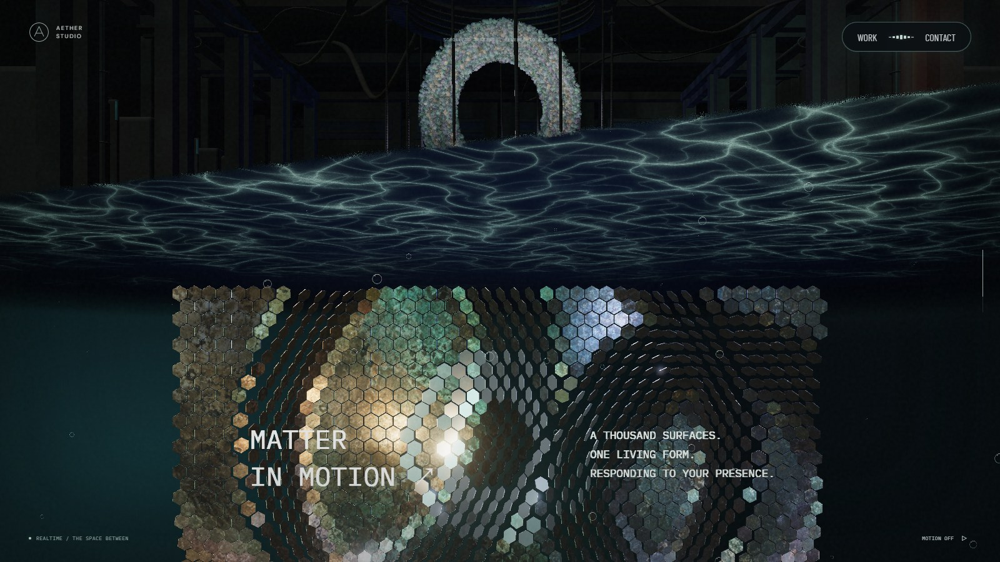
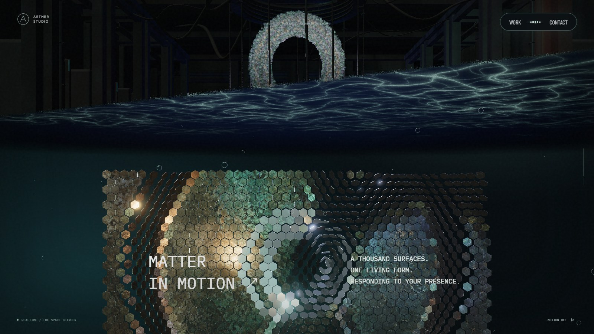
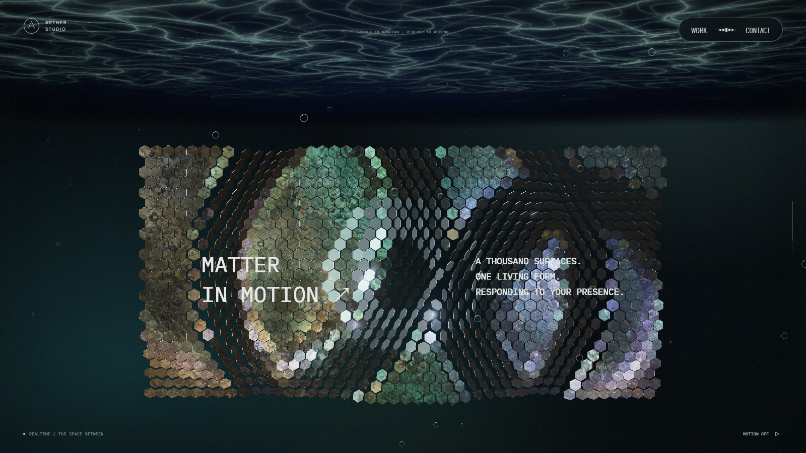
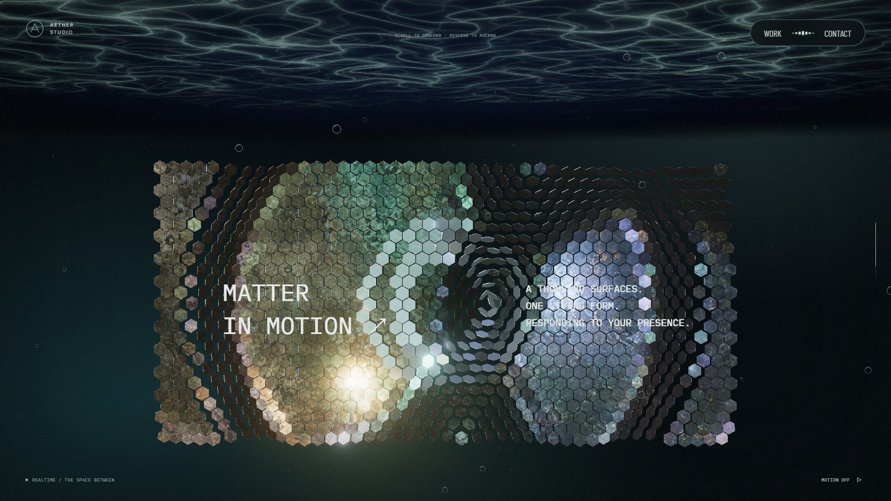

# 스케일 패널 천장 진입 자세 · 2026-09-27

리액터에서 스케일 패널로 전환하는 진행도 0.735~0.775에서 천장 기울기를 0.06rad에서 0.24rad로 바꾸던 보간을 제거했다. 생성 시 설정된 완료 각도 0.24rad를 진입부터 유지한다. 천장 위치·투영 이동·굴곡·재질과 2D 경계선 계산은 변경하지 않았다.

## 시각적 변경

5eae66c 기준 실제 PC 1600×900 화면과 수정본이다. 같은 스크롤 위치와 모션 일시정지를 사용했으며 미디어 프레임은 다를 수 있다.

| 대상 | 변경 전 | 변경 후 | 판단 포인트 |
| --- | --- | --- | --- |
| 진입 0.75 |  |  | 처음부터 완료 상태의 천장 기울기 유지 |
| 완료 0.78 |  |  | 기존 완료 형태 유지 |

lint·typecheck·build 통과. 장면 경계·높이·깊이 처리 테스트 2개 통과. 실제 천장 각도를 전환 전후와 역스크롤에서 검사하는 회귀 검증을 추가했다. PC·모바일 각 10개 지점과 왕복 휠 입력에서 페이지 오류가 없었다. 기본 카메라 및 경계선 계산은 코드 변경 범위 밖이다.
