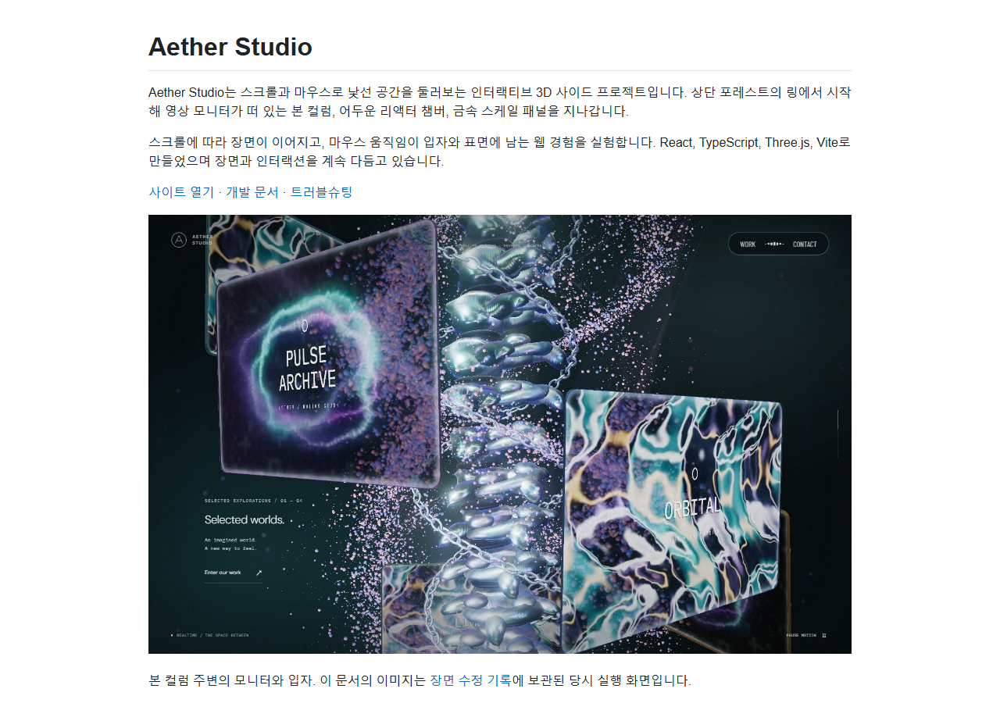
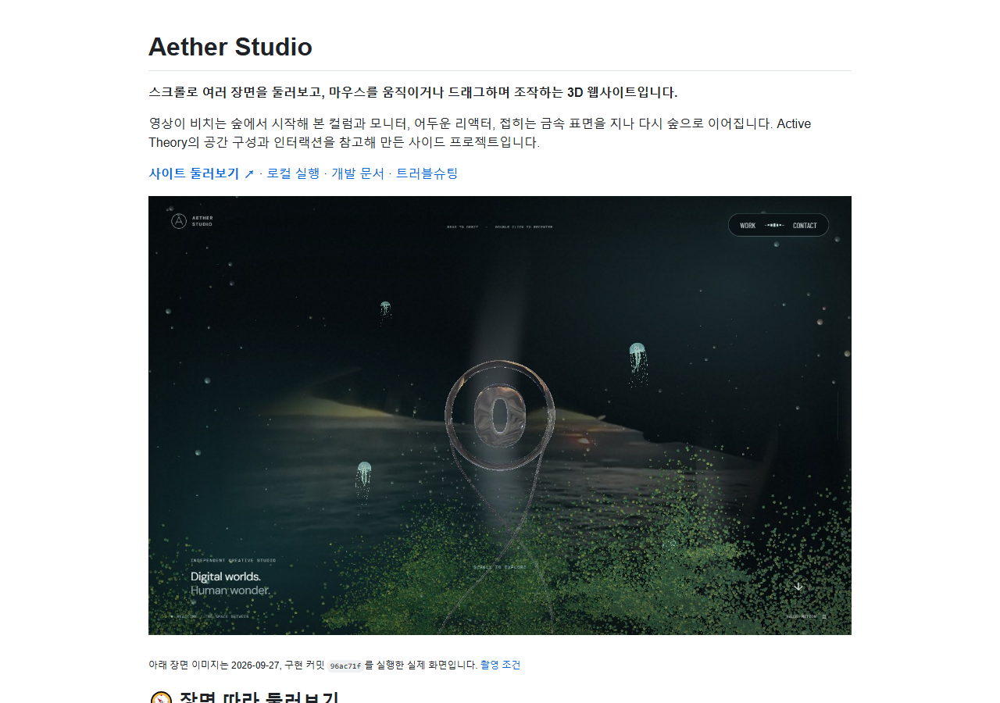
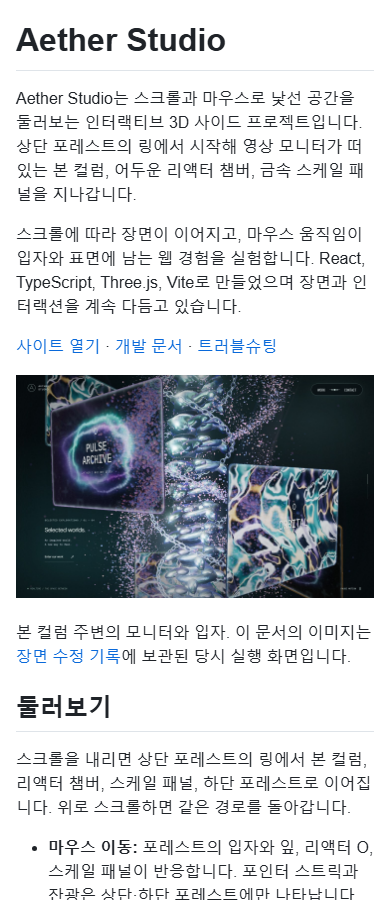
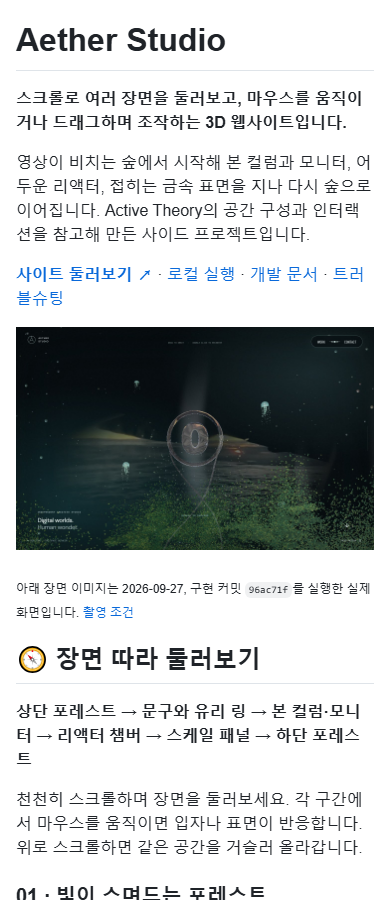

# 문서·메타데이터 검증 · 2026-09-27

구현 기준은 `96ac71f`다. README·개발/구조/진단 안내·문서 색인과 배포 메타데이터의 설명을 정리했다. `src/`, 앱 스타일, 의존성, 장면 설정과 자산 원본은 변경하지 않았다.

## 확인 범위

| 확인 | 결과 |
| --- | --- |
| lint | 통과 |
| TypeScript·production build | `npm run build` 통과. build에 `tsc -b` 포함 |
| 기존 메타데이터 검사 | `tests/metadata.spec.ts` 2개 통과 |
| 주요 웹 화면 | Work·프로젝트 순회·Escape·포커스 복귀, 프로젝트 닫기·화면 경계 검사 2개 통과 |
| README 장면 캡처 | 실제 GPU, 1440×900의 6개 진행률, 페이지 오류 없음 |
| 문서 렌더 | README·구조·개발·현재 트러블슈팅의 PC 1280px/모바일 390px 확인 |
| Mermaid | 새 도식 6개 렌더 성공 |
| 문서 이미지·가로 넘침 | 로컬 문서 렌더에서 누락 이미지·문서 전체 가로 넘침 없음 |
| 링크 | 변경 문서의 로컬 파일·제목 앵커 확인 |
| 사이트 메타데이터 | HTML의 검색·OG·Twitter·JSON-LD와 manifest 설명 일치 |
| GitHub About | `Interactive 3D`와 기존 홈페이지 유지. `webgl`, `interactive-3d` topics 추가 후 재조회 |

앱 검사는 별도 로컬 production preview(5187)를 대상으로 실행했다. 메타데이터 검사는 파일을 직접 읽는다. 장면 캡처는 Chromium/ANGLE D3D11이며 모바일 실기기·전체 GPU 성능 재측정은 이번 문서 검수에 포함하지 않았다. 기준 구현의 CI 세 작업은 조회 시 모두 성공이었으며, 이번 PR의 CI와 구분한다.

## 시각적 변경

아래는 동일한 CSS·뷰포트로 원본/수정 README를 렌더한 화면이다. **GitHub 스타일의 로컬 Markdown 렌더이며 실제 GitHub 페이지 캡처는 아니다.** 사이트 UI의 변경 전후를 의미하지 않는다.

| 대상 | 변경 전 | 변경 후 | 판단 포인트 |
| --- | --- | --- | --- |
| README · 1280×900 |  |  | 소개·탐색 링크·최신 장면 이미지 |
| README · 390×900 |  |  | 줄바꿈·이미지 폭·장면 탐색 진입 |

새 사이트 캡처의 구현 커밋·실행 조건·SHA-256은 [촬영 기록](../images/explore-2026-09-27/README.md)에 있다. 기존 비교 자료·Velog 원고·릴리스 HTML/ZIP은 덮어쓰지 않았다. 승인된 OG 이미지와 아이콘 바이트도 유지했다.
