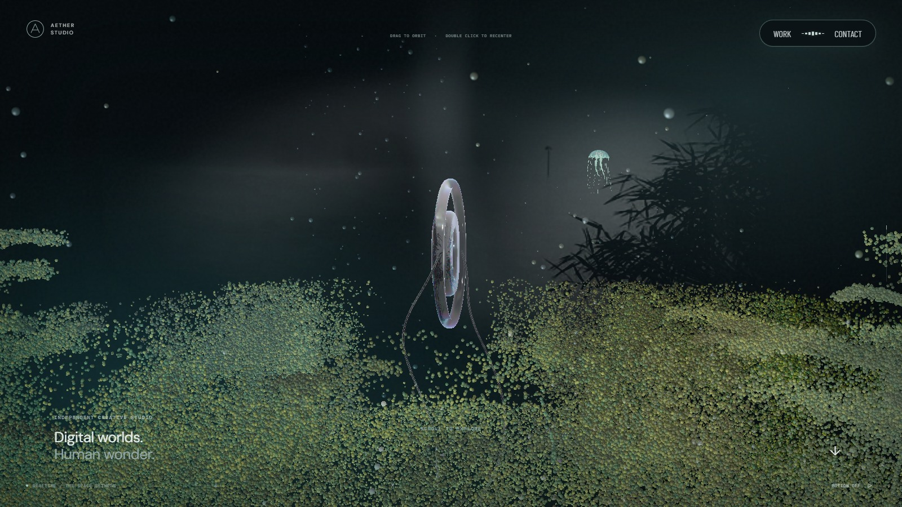
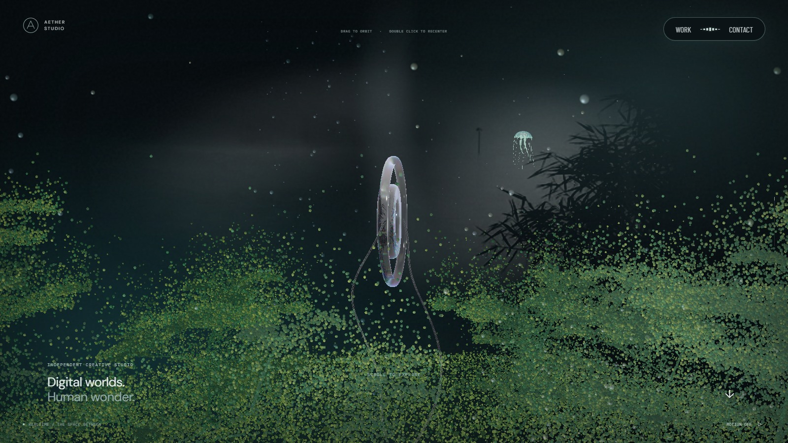
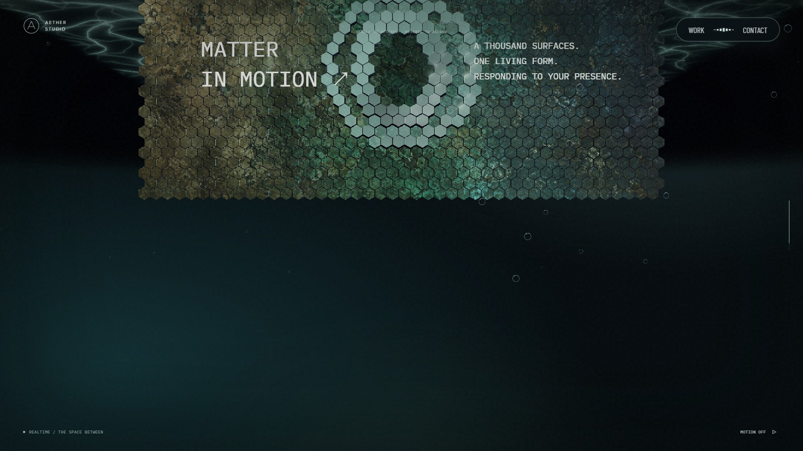
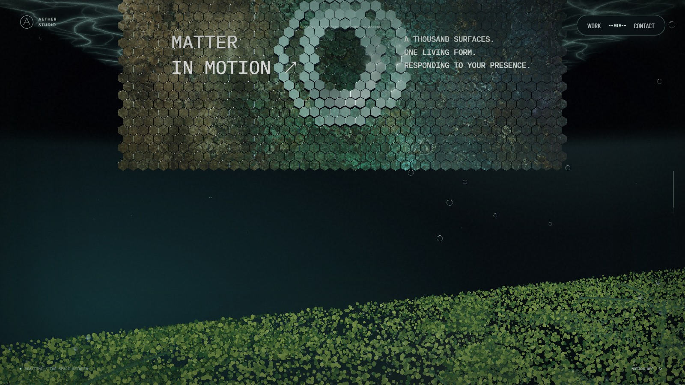
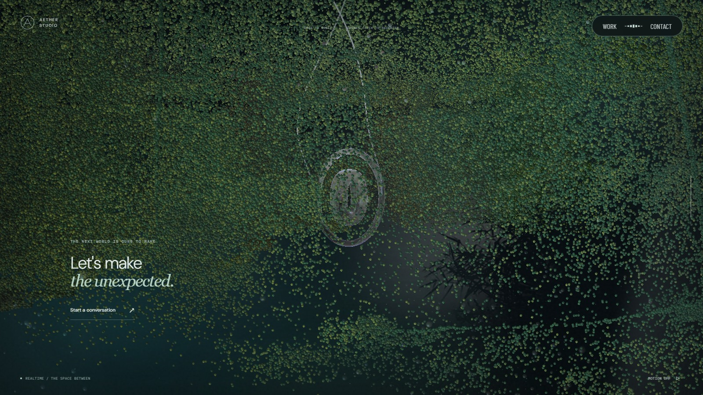
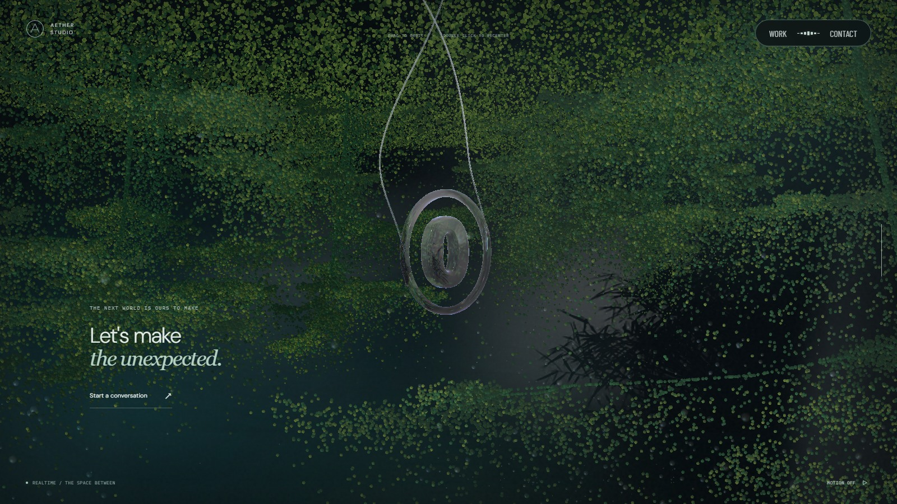
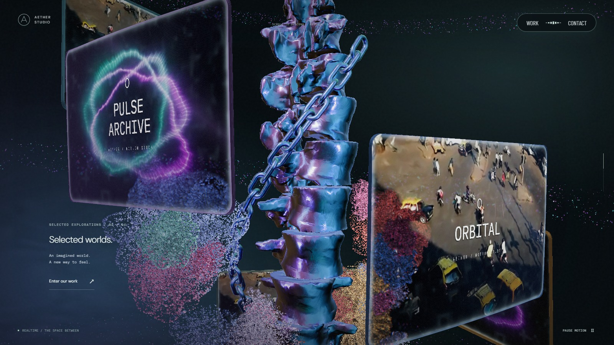
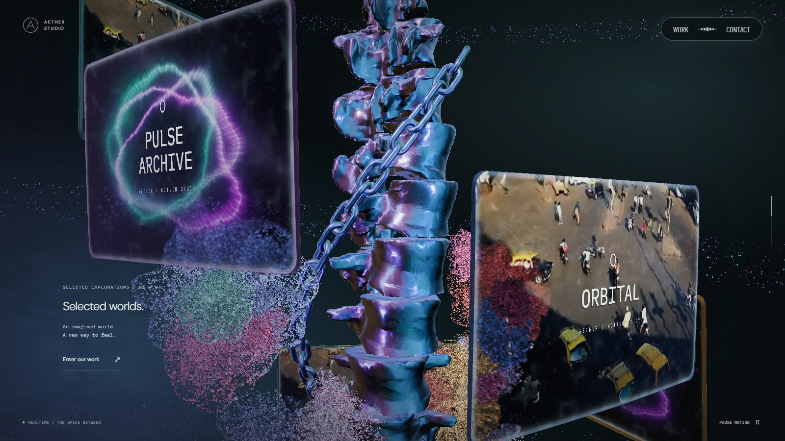

# 포레스트 입자와 하단 진입

기준 커밋은 `2a2b368`이며, 2026-09-27 후속 변경을 기록한다.

양쪽 포레스트에서 주변 나무와의 거리가 가까운 두 그루를 순서대로 제거했다. 남은 줄기·가지의 위치와 높이는 유지한다. 일반 PC는 9→7그루, 모바일은 7→5그루, 소프트웨어 렌더러는 5→3그루다. 잎·줄기 입자 예산도 남은 나무 비율에 맞춰 줄인다.

보강을 위해 움직이는 입자는 변경 전 총량의 약 1/3이다. 나무 감소율을 다시 곱해 이중으로 줄이지 않는다. 카메라 높이에 따른 순서는 유지하되 입자별 시작 높이와 이동 구간을 독립적으로 분산한다. 가까운 높이의 입자들도 서로 다른 시점에 출발하며, 역스크롤은 같은 경로를 되짚는다.

숲 입자에서 시간에 따른 미세 흔들림, 영상의 밝은 반사 무늬, 좁은 하이라이트를 제거했다. 넓은 확산광과 포인터 반응은 유지하며, 작은 입자의 명암은 화면 내 위치가 한 픽셀씩 바뀔 때 급변하지 않도록 단순화했다. 숲 뒤의 영상과 다른 장면의 조명은 그대로다.

체인은 본 컬럼 주위의 나선 경로를 따라 이동하면서 각 링크의 접선을 축으로 회전한다. 본 컬럼 주요 스크롤 구간인 23.5~66.5%에서 자체 축으로 네 바퀴 회전하도록 바꿨다. 인접 링크의 90도 차이와 체인 선행·본 컬럼 지연은 유지한다.

스케일 패널에서 하단 포레스트로 넘어가는 경계 구간을 85.5~92.5%에서 82.5~89.5%로 앞당겼다. 패널이 화면에 남아 있을 때 숲이 올라오며, 경계선은 이전과 같이 카메라 높이에 연동된다. 포레스트·벨 크리처·배경 입자·영상 조명의 진입 기준도 함께 옮겼다. 하단 포레스트에서는 자동 피치를 없애 카메라가 내려가며 반대로 들리는 느낌을 줄였다. 사용자의 드래그 복귀 구간은 유지한다.

## 시각적 변경

1600×900, 기본 입력, 같은 진행도에서 캡처한 실제 실행 화면이다. 포레스트와 전환은 모션을 정지했고, 체인은 양방향 휠 이후 40%에 복귀해 멈춘 상태다. 영상과 시간 기반 표면의 정지 프레임은 다를 수 있다.

| 대상 | 변경 전 | 변경 후 | 판단 포인트 |
| --- | --- | --- | --- |
| 상단 포레스트 · 7.5% |  |  | 나무 밀집과 보강 입자의 분산 |
| 하단 전환 · 85% |  |  | 패널이 남아 있을 때 올라오는 숲 |
| 하단 포레스트 · 93.5% |  |  | 수평 시점과 입자 명암 |
| 체인 · 40% |  |  | 같은 높이에서 달라진 링크 자체 회전 각도 |

## 검증 범위

lint, typecheck, build와 관련 자동 검사에서 입자 이동량·높이별 시작 분산, 체인의 네 바퀴 회전·역방향 복원, 카메라의 연속 하강, 전환 경계의 픽셀 차폐를 확인한다. 숲만 분리한 GPU 검사에서는 카메라를 고정하고 시간과 영상 텍스처를 바꿔도 입자 픽셀이 달라지지 않는지 확인한다. 이는 정지 상태의 입자 반짝임 검사이며 전체 화면의 영상·링·벨 크리처 애니메이션을 정지시키는 검사가 아니다.

PC 1600×900·모바일 390×844에서 양방향 휠, 경계 진입·이탈, 체인 선행과 본 컬럼 복귀를 확인했다. 페이지·콘솔 오류는 없었다. [측정 기록](forest-flow-2026-09-27/motion.json)에 입력 전후 진행도와 관측값을 보관했다. 모바일은 Chromium 에뮬레이션이며 실제 Safari/iOS 및 저사양 기기의 장시간 실행은 별도 확인이 필요하다.
