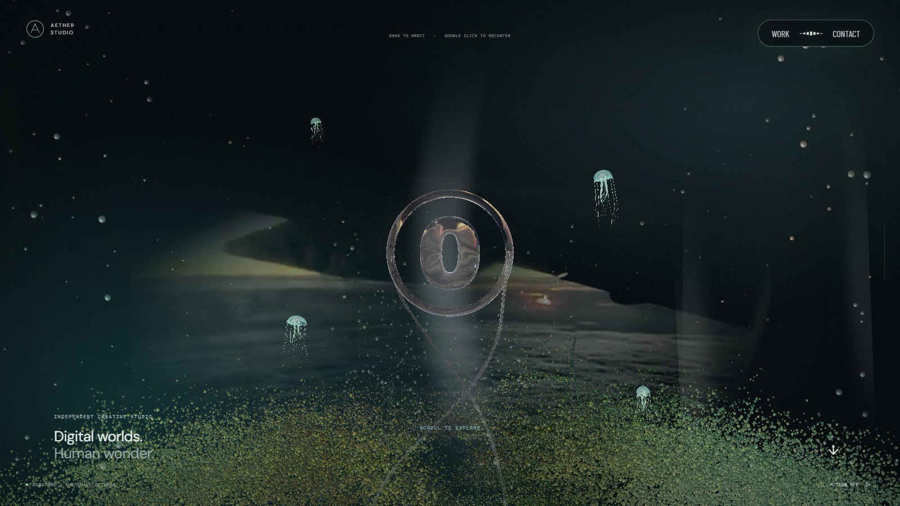
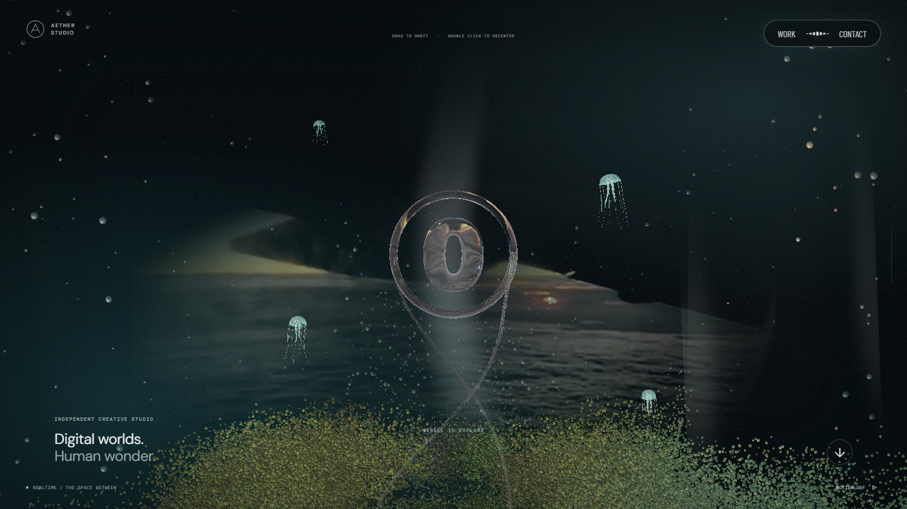
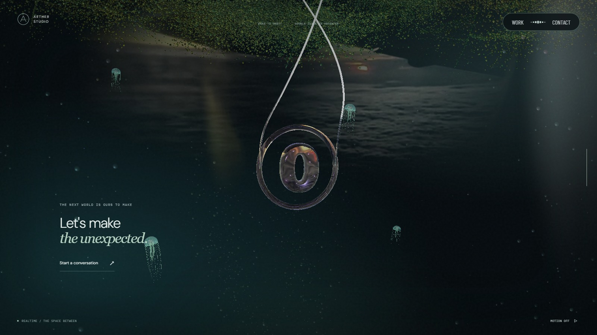
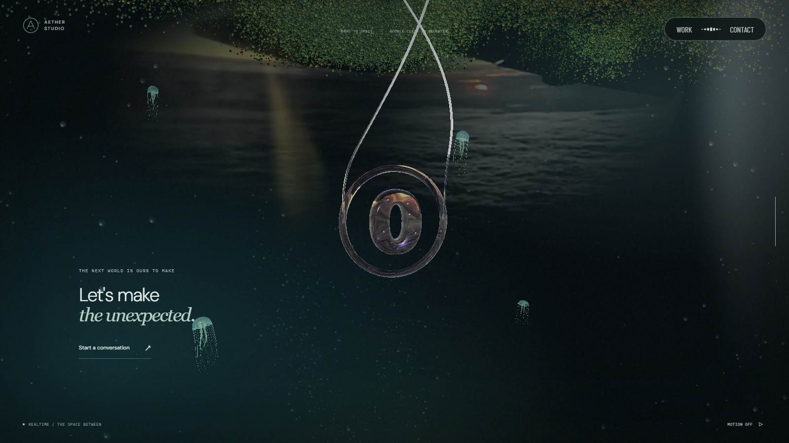
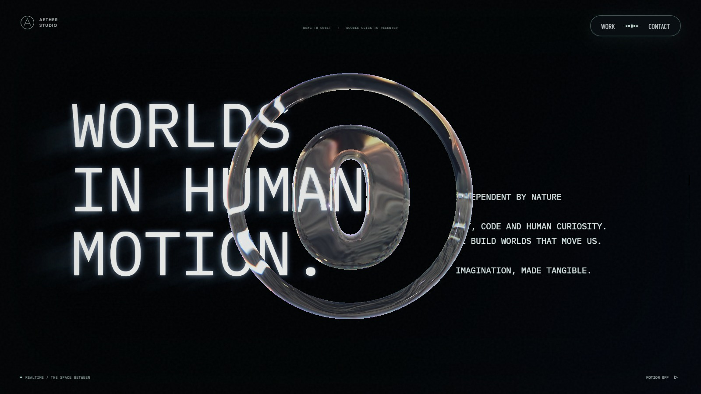
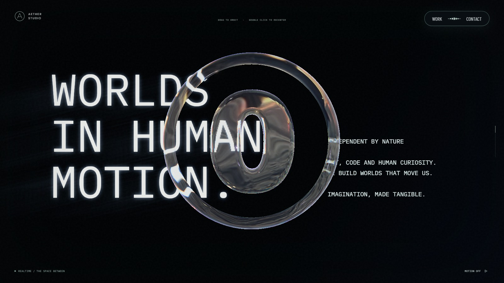

# 포레스트 분포·문구 빛 번짐·체인 반응

2026-09-26 확인. 기준은 `f37e080` 배포다.

## 변경

- 포레스트의 Y 좌표와 바닥 높이는 유지하고 X/Z를 2/3로 줄였다. 가지의 수평 길이와 나무의 원형 분포가 함께 줄어든다. 나무 수는 데스크톱 28→14, 모바일 22→11, 소프트웨어 모드 14→7이다.
- 같은 입자 예산 안에서 움직이는 잎 비율을 34%→85%, 가지 비율을 23%→57.5%로 바꿨다. 각각 약 2.5배다. 기존 카메라 높이별 순차 합류와 양방향 경로를 유지한다.
- 좌측 문구의 가는 윤곽에서 왼쪽 아래로 직선 빛을 누적한다. 물결 변형과 장면 경계는 문구·빛에 함께 적용한다.
- 체인은 현재 스크롤로 나선 이동·회전을 갱신한다. 본 컬럼·모니터·꽃은 하나의 65ms 추종 값을 공유한다. 빠른 이동에서 지연 진행도는 0.006 이내이며, 모션 정지·모션 감소 설정에서는 즉시 같은 위치로 맞춘다. 카메라와 장면 경계에는 이 지연을 적용하지 않는다.

## 실제 화면

1600×900, 기본 시점, 모션 정지, 같은 진행도로 캡처했다. 영상 정지 프레임은 다를 수 있다.

| 대상 | 변경 전 | 변경 후 | 판단 포인트 |
| --- | --- | --- | --- |
| 상단 포레스트 · 0% |  |  | 중심 쪽으로 모인 식물과 짧아진 가지 |
| 하단 포레스트 · 100% |  |  | 같은 높이의 역방향 배치 |
| 문구 · 22% |  |  | 왼쪽 아래로 뻗는 가는 직선 빛 |

## 검증

lint, typecheck, production build와 관련 회귀 검사 12개를 통과했다. 체인의 나선 접선 이동·종단 프레이밍, 본 컬럼의 양방향 지연과 정지 후 정확한 복귀, 프레임률 차이, 포레스트 이동 비율·높이·역동작을 검사했다.

실행 화면 1600×900·390×844에서 휠 이동을 양방향으로 확인했다. 움직이는 각 구간에서 체인이 본 컬럼보다 앞섰고 정지 후 두 진행도가 같아졌다. 최대 차이는 약 0.00065였다. [측정 기록](forest-light-chain/motion.json)에 구간별 관측과 정지 값을 보관했다. 포레스트의 진행도 0·0.045·0.075·0.935·0.965·1과 문구 0.22를 확인했으며 페이지·콘솔 오류는 없었다.

모바일 검증은 Chromium 에뮬레이션이다. 실제 Safari/iOS 및 저사양 기기의 장시간 성능은 이번 확인 범위에 포함하지 않았다. 전체 입자 수는 늘리지 않았다.
