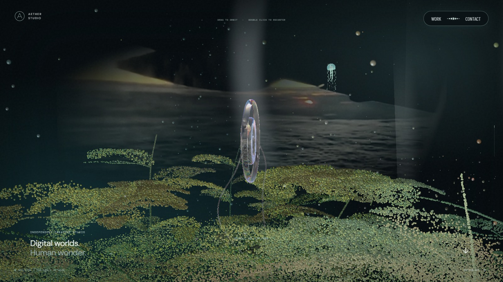
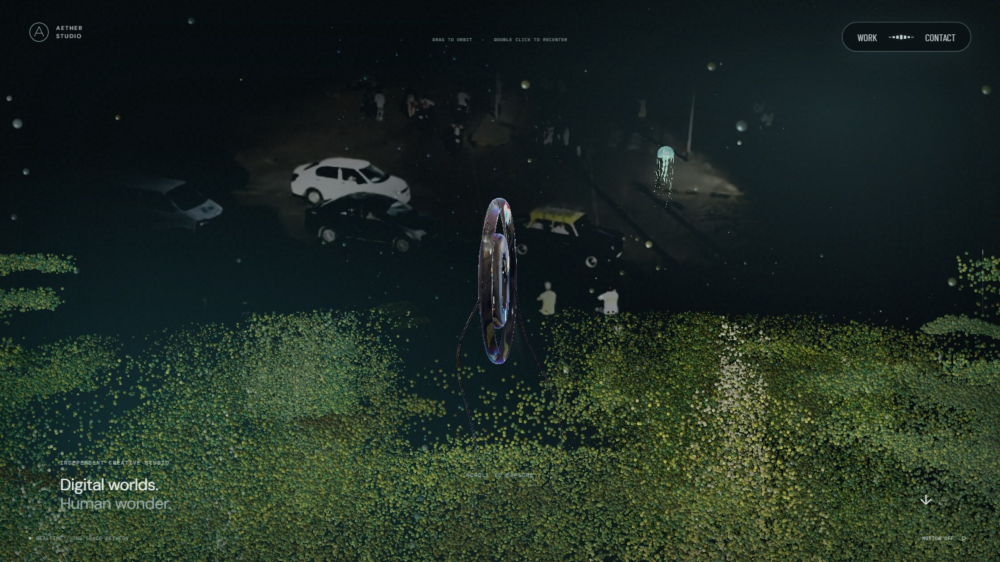
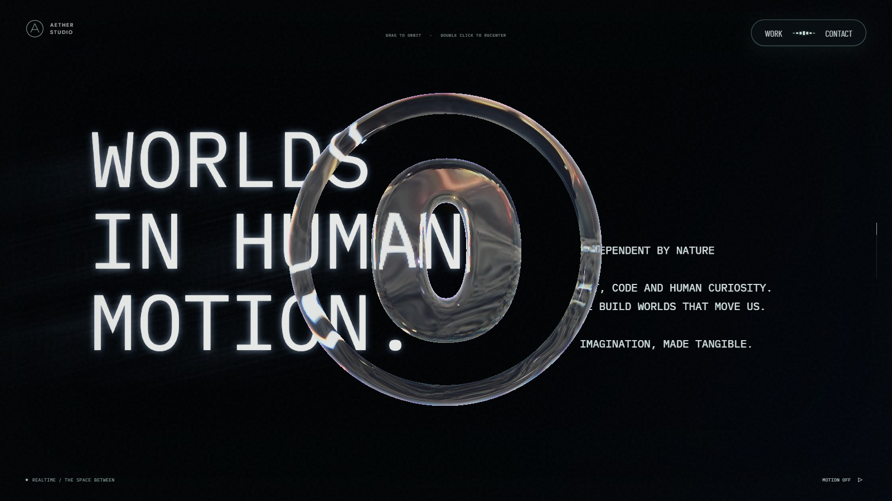
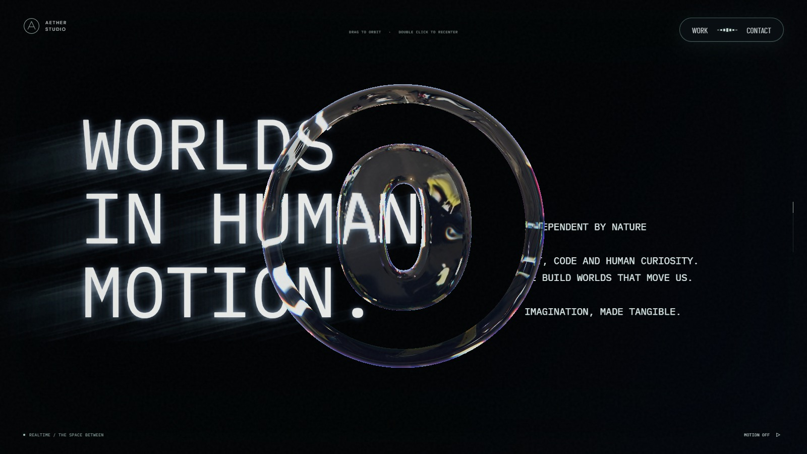
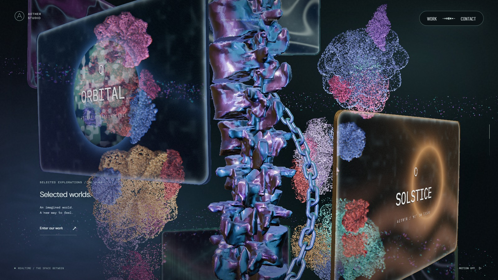
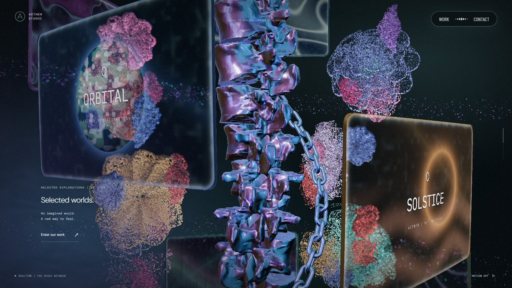
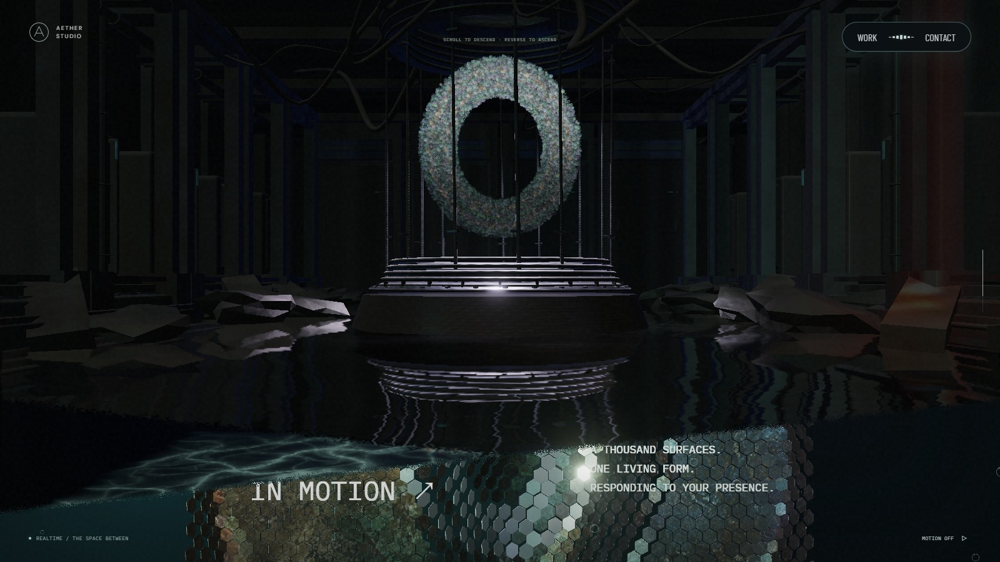
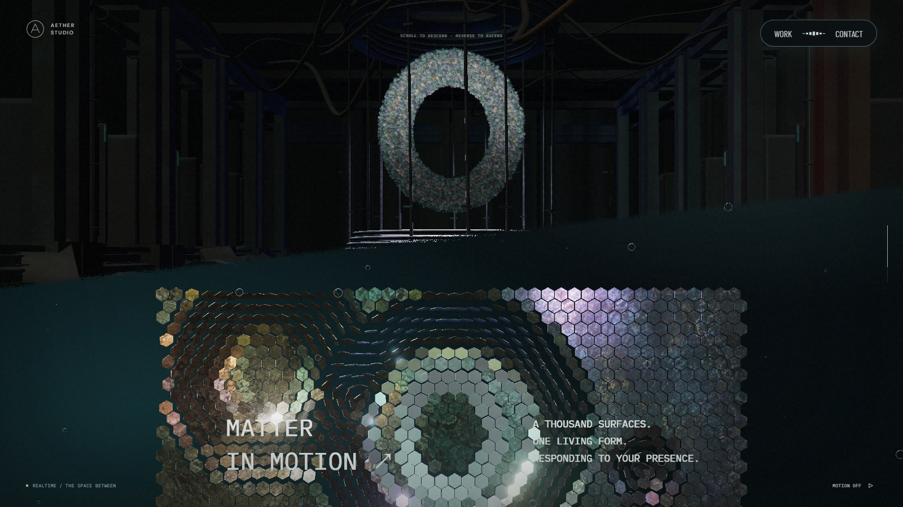
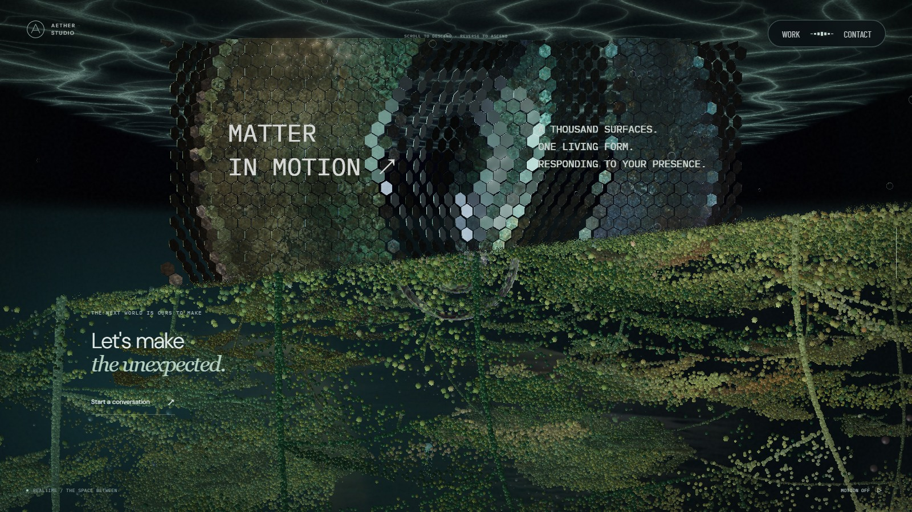
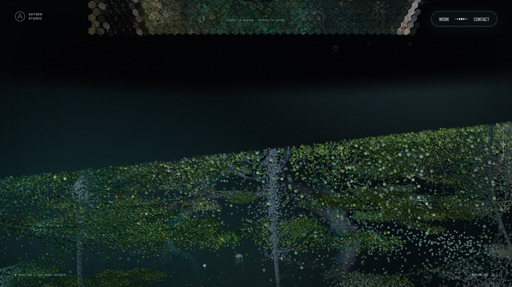

# 포레스트 보강과 스케일 패널 전환

2026-09-26 확인. 변경 전 기준은 `75a1911`이다.

포레스트 보강 입자의 세로 이동 거리와 카메라 높이 기준 반응 구간을 각각 2배로 늘렸다. 시작 위치는 중심 방향으로 12% 모으고, 높은 가지부터 낮은 가지까지 순차적으로 합류한다. 추가 요청에 따라 나무 수는 약 2/3로 줄였다. 각 포레스트 기준 데스크톱 14→9, 모바일 11→7, 소프트웨어 모드 7→5그루이며 나무 높이와 입자 예산은 유지한다. 포레스트의 스크롤 회전은 양쪽 모두 절반으로 줄였으며 드래그 입력은 그대로 반영한다.

넓고 평평한 수관을 만들던 긴 연결 가지와 늘어진 덩굴을 없애고 실제 줄기 끝에서 짧은 잎 묶음을 배치했다. 기존에 잎 배치에서 빠졌던 짧은 가지에도 잎을 분배하고 중앙의 빈 띠를 채웠다. 입자 경계는 화면 좌표 대신 입자별 고정값으로 처리하고, 날카로운 반짝임과 점 가장자리를 부드럽게 했다.

문구의 모든 큰 글자 윤곽에서 왼쪽 아래로 직선 빛을 낸다. 추가 요청에 따라 두 글자 폭으로 조정했던 길이를 다시 2.5배 늘리고 밝기를 낮췄다. 체인은 나선 경로 이동에 접선 축 회전을 더했다. 기존 65ms 본 컬럼 추종 지연과 고리의 교차 결합을 유지한다. AT의 실제 스크롤 화면에서 고리 방향 변화는 확인했지만 내부 회전축·각도를 측정한 것은 아니다. 여기서는 해당 인상을 재현하는 자체 동작으로 구현했다.

스케일 패널과 물결 천장은 고정된 월드 높이를 사용한다. 천장 높이는 리액터 바닥과 같은 `-43.212`이며, 경계선은 카메라 높이에 따라 진행한다. 패널 정면 구간은 100svh, 앞뒤 전환은 각각 119svh로 분리해 전환까지 한 화면에 압축되던 급가속을 없앴다. 리액터 물 반사에서는 다음 장면의 패널과 천장을 제외한다.

본 컬럼의 큰 꽃은 꽃 입자 배분을 40%에서 46%로 늘려 약 15% 더 촘촘하게 했다. 전체 입자 예산은 유지하며 작은 꽃의 배분은 60%에서 54%로 줄였다. 꽃잎의 형태, 높이에 따른 보강·역이동, 모니터 회피 경로는 유지한다.

## 시각적 변경

1600×900, 기본 입력, 모션 정지, 동일 진행도에서 실행 화면을 캡처했다. 큰 꽃 행은 나머지 수정을 적용한 상태에서 밀도 변경 직전·직후를 비교한다. 영상과 시간 기반 표면의 정지 프레임은 다를 수 있다.

| 대상 | 변경 전 | 변경 후 | 판단 포인트 |
| --- | --- | --- | --- |
| 포레스트 · 7.5% |  |  | 짧은 수관, 보강 중인 잎, 느려진 회전 |
| 문구 · 22% |  |  | W·I·M에서 이어지는 가는 직선 빛 |
| 큰 꽃 · 46% |  |  | 큰 꽃잎의 입자 밀도 |
| 리액터 → 스케일 패널 · 74% |  |  | 경계선과 패널 접근, 물에 비치는 다음 장면 제거 |
| 스케일 패널 → 포레스트 · 89% |  |  | 고정된 패널과 연속적인 경계선 이동 |

## 검증

lint, typecheck, production build를 통과했다. 관련 검사에서 체인의 접선 이동·자체 회전·역방향 복원, 양쪽 포레스트의 절반 회전·두 배 보강 구간, 고정된 패널·천장 높이와 장면 경계의 픽셀 가림을 확인했다. 실제 반사 렌더에서도 패널이 직접 화면에 남고 물 반사에서는 사라지는지 검사했다.

1600×900·390×844 실행 화면에서 포레스트와 문구, 두 전환을 확인했다. 스케일 패널 진입·정면·이탈의 세 위치에서 휠을 양방향으로 움직였으며 정지 구간이나 페이지·콘솔 오류는 없었다. 체인 선행 반응과 본 컬럼의 정지 후 복귀도 유지됐다. [측정 기록](forest-surface-motion/motion.json)에 입력 전후 진행도와 관측값을 보관했다.

모바일 확인은 Chromium 에뮬레이션이다. 실제 Safari/iOS와 저사양 기기의 장시간 성능은 확인 범위 밖이다.
