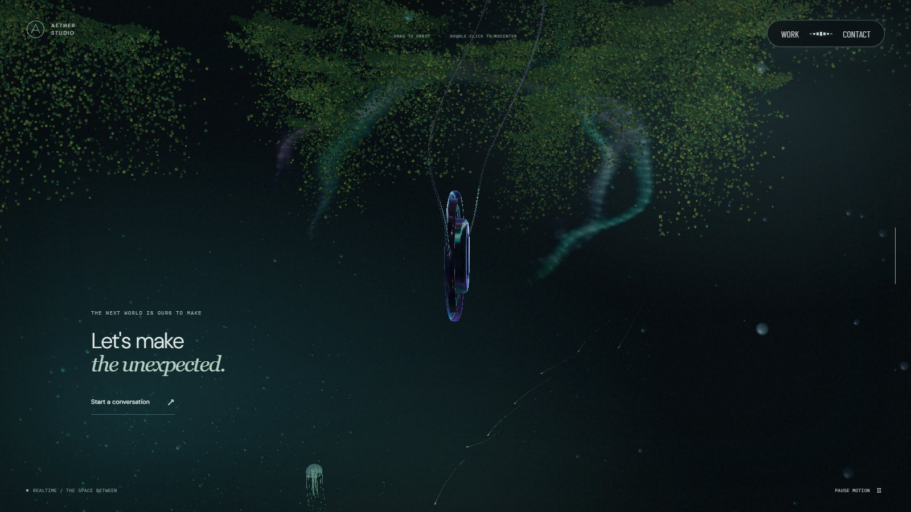
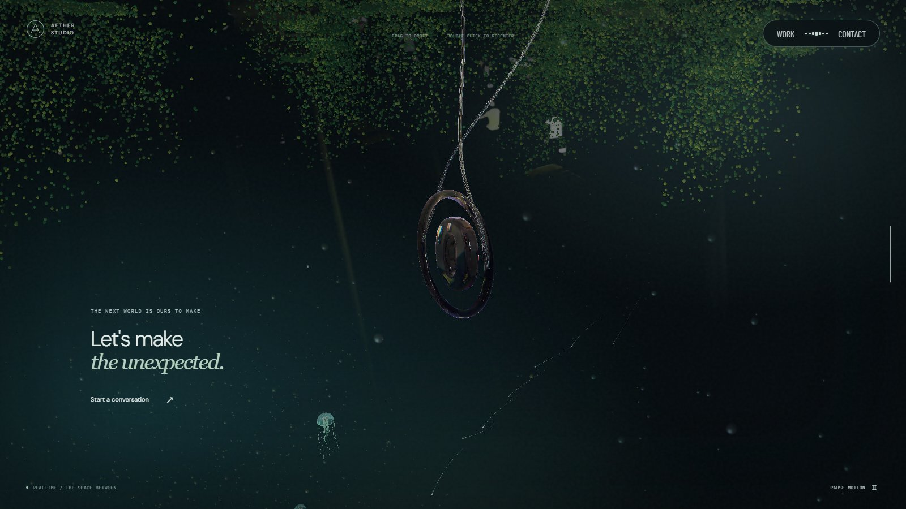
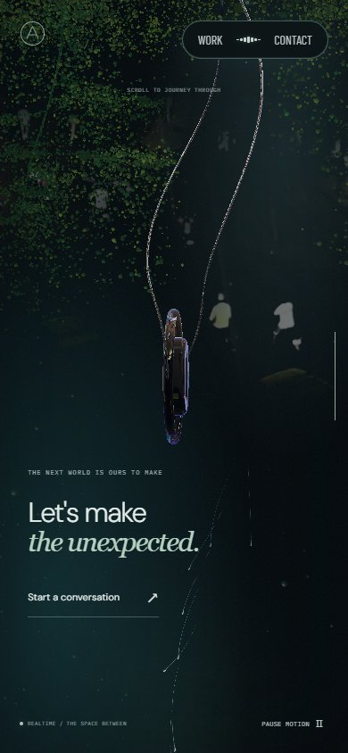
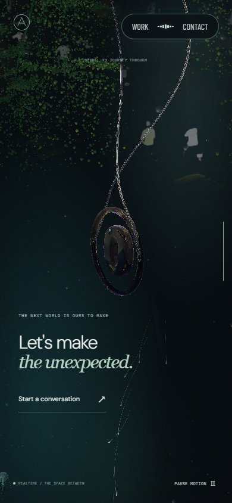

# 하단 포레스트 회전·드래그 검증 · 2026-09-27

## 변경

기준 커밋은 7b722aa다. 하단 링의 자동 회전만 계산하면 기존에도 한 방향이지만, 진행도 0.87~1.0에서 이전 드래그 각도 전체를 다시 곱하는 방식은 저장된 수평 각도에 따라 스크롤 회전을 반전시킬 수 있었다. 하단 입력은 새로 발생한 수평 변화에만 감도를 적용해 저장된 각도가 스크롤만으로 커지지 않게 했다. 링의 별도 복귀 각도도 고정해 스크롤 내림은 시계 방향, 올림은 동일 경로의 반시계 방향으로 진행한다.

드래그 잠금 해제는 0.87~1.0에서 하단 포레스트가 들어오는 0.80~0.84로 앞당겼다. 수평 이동은 제한하지 않는다. 수직 입력은 아래쪽 약 16°, 위쪽 약 13°로 제한한다. 기존 아래쪽 약 2.3° 제한을 넓히되 과도한 위쪽 시선은 막았다. 수직 입력은 절대 각도에 한계를 적용하므로 이전 장면에서 선택한 각도와 무관하게 양쪽 한계에 도달할 수 있다.

상단 링 회전, 카메라 기본 높이, 스케일 패널·천장 위치, 장면 경계 계산은 유지한다. 드래그를 사용하는 경우 전환 중 카메라 시점이 달라지는 것은 의도한 변경이다. 더블 클릭 복귀와 렌더러 재생성 시 선택한 수평 시점 보존도 확인했다.

## 시각적 변경

실제 브라우저에서 같은 뷰포트, 진행도 0.99, 중앙 복귀 후 동일한 대각선 드래그를 적용했다. 모션을 켠 상태라 입자·미디어 프레임은 다를 수 있다. 정지 화면은 회전 방향의 증거가 아니며 왕복 경로는 별도 수치 검사로 검증했다.

| 대상 | 변경 전 | 변경 후 | 판단 포인트 |
| --- | --- | --- | --- |
| PC 1600×900 |  |  | 드래그 시 수직 시야와 링 자세 |
| 모바일 폭 390×844 |  |  | 작은 화면의 시선 한계 |

## 검증

- lint, typecheck, build 통과.
- 입력·프레이밍·포레스트·회전 경로 테스트 16개 통과. 마지막 수직 입력 보정 뒤 관련 테스트 2개 재통과.
- PC·모바일 전체 스크롤, 전환 전후 잠금과 드래그, 역스크롤 검사 4개 통과. 모바일은 동시 테스트의 결과 파일 충돌로 첫 실행 종료 시 실패했고, 독립 결과 경로로 재실행해 통과했다.
- 저장된 수평 각도 -5, 0, 5rad 모두에서 하단 전 구간 내림 방향과 역스크롤 동일 경로를 확인했다.
- PC·모바일 폭에서 전환 초반 0.82, 중간 0.90, 마지막 0.99의 드래그와 더블 클릭을 실행했다. 최종 수직 한계는 0.99에서 다시 캡처했다. 페이지 오류 없음.

모바일 캡처의 드래그는 마우스 입력이며 모바일 네이티브 터치 제스처까지 검증한 것으로 확대하지 않는다. 배포 전 로컬 검증 기록이다.
