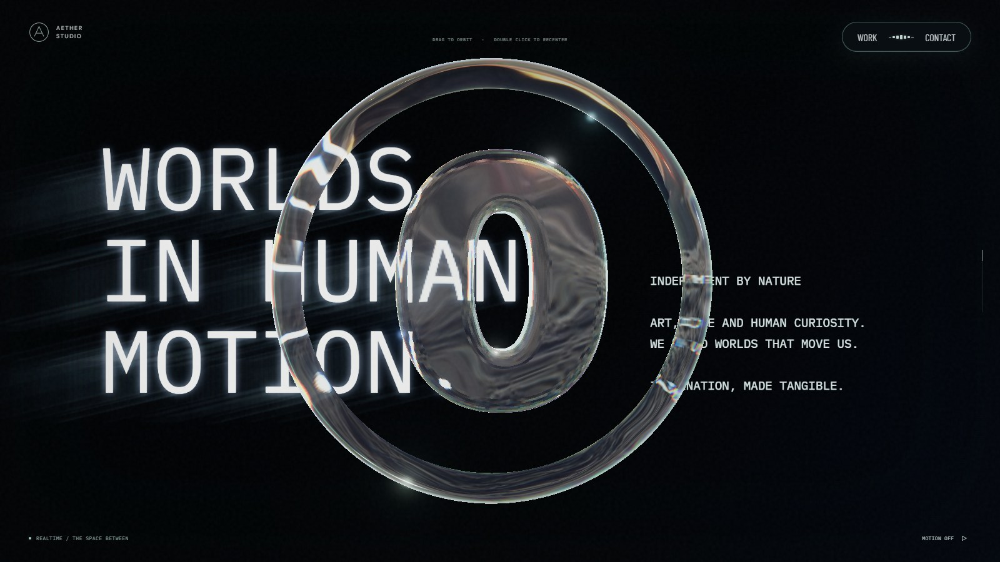
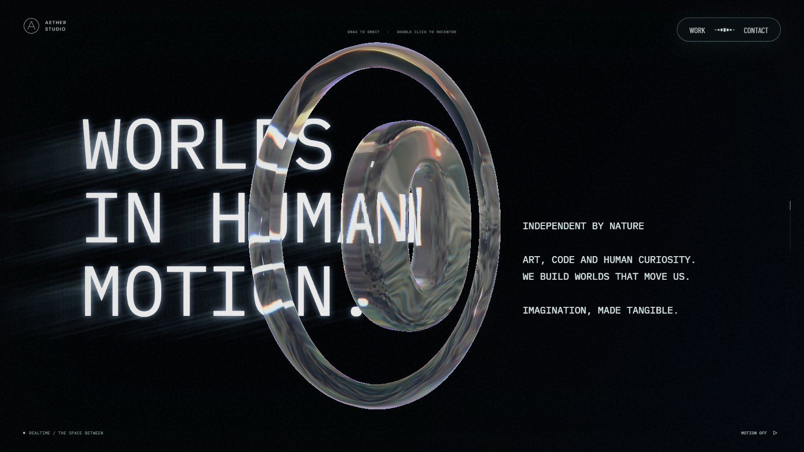
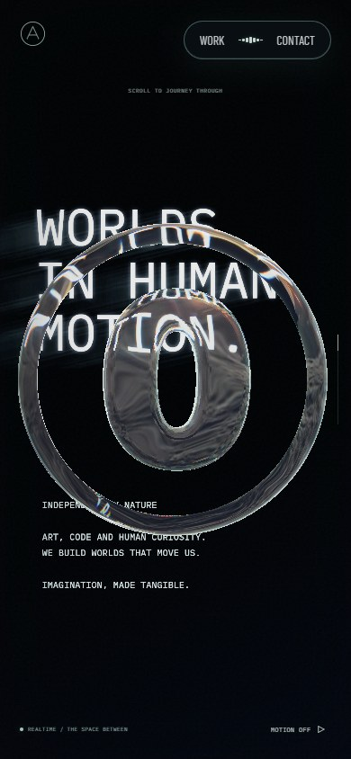
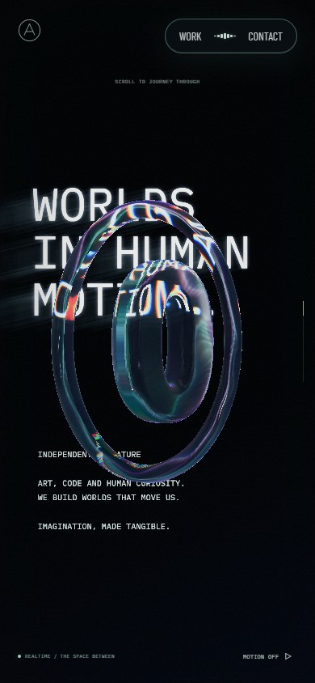

# 원형링 스크롤 회전 검증 · 2026-09-27

## 원인과 변경

#51의 8c07a35에서 상단 카메라 정면 고정을 해제하는 보간이 추가됐다. 진행도 0.16~0.20에서 같은 방향인 0과 약 2π를 수치 그대로 연결해 카메라 한 바퀴가 짧은 구간에 몰렸다. 부모 회전이 링의 화면상 방향을 보정하므로 링 자체가 두 바퀴 도는 설정은 아니다. 다만 월드 조명·반사·굴절은 카메라 회전에 영향을 받는다. 최근 천장 수정 c793974와는 별개다.

정면 고정 해제는 2π를 뺀 동등한 각도로 연결했다. 링은 기존 진입부터 텍스트 구간까지 한 바퀴 도는 범위를 유지하되 0~0.235에 완만하게 배분했다. 본 컬럼 전환 직전 0.235~0.305에서는 기존 약 40° 대신 약 16° 역회전한다. 포인터 회전과 하단 링 계산은 유지한다.

## 시각적 변경

기준 c793974와 수정본의 실제 브라우저 캡처다. 같은 뷰포트·스크롤 진행도 0.18·모션 일시정지를 사용했다. 반사에 쓰이는 미디어 프레임은 완전히 동일하지 않을 수 있다. 정지 화면만으로 회전 속도를 증명하지 않으며 수치 경로 검사와 왕복 휠 입력을 함께 확인했다.

| 대상 | 변경 전 | 변경 후 | 판단 포인트 |
| --- | --- | --- | --- |
| PC 1600×900 |  |  | 중간 회전 자세와 텍스트 배치 |
| 모바일 390×844 |  |  | 링·텍스트·전환 영역 |

## 검증

- lint, typecheck, build 통과.
- 링 재질·리소스·회전 및 씬 프레이밍 테스트 14개 통과.
- PC·모바일 각각 진행도 0.10, 0.14, 0.16, 0.17, 0.18, 0.19, 0.20, 0.235, 0.27, 0.295, 0.32, 0.94 캡처. 런타임 오류 없음.
- 같은 지점의 수정 전후 카메라 높이·본 컬럼 회전값 차이 0. 상단 해제 구간 카메라 각도는 약 -0.07rad 범위로 줄었다.
- 진행도 0.17, 0.235, 0.295에서 왕복 휠 입력 확인. 원형링 한 바퀴, 약 16° 역회전, 포인터 입력 보존을 수치 회귀 테스트로 확인.

## 한계

원형링 회전 자세와 이에 따른 반사 모습은 의도적으로 바뀐다. 기기별 반사·미디어 프레임의 완전한 일치는 검증 범위가 아니다. 배포 전 로컬 검증 기록이다.

추가 검증: PC·모바일 전체 스크롤, 배경 드래그, 회전 잠금·역스크롤 테스트 4개 통과(총 18개).
