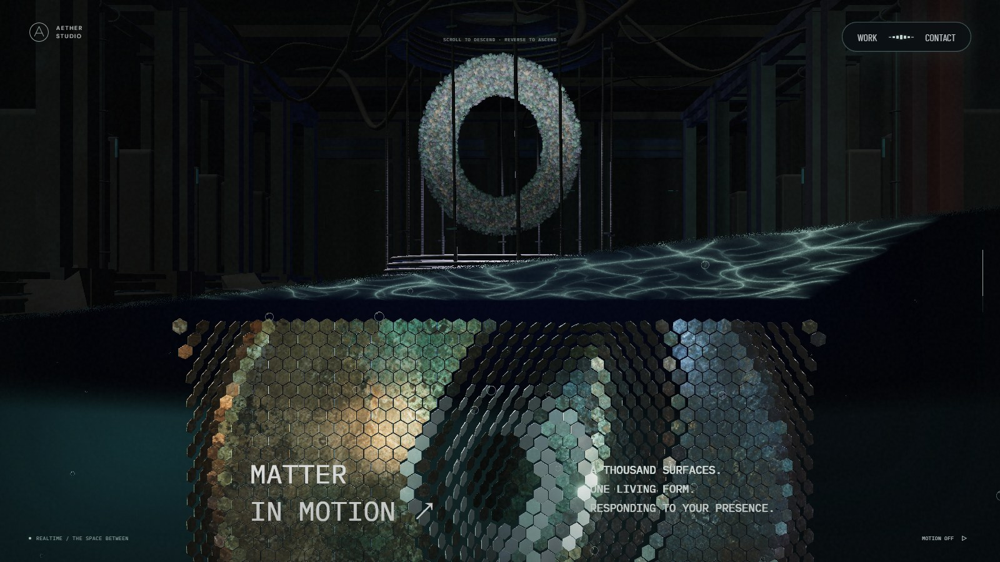
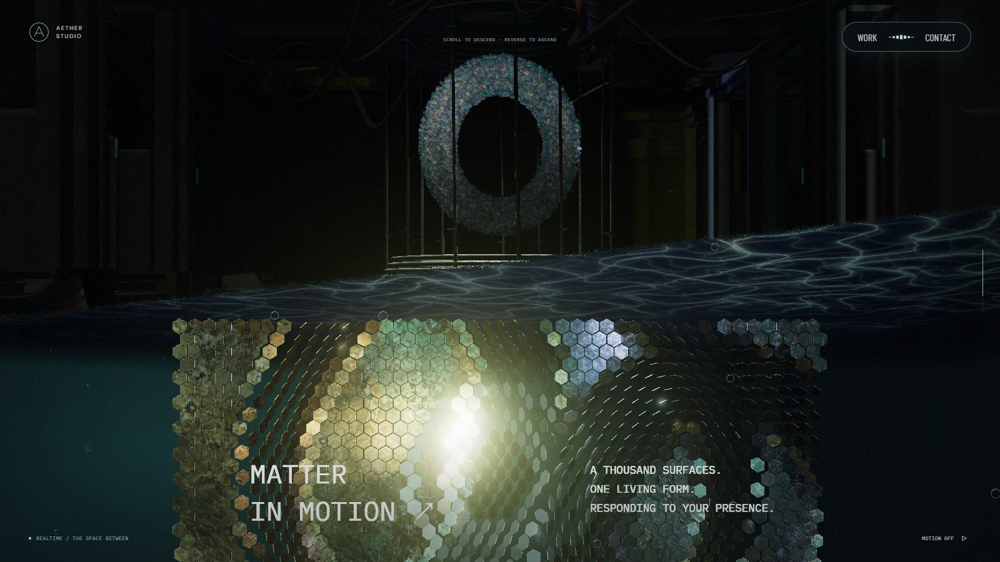
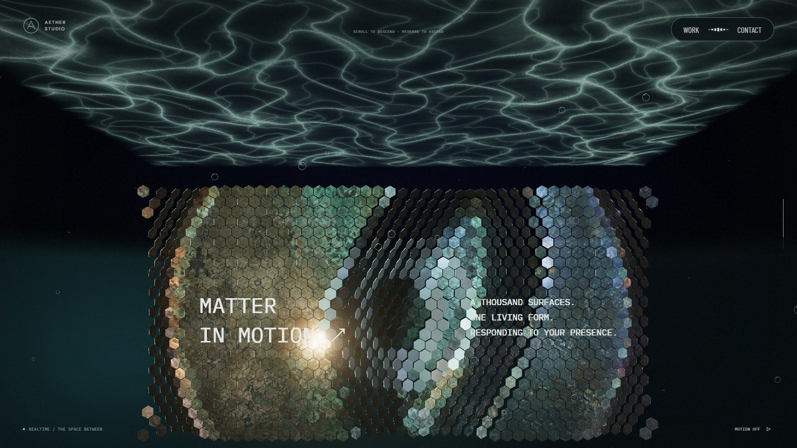
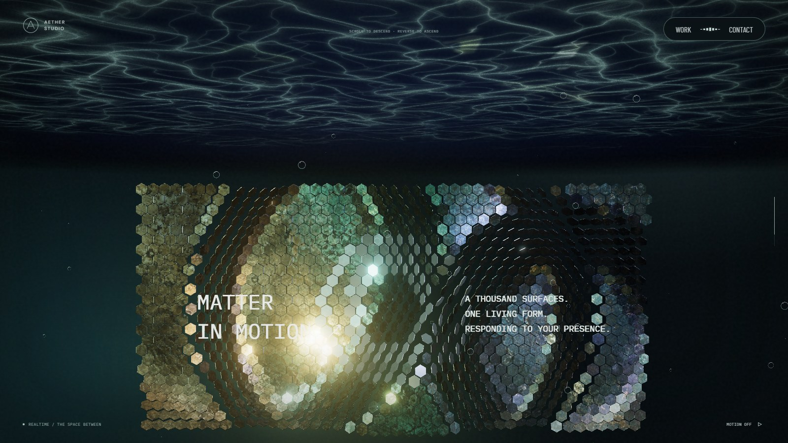
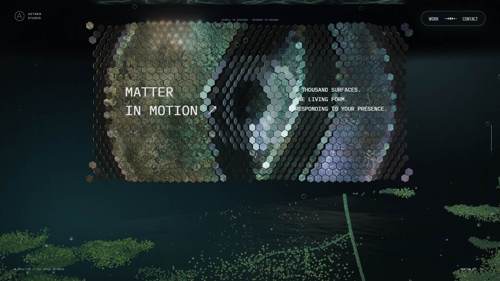
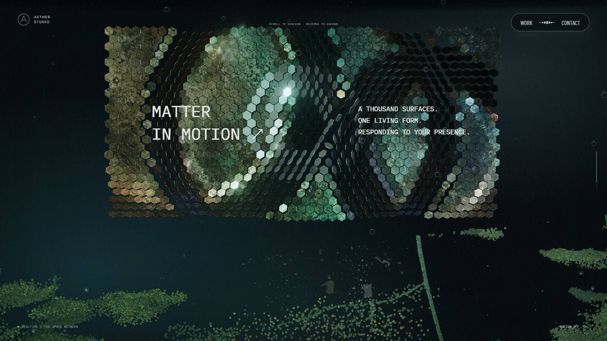
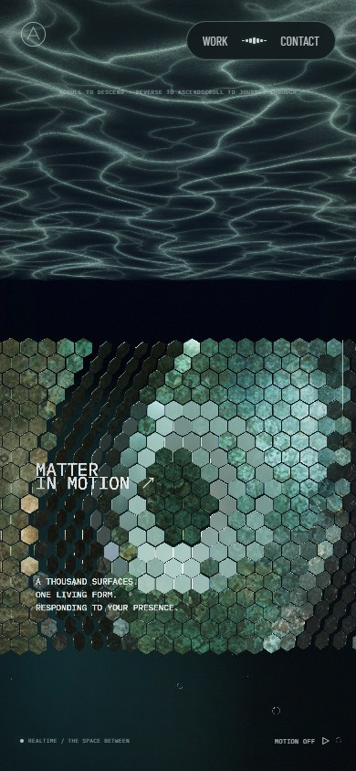
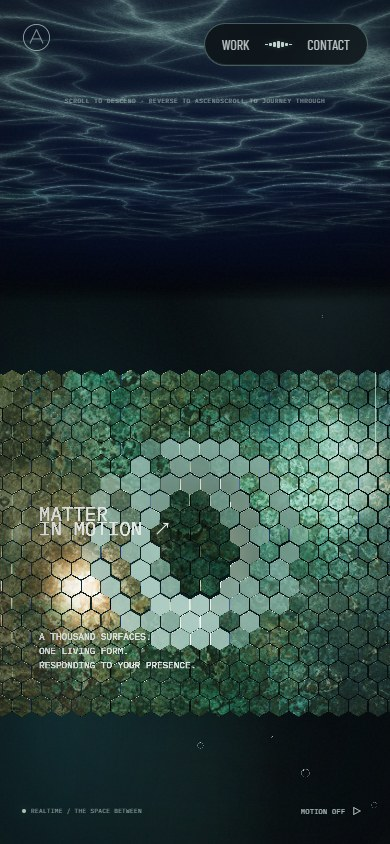

# 스케일 패널 천장의 원근과 기울기

기준 커밋은 `d3d66ae`다. 천장이 큰 사다리꼴로 보이던 범위를 줄이고, 스크롤할 때 표면의 원근 변화가 남도록 조절했다. 첨부된 참고 화면은 구도 판단에만 사용했다.

천장은 진입 초반의 완만한 기울기에서 정면 구간의 비스듬한 기울기로 연속적으로 바뀐다. 표면과 물결에 같은 굴곡을 주고, 물결 영역을 천장 전체로 확장한 뒤 거리와 각도로 흐리게 처리했다. 작은 직사각형 물결 메시의 경계가 사다리꼴로 드러나던 부분을 없앴다. 화면 이동 보정은 92%만 적용해 카메라 이동에 따른 원근 차이를 남겼다. 거리·각도 계산에도 보정된 위치와 법선을 사용한다.

천장의 중심 높이, 리액터 바닥, 패널 위치, 카메라 경로, 스크롤 길이와 모든 씬 전환 경계는 유지한다. 천장 메시 두 개와 해당 셰이더만 바꾸며 반사 대상이나 유체·마우스 입력은 변경하지 않는다.

## 시각적 변경

PC 1600×900, 모바일 390×844의 실제 실행 화면이다. 같은 진행도와 기본 입력으로 촬영했다. 모션 정지 시점의 영상·조명·패널 파형은 다를 수 있으므로 천장 범위와 구도를 비교한다.

| 대상 | 변경 전 | 변경 후 | 판단 포인트 |
| --- | --- | --- | --- |
| 진입 · 74% |  |  | 경계선이 열릴 때부터 보이는 천장 |
| 정면 · 76.5% |  |  | 줄어든 화면 점유와 부드러운 원경 |
| 이탈 · 82.5% |  |  | 기존 위치에서 진입하는 하단 포레스트 |
| 모바일 · 76.5% |  |  | 좁은 화면의 천장과 패널 간격 |

## 검증

[측정 기록](scale-ceiling-depth-2026-09-27/motion.json)에서 PC·모바일 각각 16개 진행도의 카메라 높이와 회전값이 변경 전후 동일하다. 네 구간에서 세 번씩 휠을 내리고 되돌렸을 때 숲 회전값은 시작값으로 돌아왔으며 페이지·콘솔 오류는 없었다.

깊이 차폐 검사는 이동 보정을 CPU 정점에도 독립적으로 적용해 실제 GPU 셰이더와 비교한다. 기존 82% 검사 지점은 작아진 천장 밖이므로, 천장이 보이는 진입 75%와 정면 76.5%의 두 지점으로 바꿨다. CPU 변형 뒤의 경계 상자도 다시 계산한다. 천장 중심 높이와 다른 씬의 높이·경계선 검사는 유지한다.

`lint`, `typecheck`, `build`를 통과했다. 상호작용 검사 116개 중 115개가 처음 통과했고, 깊이 검사 지점과 CPU 경계 상자를 갱신한 뒤 깊이·경계선 검사 2개를 다시 통과했다. PC·모바일에서 24개 지점을 오가는 전체 스크롤 검사 2개도 통과했다.

모바일 확인은 Chromium 에뮬레이션이다. 실제 Safari/iOS는 확인하지 않았다. 천장 굴곡으로 메시 정점 수가 늘어나므로 저사양 실제 기기의 성능은 별도 확인이 필요하다.
