# 스케일 패널 전환과 체인 이동

기준 커밋은 `ba0510e`다. 리액터 챔버에서 스케일 패널로 들어올 때 천장이 뒤늦게 나타나는 현상, 하단의 긴 빈 공간, 포레스트 진입 뒤 급한 회전, 체인의 나선 이동을 수정했다.

천장을 패널보다 6.75 월드 단위 위에 두고, 화면에서는 패널과 같은 세로 이동량을 적용한다. 원근 투영의 수평선 때문에 천장이 전환 경계선 뒤에 숨었다가 나타나던 동작을 없앴다. 천장 표면과 물결에 같은 이동을 적용하며, 경계선 마스크도 이동이 끝난 화면 좌표를 사용한다. 리액터 바닥과 반사면의 위치는 유지한다.

하단 포레스트 경계 구간을 진행도 82.5~89.5%에서 80~87%로 옮겼다. 경계선이 처음 보일 때 패널 아래 빈 공간은 PC 기준 화면의 약 1/3 이하다. 하단 카메라 경로와 포레스트·배경 영상의 기준 높이를 함께 올려, 숲의 천장 전체가 먼저 드러나는 구도를 줄였다.

하단 회전은 80~100% 구간에 나눴다. 드래그 시점 복귀도 87~100%에 걸쳐 적용한다. 92.5%에서 갑자기 바뀌던 스크롤 거리 비율은 90.5~94.5% 사이에서 연속적으로 변한다. 전체 페이지 높이와 앞 장면의 스크롤 길이는 유지한다.

체인은 카메라에 보이는 끝점 높이를 맞추기 위해 나선 위의 위치를 다시 계산하던 보정을 제거했다. 이 보정은 일부 구간에서 링크의 이동을 역전시켰다. 이제 스크롤 진행도가 나선 경로의 이동량을 정하며, 장면 경계선이 표시 범위를 담당한다. 전면 가닥은 우상단에서 좌하단으로 기울어진 경로를 따라 이동한다. 본 컬럼의 시계 방향 회전, 체인 선행·컬럼 지연, 접선 축 네 바퀴 회전과 인접 링크의 직교 배치는 유지한다. 전체 화면에서 보이는 방향은 컬럼 회전과 원근 효과도 함께 반영한다.

## 시각적 변경

PC 1600×900, 모바일 390×844에서 같은 진행도와 기본 입력으로 캡처한 실제 화면이다. 모션을 정지한 뒤 스크롤했으며, 영상과 시간 기반 표면의 정지 프레임은 다를 수 있다. Active Theory는 동작 참고용으로만 확인했고 해당 사이트의 코드·에셋·캡처는 포함하지 않았다.

| 대상 | 변경 전 | 변경 후 | 판단 포인트 |
| --- | --- | --- | --- |
| 리액터 → 패널 · 74% | 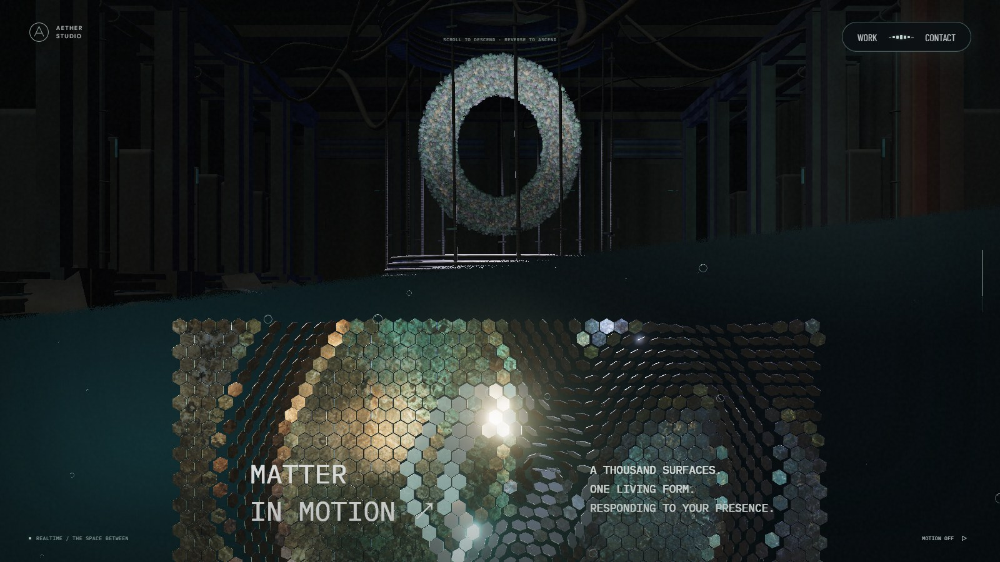 | 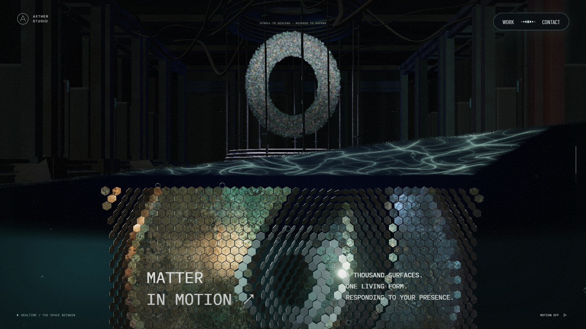 | 경계선 아래에서 패널과 함께 들어오는 천장 |
| 패널 → 포레스트 · 82.5% | 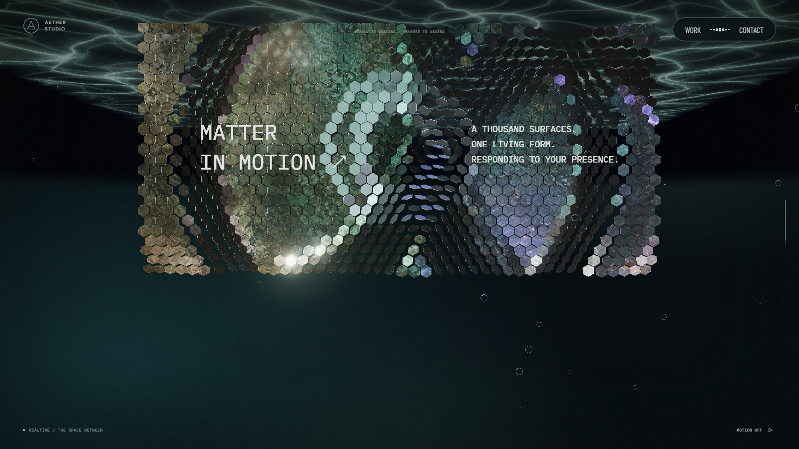 | 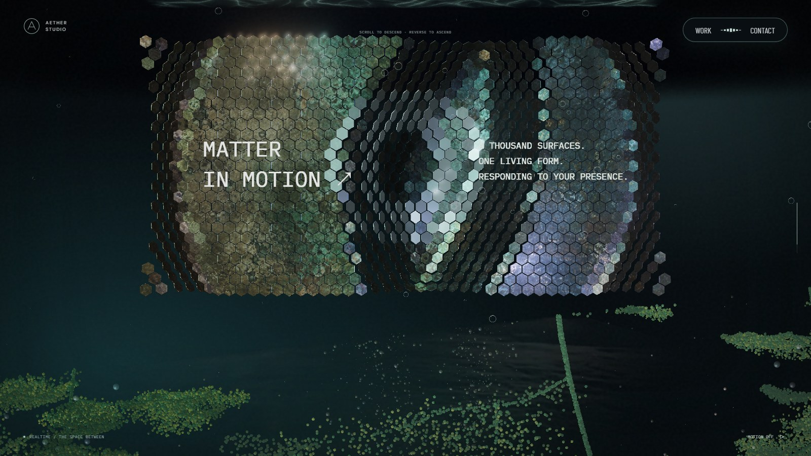 | 긴 빈 공간 전에 시작되는 다음 장면 |
| 하단 포레스트 · 93.5% | 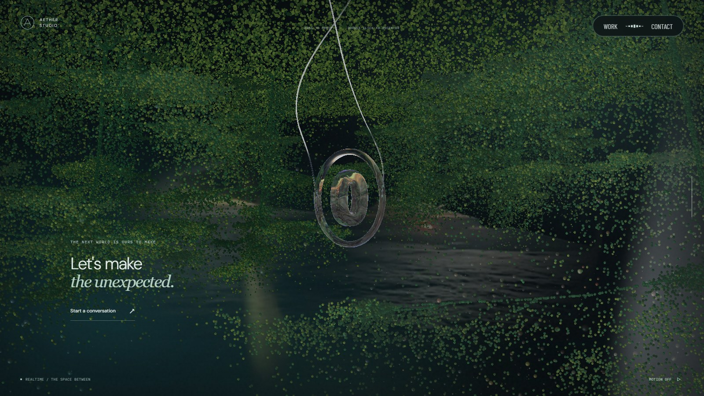 | 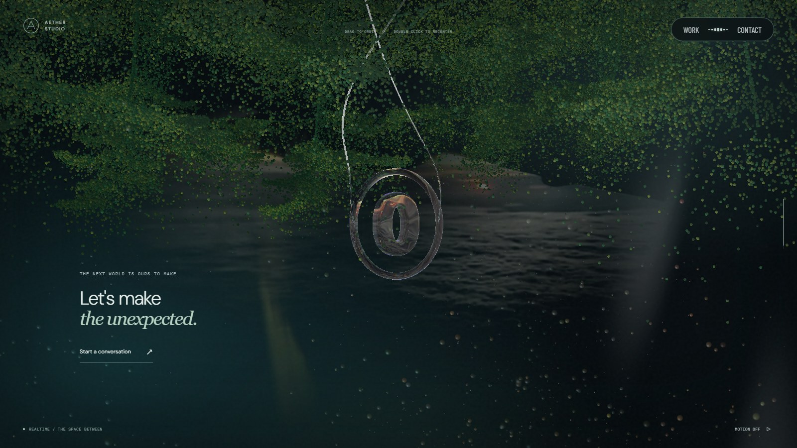 | 완만해진 회전과 높아진 숲의 기준 위치 |
| 체인 · 40% | 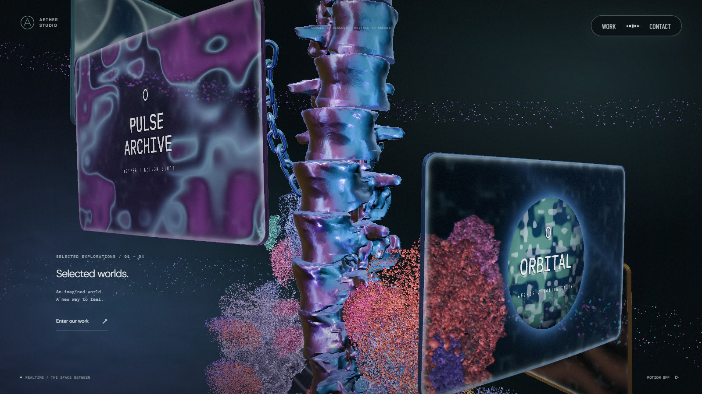 | 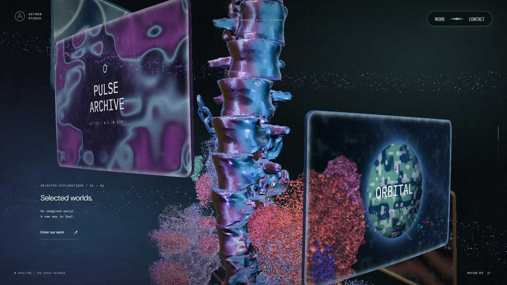 | 나선 이동으로 정해지는 링크 위치 |
| 모바일 진입 · 74% | 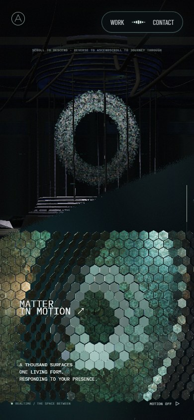 | 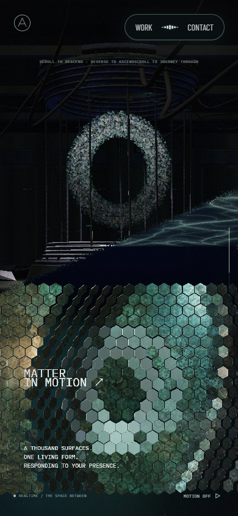 | 좁은 화면에서도 보이는 천장 |
| 모바일 하단 전환 · 82.5% | 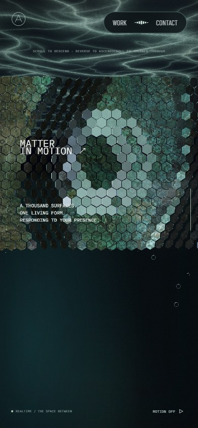 | 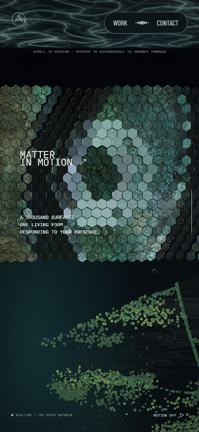 | 경계선과 숲의 진입 위치 |

## 검증

자동 검사에서 체인 전 구간의 연속 하강, 링크 간격·접선 정렬, 카메라 위치에 영향받지 않는 이동, 역스크롤 복원을 확인한다. 천장의 실제 셰이더와 최종 투영을 반영한 CPU 교차 검사로 깊이 차폐를 비교하고, 공통 경계선의 픽셀 누출도 검사한다. 하단 회전량과 스크롤 속도의 연속성, 스크롤 좌표의 정·역변환도 확인한다.

`lint`, `typecheck`, `build`를 통과했다. 상호작용 검사 116개 실행 후 이전 높이·전환 기준을 사용하던 4개 검사를 갱신했고, 관련 11개 재검사를 모두 통과했다. PC·모바일에서 24개 지점을 오가는 전체 스크롤 검사 2개도 통과했다.

진행도 93.5%에서 화면 높이의 1/5씩 세 번 휠을 내렸을 때 PC의 숲 회전량은 약 0.598라디안에서 0.229라디안으로 줄었다. 같은 양을 되돌리면 기록된 시작 회전값으로 복귀했다. 모바일에서도 각각 약 0.598, 0.229라디안이며, 두 환경의 페이지·콘솔 오류는 없었다.

[화면·휠 입력 측정](scale-entry-chain-feed-2026-09-27/motion.json)에 PC·모바일의 진행도, 카메라 높이, 회전값과 양방향 입력 결과를 보관한다. 모바일 검증은 Chromium 에뮬레이션이며 실제 Safari/iOS는 확인하지 않았다. 참고 사이트와의 시각적 일치율을 수치로 주장하지 않는다.
