# 스크롤 장면 비교 · 2026-09-21

[Active Theory](https://activetheory.net/)를 관찰해 링·꼬리의 결합, 구슬 입자, 금속 반사, 원근 프로젝트, 기계 장치의 장면 흐름을 개선했습니다. 브랜드·문구·모델·shader·프로젝트 이미지는 자체 작성했습니다. 이 문서의 원본 이미지는 비교·검수 목적의 실제 브라우저 캡처이며 런타임에는 사용하지 않습니다.

## 비교 조건

- 모든 데스크톱 이미지: 1440×900, 기본 포인터 위치, 사용자 입력 없는 정착 상태.
- 변경 전: 기존 공개 배포의 실제 문서 스크롤 0/25/50/75/100%.
- 변경 후: 새 production 빌드의 500svh 홈, 실제 문서 스크롤 0/25/50/75/100%. Chromium D3D11, RTX 2060 SUPER GPU 확인. 소프트웨어 렌더러 이미지를 GPU 화면처럼 표시하지 않았습니다.
- 원본: DOM 높이가 900px인 가상 스크롤입니다. 실제 wheel 입력을 0/5,000/10,000/15,000/20,000px 누적한 대표 장면이며 원본 내부 진행률의 정확한 25% 간격이라고 주장하지 않습니다. 끝 장면 이후 추가 입력에도 구도가 유지되는 것을 확인했습니다.
- 동적 입자는 촬영 순간마다 달라집니다. 픽셀 일치율을 측정하지 않았고, 사용자가 제시한 약60%는 시각 방향의 목표입니다.

## 같은 크기의 실제 캡처

| 지점 | 참고 원본 | 변경 전 | 변경 후 |
| --- | --- | --- | --- |
| 시작 | 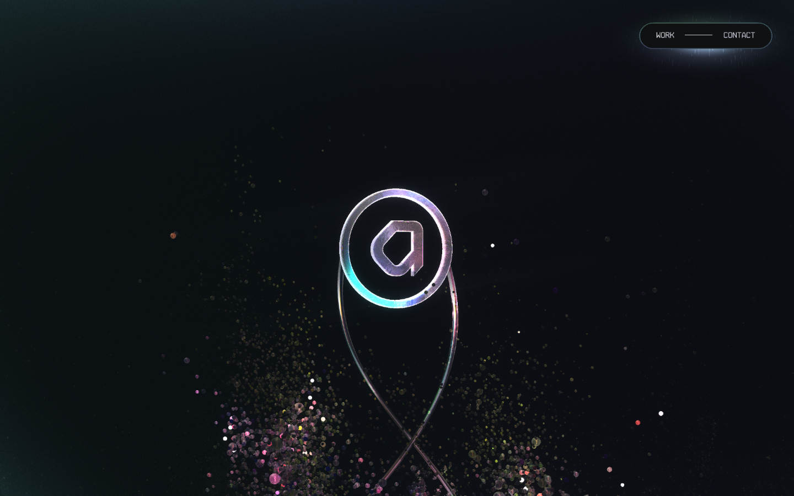 | 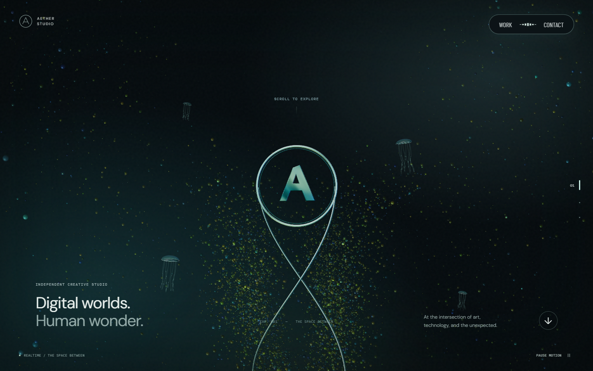 | 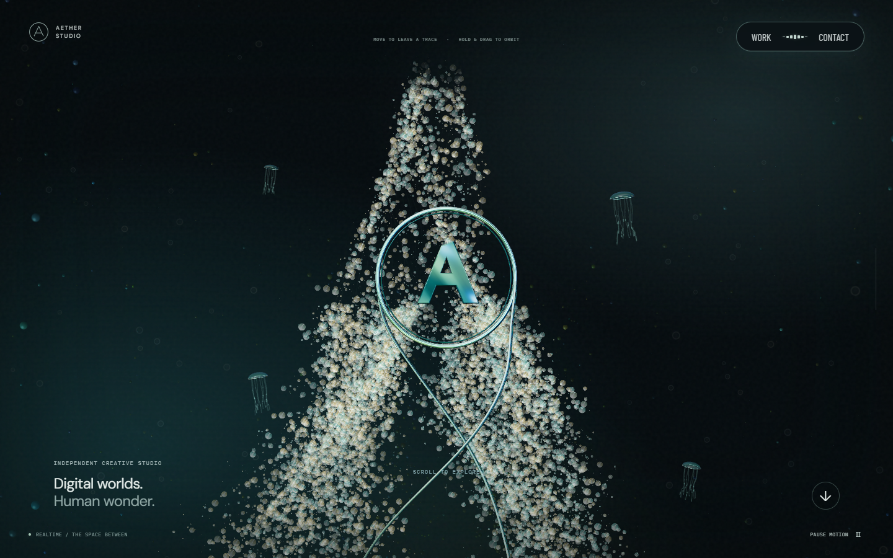 |
| 25% 대표 | 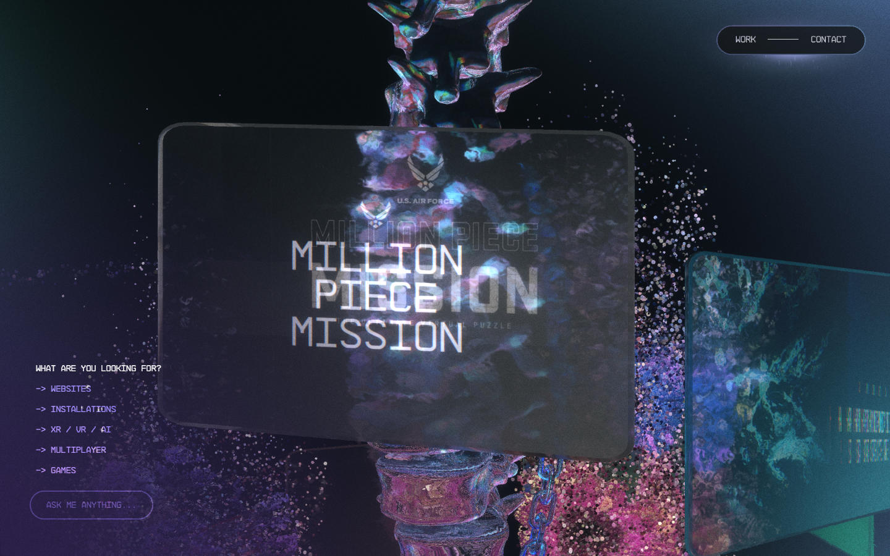 | 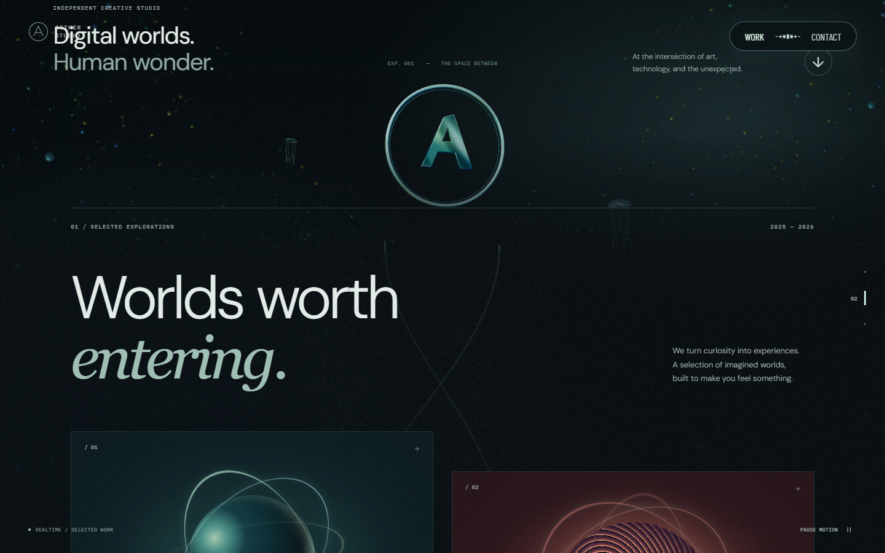 | 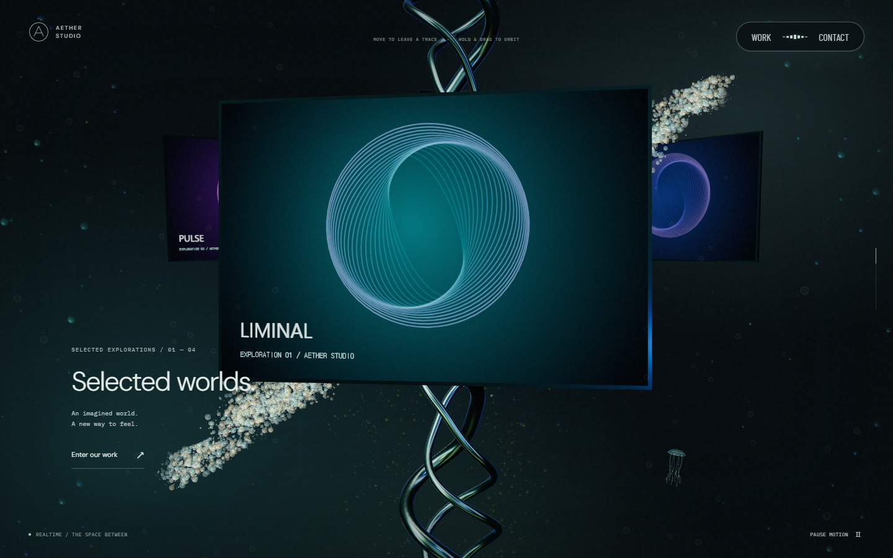 |
| 50% 대표 | 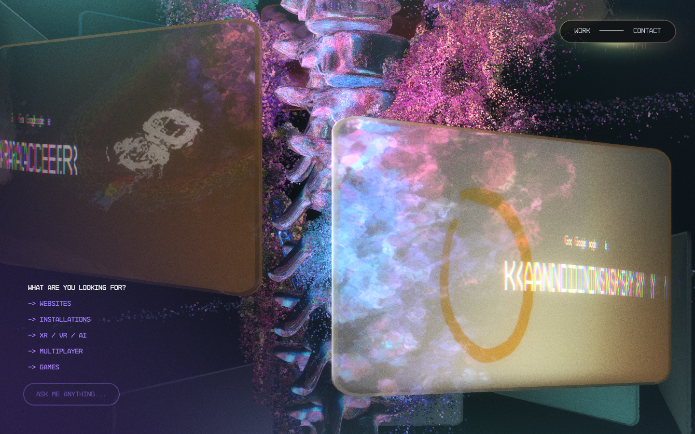 | 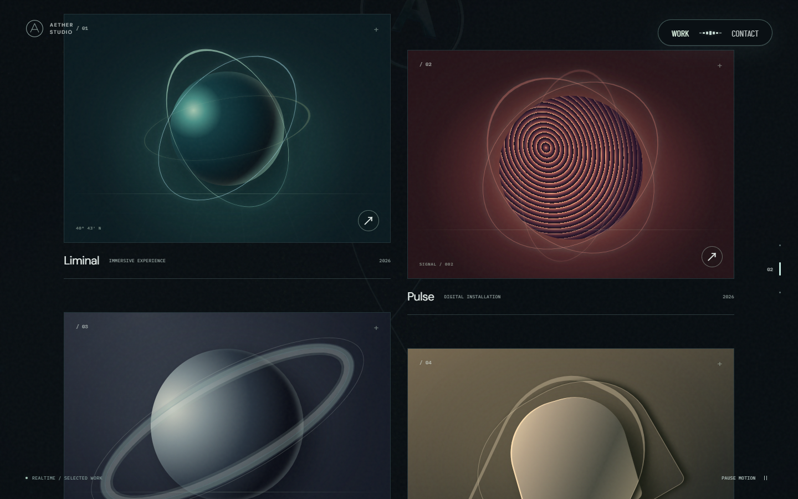 | 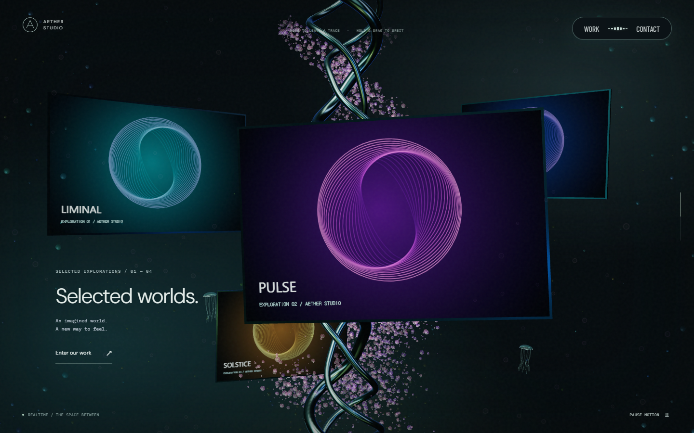 |
| 75% 대표 | 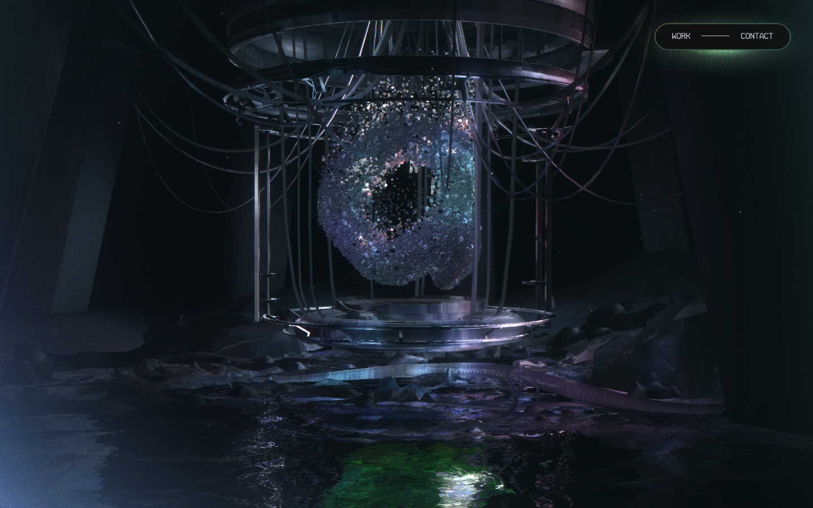 | 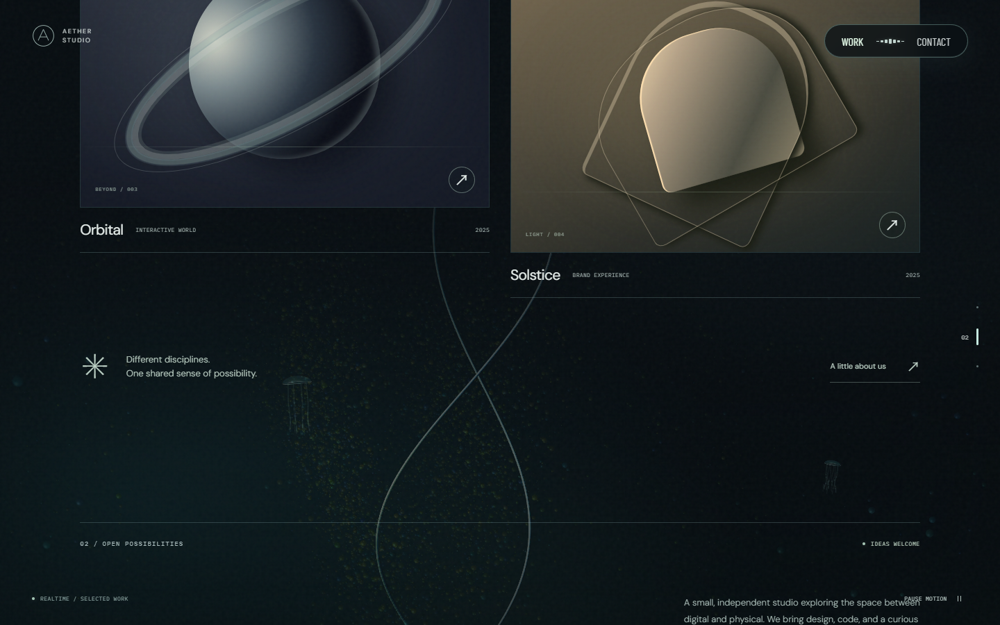 | 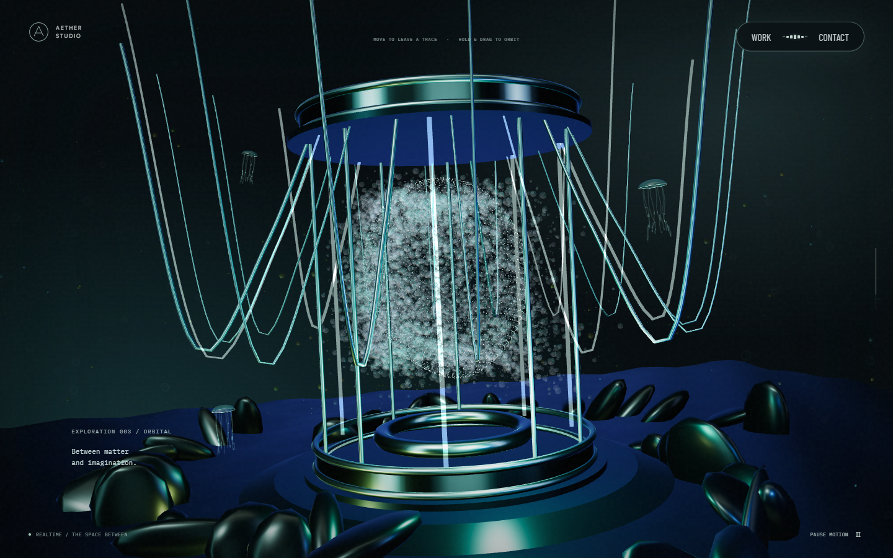 |
| 끝 | 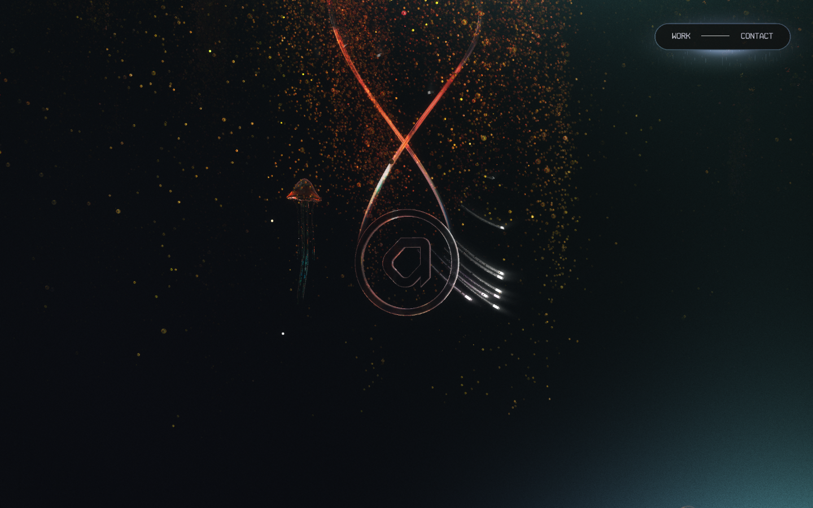 | 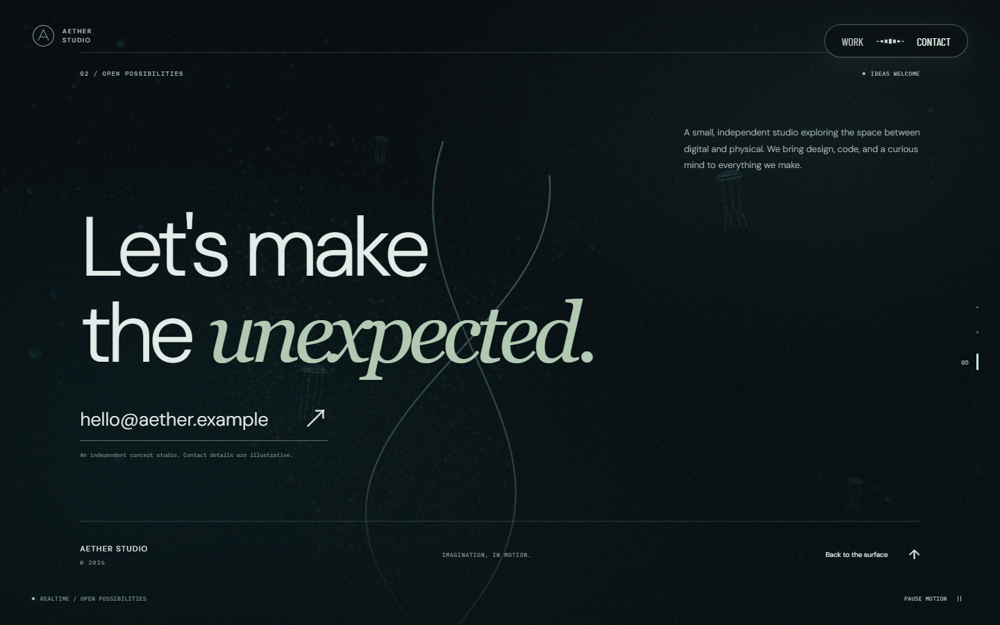 | 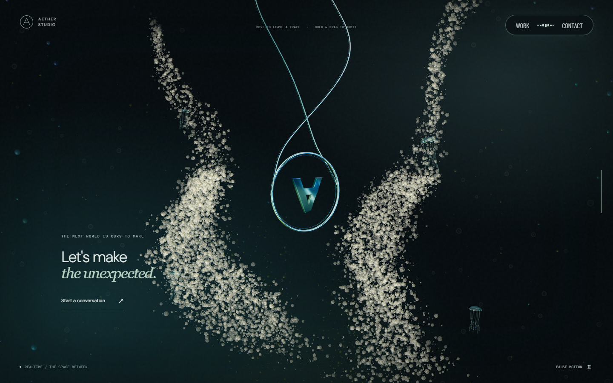 |

## 관찰 결과

| 기준 | 반영한 내용 | 남아 있는 차이 |
| --- | --- | --- |
| 구도·레이아웃 | 작은 링 → 대형 소개 → 큰 전면 카드 → 원근 카드 → 기계 장치 → 역방향 링 | Work/Contact은 접근 가능한 별도 hash 콘텐츠 화면도 제공 |
| 파티클 | 금색·청록 구슬 반사, 하단 군집, 보라색 수직 기둥, 근경 bokeh | 원본의 더 복잡한 분포와 입체 구슬 군집은 단순화 |
| 빛 | 환경 반사, 금속 테두리, 청록 광원, 과도한 백색 누적 방지 | 원본의 무지갯빛과 후처리·바닥 반사 정밀도는 다름 |
| 3D 모델 | 링과 꼬리의 단일 부모, 3가닥 유기 기둥, 케이블·콜라·코어·받침·바닥 | 원본 모델의 비정형 표면과 세밀한 기계 구조는 단순화 |
| 마우스 | 1.45초 은빛 리본 흔적, 누른 채 선회, 해제 후 복귀 | 원본의 흐름장 시뮬레이션과 동일한 알고리즘은 아님 |

독립 시각 검토에서는 다섯 주요 구도의 대응과 약60% 근사 목표의 방향을 확인했습니다. 정량 인증이나 원본과의 동일성 보장이 아닙니다. 소프트웨어 GPU는 별도 예산으로 입자·반사를 줄이며 실제 Safari/iOS 검증은 수행하지 않았습니다.

## 기능 검증과 리뷰 대응

- 기존15개와 신규6개, 전체21개 Playwright 테스트 통과.
- 실제 shader의 밝은 픽셀 발생 및1.6초 idle 후0개, UI·touch·reduced motion 입력 제외 확인.
- 카메라 테스트는 주변 애니메이션 시간을 고정하고 클릭 광원이 사라진 뒤 화면이 바뀌는지 확인하여 단순 배경 애니메이션을 카메라 효과로 오인하지 않도록 했습니다.
- 5개 스크롤 지점, 모바일 가로 넘침, deep link, 뒤로/앞으로, Escape·focus 복원 확인.
- 레드팀 P2: 전면 카드가 PULSE인데 설명은 Liminal로 남는 문제 → `Selected worlds.` 공통 문구로 교정. `adccf65`에서 반영 후 독립 재검토 종료, recommend.
- typecheck·lint·production build 통과. 실제 캡처의 브라우저 오류0개. 장기 GPU 메모리 추적·실기기 모바일 성능 측정은 범위 밖입니다.
